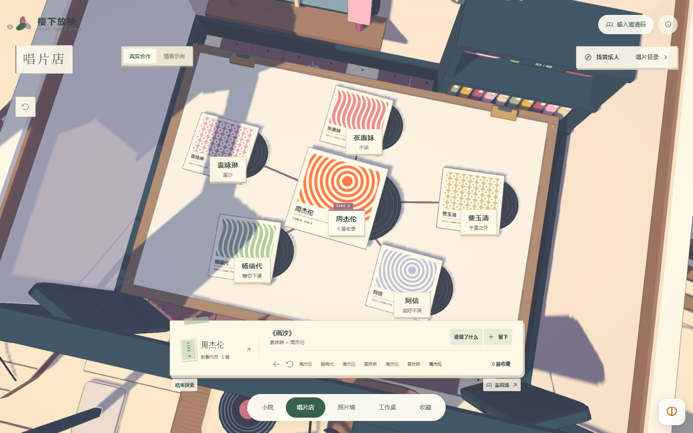

# Music Map × Music Space

**同一刻，另一面。散场以后，用另一位观众的视角，补完整你记住的那一晚。**

当前 MVP **0.12.0** · 产品文档 **2.3** · 2026-09-27

在樱花小院里留下自己的现场照片，和朋友交换另一种视角。走进唱片店，沿桌上的合作唱片认识音乐人；回到照片墙，记录、邀请、换卡，最后把照片收进自己的纪念册。选照片、留一句，两步制卡，默认私藏；单卡和双联可预览、下载 PNG。



本轮唱片桌、照片墙与纪念册画面见[视觉规范](docs/VISUAL_THEMES.md)，操作证据见[项目状态](docs/PROJECT_STATUS.md)。

## 现在能做什么

- **音乐探索**：唱片关系桌承载 11 位艺人、10 首作品、10 条有来源的共同演唱关系；选择唱片沿关系探索，展开内页查看每个人的演唱、词曲、制作等已核实工种。另可搜索 120 首独立开放曲库作品，其共同署名与人工核实制作名单分开。虚构图谱和旧记录保留。
- **独立音乐收藏**：真实精选与开放曲库中的歌可单独留下，不依赖探索路线；「带到现场」仅把歌名填入一个新场次的草稿，场次由用户自己填写。
- **本地情景演示**：「体验示例」里切换 Lin / 阿遥，完成制卡、展示、申请、接受、拒绝与取消。预置内容明确标为示例；接受后自动收好本机双联记忆。
- **自己的音乐现场**：填写场次、可选日期／地点／歌名，上传一张自己的照片，选一个时刻和视角；默认私藏。保存后可邀请朋友、看同场卡片、主动展示或下载单卡。
- **真实同场交换**：独立匿名身份、邀请码／二维码、主动展示的卡墙；用共同瞬间和不同视角说明相遇理由。申请指向两张确定的卡，由接收者本人同意。
- **可回访的个人收藏**：「我的记录」默认显示本人跨场次卡片与双联，另有音乐收藏、探索路线和示例。离场后仍可读本人留存；删除自己的双联不影响对方副本，后续改卡不改写已接受快照。单卡与双联都可下载 PNG。
- **樱下放映**：一个常驻三渲二小院贯穿探索、制卡、交换与收藏。唱片桌、场次票签、照片托盘、纪念册和封套内页使用同一套暖纸、细墨线与索引语言；页面与 PNG 保持同一樱花画风。

**真实合作有来源；本应用没有内置音频，试听链接已撤下，QQ 音乐同版本直达尚未核实。** 署名来源仍可单独查看。本地情景和旧房间仍是虚构场次，预置图由AI生成。新房间使用参与者自行填写的活动与选择的照片，不验证到场。现有实操是内部独立会话，不代表已有外部用户或公网服务。

先服务散场后的同场小圈，共同纪念是交换收益，音乐探索是可选入口。依据见[竞争力复盘](references/research/2026-09-27/README.md)。

## 樱下放映

只保留这一套艺术方向：暖白、樱粉、鼠尾草绿和彩色阴影。探索的唱片和合作细线位于同一个 Three 场景中，艺人标签跟随物件投影；底部封套索引与路线纸条承接查找和返回。照片墙使用场次票签、照片托盘与可展开目录，收藏使用纪念册，署名和表单延续为封套内页与工作纸。

Three 0.186.1 与 GSAP 3.15.0 驱动六类机位，镜头行进和照片抬起可打断，场景跨路由保留。减少动态偏好直接显示目标画面；WebGL 不可用时保留普通关系图与页面操作。用户照片只沿原授权接口读取，不生成公共图片地址；页面和单卡、双联 PNG 保留真实照片、作者与交换快照。见[视觉规范](docs/VISUAL_THEMES.md)和[来源许可](THIRD_PARTY_NOTICES.md)。

旧声浪现场、独立刊物及主题选择退出当前产品；旧版本的画面和检查记录仍按历史保留。

## 已下载的开放数据

Hugging Face 的 `maharshipandya/spotify-tracks-dataset` 完整 CSV 已下载到 `data/external/spotify-tracks-dataset/dataset.csv`：**114,000 行、20,118,244 B**，固定 revision `635b034f69257814eff850a5c2b3346fe458134f`。没有下载音频或模型权重。

前端仅内置整理后的 120 首共同署名作品，原 CSV 不进入页面或运行包。复现命令：`python scripts/datasets/download_hf_catalogue.py`。范围与来源见[下载记录](references/research/2026-09-27/huggingface-download.md)，10 首人工核实作品见[逐人署名记录](references/research/2026-09-27/collaboration-roles.md)。

## 快速运行

需要 **Node.js 24 或更新版本**。

```sh
npm ci
npm run build
npm start
```

打开 **http://127.0.0.1:8787/**。同一个服务提供页面与 SQLite 交换接口，无需外部数据库或模型。

开发前端：`npm run dev`；真实房间开发时另开终端运行 `npm run server`。Vite 将 `/api/live` 转发到本机 `8787` 端口。

### 两种交付

| 交付 | 能力 | 条件 |
| --- | --- | --- |
| `dist/index.html` 单文件 | Map、本机音乐收藏与本地双角色情景演示 | 浏览器；可评估 WorkBuddy 等 HTML 托管 |
| Node 完整版本 | 上述功能 + 真实房间交换与跨场次个人收藏 | Node.js 24、同源服务与持久化磁盘；对外部署使用 HTTPS |

`npm run preview` 只预览静态页面。静态托管不能运行 SQLite 后端。`npm start` 默认仅监听本机，支持 `HOST`、`PORT`、`DATA_DIR`；完整部署和 Docker 命令见[实施规格](product/docs/03-build-guide.md)。数据库默认在 `data/music-map.sqlite`，已排除 Git，不得打进分享包。

每次推送，GitHub Actions 构建 **music-map-space-demo**（单文件）与 **music-map-space-runtime**（页面、后端、运行说明）两份产物，保留 14 天。见 [Actions](https://github.com/musicMapTeam/musicMap/actions/workflows/build.yml)。仓库同步与网站部署分别记录。

### 演示与材料

- [106 秒实际操作录屏](delivery/music-map-space-demo.mp4)与[16:9 封面](delivery/cover.png)：仍为 **0.4.0**，未按当前版本重制，不含后续空间镜头、曲库与个人收藏入口。
- [16:9 参赛封面](delivery/cover.png) · [交付清单](delivery/README.md) · [报名介绍与现场演示脚本](docs/competition/README.md)。
- 完整运行包解压后，在包根目录执行 `node server/index.js`，无需安装 npm 依赖。详见 [运行包说明](RUN-ME.md)。

## 两分钟体验

### 一个人快速看完整流程

运行 Node 版本，首页点「记录我的现场」→ 创建场次 → 选照片、留一句 → 保存自己的卡 → 下载或去「我的记录」。已有房间时直接编辑本场卡。当前页面关闭再开编辑器会继续草稿；保存成功或换房清理，刷新或切页不承诺恢复。

想先看完整交换，可点「体验示例」→ 制卡并申请 → 切到阿遥接受 → 打开双联、下载票根。示例身份和记录只在本机。

### 两个人真实交换

首页点「邀请朋友」→ 没有当前房间时留昵称、创建场次 → 展示邀请码与二维码；已有房间则直接邀请。朋友经邀请链接或首页「我有邀请码」入场 → 双方制卡，接收方展示 → 发起方确认两卡并申请 → 接收方独立同意 → 双方回看和下载。

同一台电脑可用两个浏览器或普通 / 无痕窗口。朋友的手机需要已部署的链接，或同一网络下可访问的服务地址；`127.0.0.1` 不能发给另一台设备。身份保存在浏览器，清除站点数据会失去身份访问能力，MVP 暂无账号找回。

## 完成证据与边界

0.12 的构建、实际浏览器操作、画面、运行包及 PR / 合并结果统一见[项目状态](docs/PROJECT_STATUS.md)。本页不将旧版本检查沿用为本轮结果。

历史证据：0.11 的樱花单一视觉、邀请、草稿与回访检查，0.10 的两步制卡、PNG 预览和收藏保位，以及更早的场景、照片上传与独立身份交换，均保留原版本记录。具体范围见项目状态，不代替本轮检查或实体手机验收。

**仍需外部操作**：选定评审访问环境并部署、少量真实用户试用、核对报名信息并提交。官方 FAQ 对已公开上线作品有限制，发布前按[交付计划](product/docs/02-delivery-plan.md)确认定向评审方式。本轮没有购买服务器、下载模型权重或提交赛事表单。

## 项目导航

| 入口 | 内容 |
| --- | --- |
| [参赛材料](docs/competition/README.md) | 报名介绍、演示脚本、素材状态与提交核对 |
| [项目状态](docs/PROJECT_STATUS.md) | Todo / Doing / Done 与证据 |
| [产品方案](product/docs/01-product-plan.md) | 用户价值、机制、范围、艺术方向 |
| [视觉规范](docs/VISUAL_THEMES.md) | 樱下放映、空间交互、上游来源与资源边界 |
| [交付计划](product/docs/02-delivery-plan.md) | 官方要求、托管和演示 |
| [实施规格](product/docs/03-build-guide.md) | 栈、API、数据、运行与部署 |
| [协作指南](CONTRIBUTING.md) · [代理约定](AGENTS.md) | 分工、小步提交、必要检查 |
| [更新记录](CHANGELOG.md) · [来源说明](THIRD_PARTY_NOTICES.md) | 版本、许可与素材 |
| [官方资料档案](references/official/2026-09-26/README.md) | 官网与六张官方表原文 / 截图 |

入口 `web/index.html`；前端 `web/js/`、`web/css/`；后端 `server/`。Vite + 原生 ES 模块，后端使用 Node 自带 HTTP、加密和 SQLite，无运行时 npm 依赖。`product/prototype/` 与 `archive/` 为历史参考。

本轮完成情况以[项目状态](docs/PROJECT_STATUS.md)中的实际记录为准。
