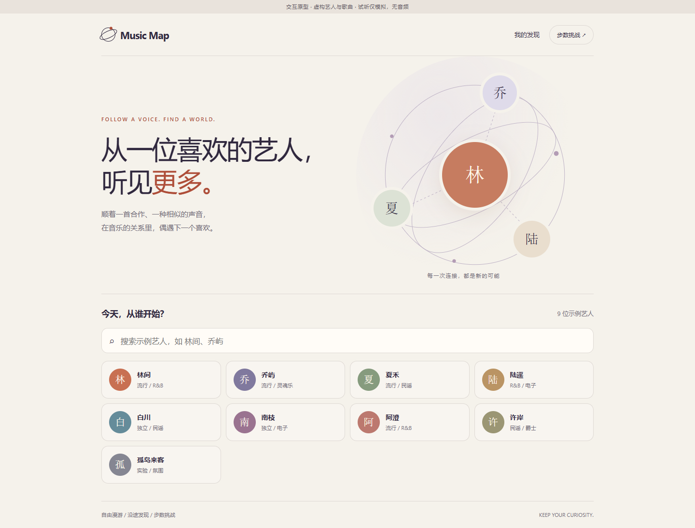

# Music Map

从喜欢，走向未知。一个以艺人关系网连接自由漫游、沿途发现与轻松步数挑战的音乐探索产品。

参赛赛道：**创新音乐产品**。第一版面向手机浏览器，核心规则以 PRD v0.2 为准。

## 产品与原型交付

完整内容位于 **[product/](product/README.md)**：

- [产品需求文档 PRD](product/docs/01-PRD.md)
- [用户流程图](product/docs/02-user-flows.md)
- [原型设计与交互说明](product/docs/03-prototype-spec.md)
- [可点击原型文件](product/prototype/index.html)
- [数据与素材清单](product/docs/04-data-assets.md)
- [验收清单](product/docs/05-acceptance.md)
- [开发交接说明](product/docs/06-handoff.md)
- [参赛介绍与视频脚本工作稿](product/docs/07-submission.md)
- [原型核验记录](product/verification/report.md)

## 体验原型

下载或克隆本仓库后，用浏览器打开 `product/prototype/index.html`，保持该目录内的 CSS、JS 文件完整。原型无安装依赖，可在本地打开；GitHub 文件预览页展示源码，不直接运行网页。

原型含空间旋转、切换中心、代表作抽屉、留下歌曲、历史回顾和合作挑战。**当前艺人、歌曲及关系均为虚构示例，试听仅模拟，没有真实音频。** 正式音乐数据、音频、素材接入和在线 Demo 部署仍需开发完成与验收。

## 协作起点

产品交付已准备；开发从数据与音频最小验证开始，按交接说明接入真实内容并实现正式版本。原型不限定正式项目的技术框架。初赛最晚 **2026 年 10 月 9 日**提交，完整材料要求见 PRD 与验收清单。
