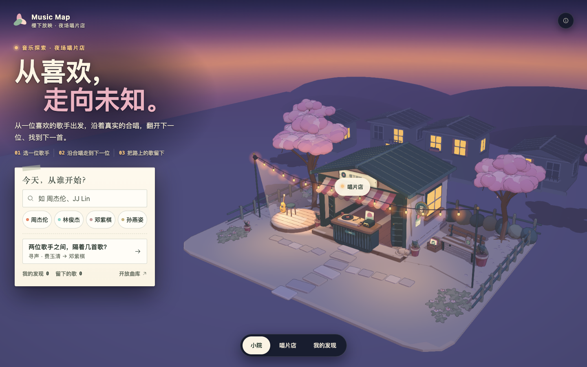

# Music Map

**从喜欢，走向未知。** 从一位喜欢的华语歌手出发，沿真实的合唱录音走到下一位，把路上的歌留下。

MVP **0.16.0** · 产品文档 **3.0** · 2026-09-29 · 在线演示：**<https://musicmapteam.github.io/musicMap/>**



上图为 0.16 首页（1440×900，与其余 0.16 截图同批拍摄，画面对应提交 `b5939d9` 的代码，截图在 `7fa4147` 提交）。其余页面见[视觉规范](docs/VISUAL_THEMES.md)，本轮检查记录见[项目状态](docs/PROJECT_STATUS.md)。

## 0.16 是什么

- **只做 Music Map。** 2026-09-28 用户决定 Music Map 为唯一参赛主线。Music Space 已移出应用入口，代码保留在 `3dd102c`，见[下文](#music-space-去哪了)。
- **一个静态网页文件。** 没有后端和账号，数据只存在当前浏览器，可从 `file://` 或任意静态托管打开。
- **美术不变。** 继续使用冻结的「樱下放映 · 夜场」，小院里讲的是一家夜场唱片店。

## 现在能做什么

主线是：选一位歌手，沿合唱走下去，留下喜欢的歌，回顾这一路，再把题目发给朋友。

- **小院（首页）**：可以搜索已收录的歌手，也可以点示例「周杰伦」「林俊杰」「邓紫棋」「孙燕姿」，都会直接开始一次自由漫游。搜不到时提示“本专题还没收录”，并给出可出发的歌手。寻声题签用来继续上一局或开一局新的。底部有「我的发现」「留下的歌」计数和「开放曲库」。
- **自由漫游（唱片店 ·「完整图鉴」）**：
  - 桌上摊开全部合唱。点与当前歌手相连的歌手就走过去，每一步对应一首合唱录音。
  - 路线条上有「返回上一位」「回到起点」「本次发现 · N 首」「结束探索」。
  - 回顾按 PRD v0.2 的顺序排列：先是概览；然后是留下的歌，写明在哪里留下；接着是「我走过的路」，分支处写「返回 X，换个方向」；再是途经艺人，每位都能「从 TA 再出发」；最后是「继续本次探索」「开始新探索」「回到小院」。
  - 要替换一段已有进度的漫游时，先请用户确认。
- **寻声**：
  - 唱片店默认开一局「费玉清 → 邓紫棋，隔着几首歌？」。桌上起雾，只有起点和终点正面朝上。
  - 在所在歌手的手牌里翻开一首合唱，才能认出对方；沿翻开的合唱「前往」才算一步。翻开、提示和查看都不计步。
  - 提示分三级：还隔几首、往哪翻、揭晓答案。抵达后整桌翻开，路线描金，给出「连线歌单」。
  - 共 12 道预设题：原有 5 道，另有 7 道较长的题，本专题最短路线为 4–6 首。也可以「自选起点和终点」。
  - 「最短」只用于本专题收录范围内的对比，不说用户走的路线最短。
- **分享**（都由用户点击触发，在本机生成，不上传）：
  - **题目链接**：「把这道题发给朋友」和「出题给朋友」生成 `?from=<起点>&to=<终点>#/explore`。朋友打开后得到同一道题，并看到「朋友出的题」提示。链接只带起点和终点，不带路线、答案、收藏或历史。发送时先试系统分享，再试复制到剪贴板，都不行就显示可选中的链接。
  - **战绩卡**：「保存战绩卡」生成 1080×1350 的 PNG。中间经过的歌手背面朝上，卡上写步数和提示次数，二维码是这道题的链接。
  - **发现卡片**：漫游回顾里的「保存发现卡片」生成同尺寸 PNG，对应 PRD 5.8。歌手或歌太多时，卡片标「节选」。
- **我的发现**：分「探索记录」和「留下的歌」两栏。记录可以回顾、继续，也可以删除，删除前会确认。
- **开放曲库**：收录 126 首华语共同署名作品，可以单独留下，但不连入关系图。

## 数据与诚实边界

- **合唱关系网**：
  - 数据版本 `real-vocal-2026-09-v4`，共 29 位歌手、37 份共同演唱录音、37 条边。整张网连成一片，有 9 个独立回路，相隔最远的两位歌手隔 6 首。
  - 其中 12 位是原有歌手，17 位于 2026-09-28 新增。新增歌手中有乐团节点「五月天」，和「阿信」分开。
  - 新增的 24 份录音里，录音室版 16 份，现场版 7 份（《后来的我们》《年少有为》只见官方影片；《爱我还是他》登记时只有影片，2026-09-29 在 QQ 音乐找到同场现场音轨，无专辑，待产品负责人确认），另有 1 份单曲没有标注版本。
- **每条边都有来源**：
  - 每条边对应一份录音，两位歌手都署名为演唱，并附官方来源：唱片公司或艺人官网、官方 MV（经 oEmbed 核对）或商店元数据。
  - 共同作曲、制作、和声、旁白或 MV 出演都不算合唱。
  - 有 3 首候选没有采用：《布拉格广场》《（……恋人絮语）》《（……小小牧羊人）》。
  - 来源记录：[0.4 的原始来源](references/research/2026-09-27/real-catalogue-sources.md)、[原 10 首的逐人署名](references/research/2026-09-27/collaboration-roles.md)、[0.13 新增 3 份](references/research/2026-09-27/vocal-network-expansion.md)、[2026-09-28 新增 24 份](references/research/2026-09-28/network-expansion.md)。
  - 这张网只收合唱，不是音乐百科。「隔几首」「最短」只在本专题收录范围内成立。
- **QQ 音乐同版本直达（已上线）**：
  - **状态**：「去 QQ 音乐听」入口在提交 `b5939d9`；当前在线演示是 `7fa4147` 的构建（`gh-pages` `e710bf8`），带这个入口。2026-09-29 在线点开 3 首，都在新窗口打开对应的 QQ 音乐歌曲页，记录见[项目状态](docs/PROJECT_STATUS.md)。
  - 只链接 QQ 音乐上同一录音、同一版本的歌曲页。37 份录音中 31 份已核到（其中《爱我还是他》是无专辑的同场现场条目，按例外收录，待产品负责人确认）。另外 6 份不放链接：5 份 QQ 上没有同一版本；《黑暗骑士》QQ 有同一录音，但演唱署名是林俊杰 / 五月天（乐团），待五月天 / 阿信的节点规则确认。
  - 链接会离开本应用打开 QQ 音乐网页。在线检查时没有登录：三页等 8–15 秒都没有显示歌名，其中《千里之外》《说好不哭》的截图里弹出了登录框（《不该》没有截图）；没有登录，也没有播放。登录后能否播放、VIP 或下载 App 的提示，都没有验证；也没有在真机或中国大陆网络下测试。
  - 核对方法见[核对登记](references/research/2026-09-29/qq-music-links.md)。
- **没有内置音频**：应用内不能试听，不含音频、歌词或专辑封面。
- **开放曲库**：
  - 来自 Hugging Face `maharshipandya/spotify-tracks-dataset`，固定 revision `635b034f69257814eff850a5c2b3346fe458134f`。从 mandopop / cantopop 行中取 2–5 位共同署名的作品，共 126 首。
  - 共同署名不代表合唱，这些作品也不进入关系图。
  - 完整 CSV（114,000 行，20,118,244 B）留在忽略目录 `data/external/`，不进入页面。复现命令：`python scripts/datasets/download_hf_catalogue.py`。见[华语曲库记录](references/research/2026-09-29/open-catalogue-zh.md)。
- **待产品负责人确认**：
  - 内容风险排除名单（黄明志、吴亦凡、明日花綺羅）是一项产品决定。
  - 五月天与阿信的节点规则。
  - 是否保留李荣浩。
- **情景示例**：虚构数据集已从菜单隐藏。旧会话仍能打开，界面标为「情景示例」。

## 运行

直接打开[在线演示](https://musicmapteam.github.io/musicMap/)即可。本地开发：

```sh
npm ci
npm run dev       # 开发服务器，地址见终端
npm test          # 跨标签页存档与路由回归（Node 内置测试）
npm run build     # 生成单文件 dist/index.html
npm run preview   # 预览构建结果（npm start 与此相同）
```

构建需要 Node.js 20.19+ 或 22.12+。`.nvmrc` 和 CI 使用 24。

`dist/index.html` 可以双击以 `file://` 打开，也可以放到任意静态托管，不需要服务器、数据库、模型或账号。打开来源页和 QQ 音乐链接需要联网。从 `file://` 打开时，题目链接和战绩卡二维码指向本机文件，朋友打不开；要分享请用在线地址。只拿到单文件时的用法见[使用说明](RUN-ME.md)。

- **公开演示**：从独立的 `gh-pages` 分支发布，只部署构建产物。当前为 `7fa4147` 的构建（`e710bf8`）。
- **CI**：推送 `main` 或提交 PR 时，GitHub Actions 先运行 `npm test`，再构建 `music-map-demo` 产物（`dist/index.html`、README、使用说明、来源说明），保留 14 天。

## 探索记录保护（2026-09-30，待发布）

- 导航与浏览器前进/后退不再把整份探索存档回写。
- 保存前核对本页最初读取的版本；Web Locks 将不同标签页的核对和写入串行化。另一页新增、删除或修改记录后，旧页停止编辑并提示「重载最新记录」，不会自动合并或复活已删记录。
- 已失败或并发冲突的本页修改保留在内存中。可以下载只含本页探索的 JSON 备份；重载丢弃未保存修改前会确认，取消后仍留在本页。备份供保留原始数据，当前没有一键导入入口。
- 保存需要可用的浏览器存储和 Web Locks；不支持或被禁用时会明确提示未保存，不退回有覆盖风险的写入。优先使用现代浏览器和 HTTPS 在线地址，或浏览器允许的本地文件。
- 原存储键与 v1 探索数据继续兼容，独立歌曲收藏不变。更新后请重载所有已打开的旧版页面；旧版代码无法识别这次保护。
- 本轮 22 项 Node 回归和 Vite 生产构建通过；测试覆盖新增/删除、同一/不同会话、同时写入、旧页导航与前进后退、失败重试、取消重载与旧存档。云端环境未能运行真实双标签浏览器验收，不能当作实体手机或跨浏览器验证。尚未推送、合并或部署。

## 仓库地图

| 路径 | 内容 |
| --- | --- |
| `web/index.html` | 入口 |
| `web/js/app.js` | 路由（home / explore / records）、本机存储、旧链接兼容 |
| `web/js/home.js` | 小院首页：搜索、示例起点、寻声题签 |
| `web/js/map.js` | 唱片店：寻声、完整图鉴与自由漫游、回顾、我的发现 |
| `web/js/map-catalogue.js` · `map-data.js` · `map-network.js` | 合唱精选与来源、数据集与题组、布局与本专题最短链 |
| `web/js/share-card.js` | 题目链接、战绩卡、发现卡片 |
| `web/js/open-catalogue.js` · `music-library.js` | 开放曲库与留下的歌 |
| `web/js/sakura-*.js` · `web/js/vendor/sakura/` | 夜场小院场景；`vendor/` 为上游渲染代码，不修改 |
| `web/css/` · `web/assets/` | 样式；HF 曲库 JSON 与许可证 |
| `scripts/datasets/` | HF 数据下载与曲库生成 |
| `references/` | 官方资料原文、按日期整理的研究与来源 |
| `product/` | 产品文档；`prototype/` 是队友在 PRD v0.2 时期做的 Map 可点原型，作为历史参考 |
| `docs/` · `delivery/` | 项目状态、视觉规范、参赛材料；视频、封面与编辑源 |

| 文档 | 内容 |
| --- | --- |
| [参赛材料](docs/competition/README.md) | 报名介绍、演示脚本、提交核对 |
| [项目状态](docs/PROJECT_STATUS.md) | Todo / Doing / Done 与证据 |
| [产品方案](product/docs/01-product-plan.md) · [交付计划](product/docs/02-delivery-plan.md) · [实施规格](product/docs/03-build-guide.md) | 定位与规则、官方要求与部署、实现与数据 |
| [视觉规范](docs/VISUAL_THEMES.md) | 樱下放映 · 夜场、画面登记 |
| [协作指南](CONTRIBUTING.md) · [代理约定](AGENTS.md) | 流程、提交、证据规则 |
| [更新记录](CHANGELOG.md) · [来源说明](THIRD_PARTY_NOTICES.md) | 版本历史、许可与素材来源 |
| [官方资料档案](references/official/2026-09-26/README.md) | 官网与六张官方表原文 / 截图 |

## Music Space 去哪了

- **决定**：
  - 2026-09-28，用户（开发侧）决定只用 Music Map 参赛。
  - 记录的理由是：两个产品装在一个包里，场景、用户和叙事都不同。这个问题由产品负责人（队友，PRD v0.2 作者，提交 `9ce4f3d`）提出。
  - 这次调整的细节还没有和队友对齐，状态为待确认。
- **移除的内容**：现场照片卡、邀请码房间、交换、双联仪式页、票根 PNG、AI 生成的示例现场图，以及 Node + SQLite 后端。
- **代码在哪里**：Space 完整保留在 `main` 的 `3dd102c`（MVP 0.15.0），查看方式是 `git checkout 3dd102c`。
- **旧链接和旧存档**：旧链接 `#/space`、`#/live`、`?room=` 会打开首页。旧存档在首次载入时丢弃 Space 数据，探索记录保留。

## 参赛材料状态

初赛截止 **2026-10-09 23:59**，内部目标 10-08。官方评分三项为用户价值、可行性和创新性，没有公布权重。

| 材料 | 官方要求 | 状态 |
| --- | --- | --- |
| 创作思路 | 100–300 字 | 见[参赛材料](docs/competition/README.md)，提交前由团队核对 |
| Demo 链接 | 可直接访问的在线链接 | 已部署 <https://musicmapteam.github.io/musicMap/>。公开访问可能被视为 FAQ Q10 的「已上线」，用户 2026-09-29 已接受这一风险 |
| 演示视频 | ≤3 分钟，录屏加语音或字幕，≤500MB | 未录制。`delivery/music-map-space-demo.mp4` 是 0.4 的 Space 旧片，不能使用 |
| 封面 | 16:9 | `delivery/cover.png` 已按 0.16 重做（源 `delivery/recording-source/cover-v016.html`），已提交（`7fa4147`），待团队终检 |

## 本轮检查与未完成

- **已做**：
  - 在 Tabbit 浏览器做了多轮独立检查：模拟视口 1440×900、1280×720、390×844、360×740、320×568，减少动态效果，无 WebGL 时的二维回退，以及另开一个干净的「朋友」浏览器上下文打开题目链接。
  - 构建通过；在线版本与 `7fa4147` 的干净构建逐字节一致。
  - 2026-09-29 在线版本上点开 3 条「去 QQ 音乐听」，并核对「关于」的音频说明和无链接歌曲的灰色说明。
  - 细节见[项目状态](docs/PROJECT_STATUS.md)。
- **未做**：实体手机、中国大陆网络、目标用户试用、视频录制、WorkBuddy 托管评估、队友审阅。模拟视口不等于真机验收。
- **与 PRD v0.2 的差距**：
  - 应用内试听和代表作抽屉没有做；改用 QQ 音乐同版本链接替代（31/37 已核对，入口已上线）。
  - 没有「每位歌手 3–5 首代表作」。
  - 真实数据没有「风格联系」模式。
  - 没有拖动旋转的球面，改为唱片桌的平移和缩放。
- **待产品负责人确认**：
  - QQ 音乐外跳。这改变了 PRD v0.2 的「不外跳」。
  - 五月天与阿信的节点规则，以及《黑暗骑士》的署名。
  - 内容风险排除名单。
  - 是否保留李荣浩。
  - Space 移出的细节。
  - GitHub Pages 公开部署与 FAQ Q10（用户已接受，产品负责人尚未表态）。
  - 完整 15 项见[产品方案 §9](product/docs/01-product-plan.md)。
- **仍需完成**：视频、封面终检、目标用户试用、真机检查、报名与提交。
- **分支**：按用户 2026-09-29「推送并且合并」的授权，`feat/map-mainline` 经 PR #6 在 Build demo 检查通过后合并到 `main`。线上 Demo 仍由独立的 `gh-pages` 分支提供。
