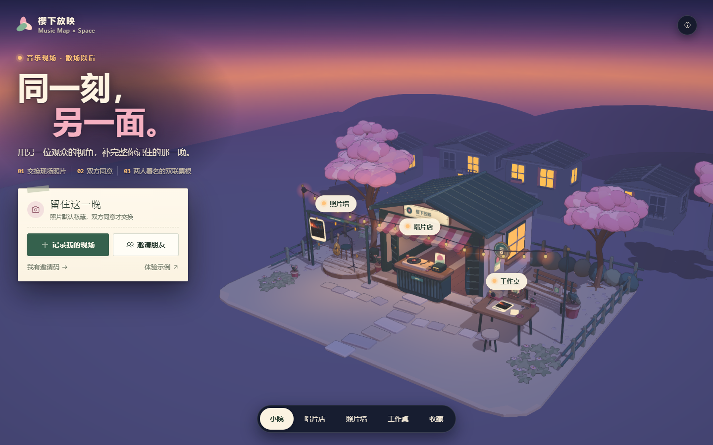

# Music Map × Music Space

**同一刻，另一面。散场以后，用另一位观众的视角，补完整你记住的那一晚。**

0.15 是视觉整改：
- 「樱下放映」改为夜场，并冻结为最终美术方向。
- 首页首屏先讲「同一刻，另一面」和交换三步。
- 唱片店改为由你自己翻开的「寻声一局」。
- 双方同意的交换进入全屏仪式页，PNG 改为夜场票根。

本轮实际检查见项目状态。

当前 MVP **0.15.0** · 产品文档 **2.6** · 2026-09-27

在樱花夜场小院里留下自己的现场照片，和朋友交换另一种视角。走进唱片店，翻开背面朝上的合作唱片，找出两位歌手之间隔着几首歌；回到照片墙，记录、邀请、换卡。双方同意后，全屏展示两人署名的双联，最后收进自己的纪念册。选照片、留一句，两步制卡，默认私藏；单卡和双联可预览、下载夜场票根 PNG。



上图为 0.15 最终构建的 1440×900 首页实际画面；唱片店寻声、双联仪式页与手机画面见[视觉规范](docs/VISUAL_THEMES.md)。证据见[项目状态](docs/PROJECT_STATUS.md)，设计见[视觉规范](docs/VISUAL_THEMES.md)。

## 现在能做什么

- **音乐探索**：唱片店默认开一局寻声，例如「费玉清 → 邓紫棋，隔着几首歌？」。只有起点和终点正面朝上；在所在歌手的手牌里翻开合作，认出合唱者，再明确「前往」才算一步。提示分三级：还隔几首、往哪翻、揭晓。抵达后整桌翻开、路线描金，得到连线歌单，可以留下歌或带到现场。答案在翻开、提示或揭晓前不出现，“最短”只指本专题收录范围。完整精选网收在目录的「完整图鉴」：12 位艺人、13 份合作录音、13 条共同演唱边，含 2 个独立回路；可以点关系线看作品、署名和来源，或选人问「和 TA 隔几首？」另开一局。另可搜索 120 首独立开放曲库作品，其共同署名与人工核实制作名单分开。
- **独立音乐收藏**：真实精选与开放曲库中的歌可单独留下，不依赖探索路线；「带到现场」仅把歌名填入一个新场次的草稿，场次由用户自己填写。
- **本地情景演示**：「体验示例」里切换 Lin / 阿遥，完成制卡、展示、申请、接受、拒绝与取消。预置内容明确标为示例；接受后自动收好本机双联记忆。
- **自己的音乐现场**：填写场次、可选日期／地点／歌名，上传一张自己的照片，选一个时刻和视角；默认私藏。保存后可邀请朋友、看同场卡片、主动展示或下载单卡。
- **真实同场交换**：独立匿名身份、邀请码／二维码、主动展示的卡墙；用共同瞬间和不同视角说明相遇理由。申请指向两张确定的卡，由接收者本人同意。
- **可回访的个人收藏**：「我的记录」默认显示本人跨场次卡片与双联，另有音乐收藏、探索路线和示例。离场后仍可读本人留存；删除自己的双联不影响对方副本，后续改卡不改写已接受快照。单卡与双联都可下载 PNG。
- **樱下放映 · 夜场**：一个常驻三渲二夜场小院贯穿首屏、探索、制卡、交换与收藏。月光、串灯、舞台灯与夜樱照亮场景，唱片桌由桌灯照亮。唱片桌、场次票签、照片托盘、纪念册和封套内页使用同一套暖纸、细墨线与索引语言。双方同意后，全屏仪式页首映双联：两半照片合拢，「双方同意」印章落下。页面与夜场票根 PNG 保持同一画风。

**真实合作有来源；本应用没有内置音频，试听链接已撤下，QQ 音乐同版本直达尚未核实。** 署名来源仍可单独查看。本地情景和旧房间仍是虚构场次，预置图由AI生成。新房间使用参与者自行填写的活动与选择的照片，不验证到场。现有实操是内部独立会话，不代表已有外部用户或公网服务。

先服务散场后的同场小圈，共同纪念是交换收益，音乐探索是可选入口。依据见[竞争力复盘](references/research/2026-09-27/README.md)。

## 樱下放映 · 夜场

只保留这一套艺术方向，0.15 起冻结为夜场，后续只做打磨。主色为：夜空靛紫与地平线暖辉、串灯琥珀、暖纸、樱粉和鼠尾草绿。夜空上用奶油色字和深色玻璃导航，纸件带夜间灯光阴影；正文不小于 14px，辅助文字不小于 12px。寻声局与完整图鉴共用同一个 Three 场景的樱花纸桌，唱片位置不因选择或翻开而重排；缩放、拖动和适配全图帮助浏览。照片墙使用场次票签和照片托盘，收藏使用纪念册。镜头按实际纸件占位重新构图；详情与表单使用窄纸面弹窗，短屏可滚动到末尾操作。

Three 0.186.1 与 GSAP 3.15.0 驱动六类机位，镜头行进和照片抬起可打断，场景跨路由保留。首次进入有一段短暂的开场亮灯。减少动态偏好直接显示目标画面；WebGL 不可用时，页面回到浅纸深字，唱片桌使用同一数据、布局与可见性的二维图。用户照片只沿原授权接口读取，不生成公共图片地址；页面和单卡、双联 PNG 保留真实照片、作者与交换快照。见[视觉规范](docs/VISUAL_THEMES.md)和[来源许可](THIRD_PARTY_NOTICES.md)。

旧声浪现场、独立刊物及主题选择退出当前产品；旧版本的画面和检查记录仍按历史保留。

## 已下载的开放数据

Hugging Face 的 `maharshipandya/spotify-tracks-dataset` 完整 CSV 已下载到 `data/external/spotify-tracks-dataset/dataset.csv`：**114,000 行、20,118,244 B**，固定 revision `635b034f69257814eff850a5c2b3346fe458134f`。没有下载音频或模型权重。

前端仅内置整理后的 120 首共同署名作品，原 CSV 不进入页面或运行包。复现命令：`python scripts/datasets/download_hf_catalogue.py`。范围与来源见[下载记录](references/research/2026-09-27/huggingface-download.md)。人工精选独立核实：原 10 首的[逐人署名](references/research/2026-09-27/collaboration-roles.md)，新增《黑暗骑士》、2020 双 J 联唱和《Stay With You》英文版见[关系网扩展记录](references/research/2026-09-27/vocal-network-expansion.md)。

## 快速运行

需要 **Node.js 24 或更新版本**。

```sh
npm ci
npm run build
npm start
```

打开 **http://127.0.0.1:8787/**。同一个服务提供页面与 SQLite 交换接口，无需外部数据库或模型。

开发前端：`npm run dev`；真实房间开发时另开终端运行 `npm run server`。Vite 将 `/api/live` 转发到本机 `8787` 端口。

### 两种交付

| 交付 | 能力 | 条件 |
| --- | --- | --- |
| `dist/index.html` 单文件 | Map、本机音乐收藏与本地双角色情景演示 | 浏览器；可评估 WorkBuddy 等 HTML 托管 |
| Node 完整版本 | 上述功能 + 真实房间交换与跨场次个人收藏 | Node.js 24、同源服务与持久化磁盘；对外部署使用 HTTPS |

`npm run preview` 只预览静态页面。静态托管不能运行 SQLite 后端。`npm start` 默认仅监听本机，支持 `HOST`、`PORT`、`DATA_DIR`；完整部署和 Docker 命令见[实施规格](product/docs/03-build-guide.md)。数据库默认在 `data/music-map.sqlite`，已排除 Git，不得打进分享包。

每次推送，GitHub Actions 构建 **music-map-space-demo**（单文件）与 **music-map-space-runtime**（页面、后端、运行说明）两份产物，保留 14 天。见 [Actions](https://github.com/musicMapTeam/musicMap/actions/workflows/build.yml)。仓库同步与网站部署分别记录。

### 演示与材料

- [16:9 参赛封面](delivery/cover.png) 已按 0.15 夜场重做，右侧为应用实际导出的双联票根（示例照片由 AI 生成）。
- [106 秒实际操作录屏](delivery/music-map-space-demo.mp4)：仍为 **0.4.0** 旧版，不含后续空间镜头、曲库、个人收藏入口，以及 0.15 的夜场、寻声与仪式页。视频需按 0.15 重制。
- [16:9 参赛封面](delivery/cover.png) · [交付清单](delivery/README.md) · [报名介绍与现场演示脚本](docs/competition/README.md)。
- 完整运行包解压后，在包根目录执行 `node server/index.js`，无需安装 npm 依赖。详见 [运行包说明](RUN-ME.md)。

## 两分钟体验

### 一个人快速看完整流程

运行 Node 版本，首页点「记录我的现场」→ 创建场次 → 选照片、留一句 → 保存自己的卡 → 下载或去「我的记录」。已有房间时直接编辑本场卡。当前页面关闭再开编辑器会继续草稿；保存成功或换房清理，刷新或切页不承诺恢复。

想先看完整交换，可点「体验示例」→ 制卡并申请 → 切到阿遥接受 → 全屏双联仪式页首映 →「保存双联图片」下载夜场票根。示例身份和记录只在本机。

想玩唱片店：点「唱片店」，桌上已摆好默认一局「费玉清 → 邓紫棋，隔着几首歌？」→ 在手牌里翻开《千里之外》→ 前往 → 需要时点提示 → 找到终点，整桌翻开并打开连线歌单 → 对一首歌点「带到现场」，预填新场次的歌名。「换一组」换下一道题；目录里的「完整图鉴」会显示全部合作。

### 两个人真实交换

首页点「邀请朋友」→ 没有当前房间时留昵称、创建场次 → 展示邀请码与二维码；已有房间则直接邀请。朋友经邀请链接或首页「我有邀请码」入场 → 双方制卡，接收方展示 → 发起方确认两卡并申请 → 接收方独立同意 → 双方在全屏仪式页看到双联，保存双联图片，之后可从「我的记录」翻开回看。

同一台电脑可用两个浏览器或普通 / 无痕窗口。朋友的手机需要已部署的链接，或同一网络下可访问的服务地址；`127.0.0.1` 不能发给另一台设备。身份保存在浏览器，清除站点数据会失去身份访问能力，MVP 暂无账号找回。

## 完成证据与边界

0.15 的构建与画面见[项目状态](docs/PROJECT_STATUS.md)。本页不将旧版本检查沿用为本轮结果。以下几项未验证：实体手机、真机双指、读屏软件，以及正常硬件下的动画时长。

历史证据：0.14 的纸件占位构图、0.13 的完整关系网与关联查询、0.12 的场景唱片桌与统一纸件界面、0.11 的邀请、草稿与回访、0.10 的两步制卡和 PNG 预览，以及更早的照片上传与独立身份交换，均保留原版本记录。具体范围见项目状态，不代替本轮检查或实体手机验收。

**仍需外部操作**：选定评审访问环境并部署、少量真实用户试用、核对报名信息并提交。官方 FAQ 对已公开上线作品有限制，发布前按[交付计划](product/docs/02-delivery-plan.md)确认定向评审方式。本轮没有购买服务器、下载模型权重或提交赛事表单。

## 项目导航

| 入口 | 内容 |
| --- | --- |
| [参赛材料](docs/competition/README.md) | 报名介绍、演示脚本、素材状态与提交核对 |
| [项目状态](docs/PROJECT_STATUS.md) | Todo / Doing / Done 与证据 |
| [产品方案](product/docs/01-product-plan.md) | 用户价值、机制、范围、艺术方向 |
| [视觉规范](docs/VISUAL_THEMES.md) | 樱下放映、空间交互、上游来源与资源边界 |
| [交付计划](product/docs/02-delivery-plan.md) | 官方要求、托管和演示 |
| [实施规格](product/docs/03-build-guide.md) | 栈、API、数据、运行与部署 |
| [协作指南](CONTRIBUTING.md) · [代理约定](AGENTS.md) | 分工、小步提交、必要检查 |
| [更新记录](CHANGELOG.md) · [来源说明](THIRD_PARTY_NOTICES.md) | 版本、许可与素材 |
| [官方资料档案](references/official/2026-09-26/README.md) | 官网与六张官方表原文 / 截图 |

入口 `web/index.html`；前端 `web/js/`、`web/css/`；后端 `server/`。Vite + 原生 ES 模块，后端使用 Node 自带 HTTP、加密和 SQLite，无运行时 npm 依赖。`product/prototype/` 与 `archive/` 为历史参考。

本轮完成情况以[项目状态](docs/PROJECT_STATUS.md)中的实际记录为准。
