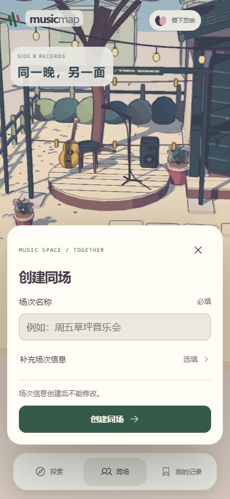
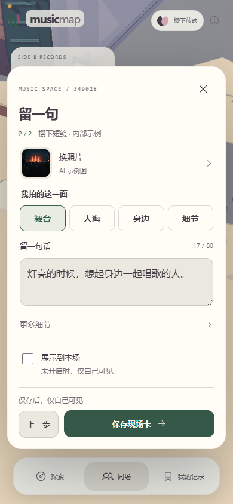
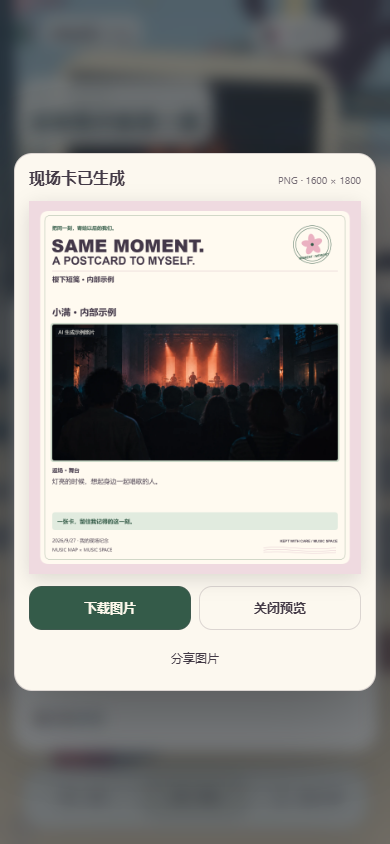
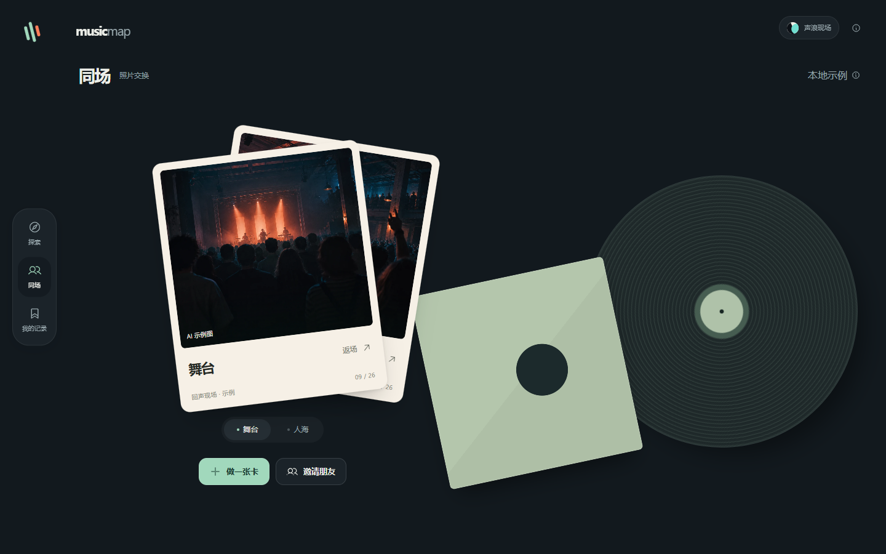
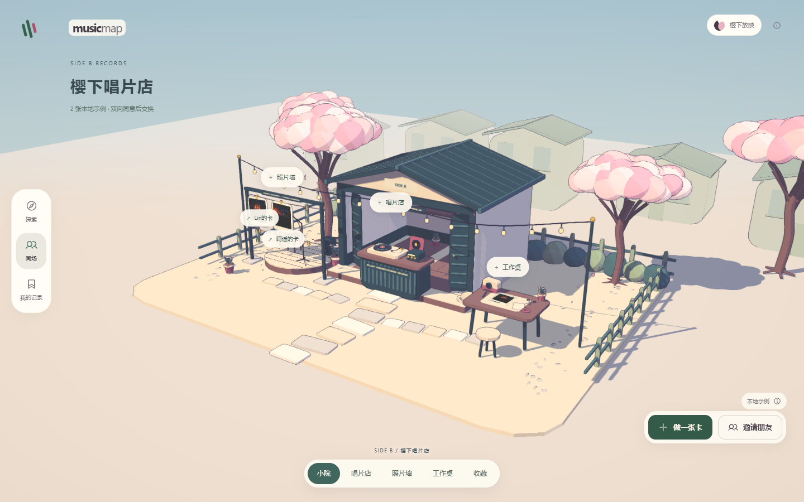
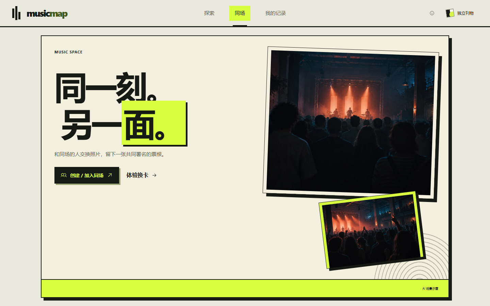

# 三套视觉主题

2026-09-27 · 对应 MVP **0.10.0** / 产品文档 **2.1**。本文记录艺术规范；本轮整合与检查状态见 [PROJECT_STATUS](PROJECT_STATUS.md)。业务规则见[产品方案](../product/docs/01-product-plan.md)。

## 选择与设计参数

### 页面预览

0.10 的 390×844 实际浏览器画面：

| 创建场次 | 两步制卡 · 留一句 | PNG 成品预览 |
| --- | --- | --- |
|  |  |  |

场次与照片均为内部示例；PNG 预览使用实际生成的 1600×1800 图片，未对外分享。

以下三张首页为 0.9.0 的 1440×900 历史画面，不代表 0.10 新流程已检查。夜场照片为项目 AI 示例图；樱花场景采用原创几何与构图、Sakura Crossing 的 MIT 渲染模块。

| 声浪现场 | 樱下放映 | 独立刊物 |
| --- | --- | --- |
|  |  |  |

[0.9 手机首页](assets/themes/sakura-mobile.png) · [0.9 个人收藏](assets/themes/sakura-library.png) · [0.9 手机双联](assets/themes/sakura-library-mobile.png)。手机为390×844模拟视口。

保留0.8历史画面：[唱片台](assets/themes/sakura-counter.png)、[店内收藏](assets/themes/sakura-records.png)、[手机看卡](assets/themes/sakura-mobile-photo.png)。

### 使用与参数

右上角主题按钮提供三套主题；0.10 起首次默认 `sakura`，已有有效偏好继续保留。选择保存到独立的 localStorage 键 **`music-map-visual-theme:v1`**，作为当前浏览器的外观偏好。

### 当前构图与交互

- 桌面左侧悬浮导轨、右上角外观工具；手机改用底部导航。主内容直接呈现照片、唱片与下一步操作，保持小标题和短标签。
- 声浪现场与独立刊物保留照片卡叠；樱下放映以全屏小院和授权卡片贴图为主画面，HTML 保留必要按钮、表单与确认。首页有卡时展示本人内容，「记录我的现场」或工作桌进入真实制卡，「邀请朋友」进入房间邀请或入场；本地双角色放在「体验示例」。没有本人卡时的预置图明确标示例。
- 首页切换照片只更新选中状态，保留卡片 DOM 供 Flip 换位；浏览器返回空 hash 时回到首页。Map 收藏／取消保留视角、焦点与滚动，按钮及计数同步，不删除探索历史。
- Map 使用无大边框的唱片关系图；艺人以首字与彩色唱片表示，不伪造头像。作品短浮卡与底部路线承载操作；点作品名查看按人的制作署名，来源按需展开。真实精选与 HF 曲库可独立收藏；「带到现场」只预填新场次的可编辑歌名。QQ 音乐直达未核实，当前不放听歌入口。
- 「我的记录」以「我的现场」为默认入口，另分音乐收藏、探索路线、示例。真实卡片和双联显示作者与场次；保存后的下一步随房间状态出现，保留下载与去收藏，不增加常驻教程。
- 房间、个人收藏和外观选择使用轻量操作层；展开表单和确认时，仍明确私藏／展示、交换对象、同意动作与错误反馈。
- 联网制卡以照片和短句分两步，新卡先选图、旧卡先编辑短句；同一表单保留输入。「更多细节」折叠环节与歌名，私藏／展示和底部保存状态可见。
- 页面接入 OverlayScrollbars 2.16.0：6px 浮动条，停止滚动后隐藏。弹窗使用原生细条；长内容继续正常滚动，不裁掉操作。参考与许可见[界面研究](../references/research/2026-09-27/interface-restraint.md)。

设计参数（design dial）按 **构图变化度 / 动态强度 / 视觉密度** 排列，范围为 1–10：从规整到自由、从安静到强动态、从留白到密集。它们表达设计取舍，不是质量评分或已测性能指标。

| 主题 | 参数 | 艺术规范 |
| --- | --- | --- |
| **声浪现场** `festival` | **(8, 6, 4)** | 夜场照片与私人唱片桌。深墨、海沫绿、暖纸白，辅以珊瑚色；照片和唱片承担视觉中心，用叠放、留白、精细阴影和轻量控件组织信息。 |
| **樱下放映** `sakura` · 首次默认 | **(7, 4, 3)** | 暖白与樱粉、彩色阴影和全屏三渲二小院。开放唱片店、工作桌与照片墙形成可走近的功能区域；真实几何经分层明暗、深度墨线和统一调色呈现。 |
| **独立刊物** `zine` | **(9, 4, 4)** | 暖纸、油墨、酸绿和唱片封套。保留不对称照片排列与印刷质感，章节式标题和大块线框退场，操作层保持轻盈。 |

三套主题都须覆盖 Map、Space、房间、制卡、确认、结果和记录等主要页面；差异体现在构图、字体层次、图形与材质。主要按钮、状态文字和错误反馈在每套主题中都保持清晰，不能由装饰替代。

## 业务状态与照片独立

- 切换主题保留当前路由、探索路径、房间身份、编辑草稿、卡片可见性、申请状态与既有记录，不触发交换、保存或退出房间等业务操作。
- 外观偏好与身份凭据、业务存储分开；主题不改变照片读取权限，也不把邀请码或图片公开化。
- 真实照片的内容保持原样，不加动漫化、补景或换人处理。卡片外框与页面布局可以变化；作者、文案、活动、时间及交换快照保持完整。
- 接受、拒绝、取消和完成画面继续由实际状态决定。动画只表达已发生的结果。
- 本地场景只发布当前角色自己的卡与已展示同伴卡；缺少自卡时可以摆出标明未保存的 seed 示例。联网场景最多摆 6 张：自己的卡与房内正在展示的卡，用户照片须先经原有 bearer 接口读取为 blob。
- 模型贴图不增加照片权限，不将 `photoId` 拼为公共 URL。退出、撤权或清理缓存时先撤下场景照片，再释放 blob；本地示例不迁入联网房间。
- 离场后仍能读取本人的跨场次卡片和双联；个人收藏不批量发布到房间照片墙，删除只影响自己的双联记录。音乐收藏仅在本机，主题切换不改变来源或收藏状态。

## 三渲二管线与原创音乐街角

0.6 实际复用 [Sakura Crossing](https://github.com/Kenton-GMI/sakura-crossing/tree/de01898e89c7f6ab3fad93fa802f0f5ac66fbd81) 的 MIT 源码：`toon.js`、`post.js`、`palette.js`。采用分层 cel 材质与彩色阴影、场景深度描线、色彩分级和 FXAA；原始提交、文件哈希及本地改动登记在 [`SOURCE.json`](../web/js/vendor/sakura/SOURCE.json)，完整许可随仓库和单 HTML 保留。

原版基于 Three 0.180.0，当前接入 **0.186.1**：保留并核对 toon shader 的补丁位置，为小场景加入正交深度还原；材质和色阶纹理改为每次挂载独立创建、独立释放。后处理限制像素预算与 DPR，空闲场景按 30fps 调度，镜头移动按 60fps 调度；这不是设备实测帧率保证。减少动态效果对应静止环境与立即切镜，保留离屏与隐藏暂停。参数和资源释放实现不等于设备性能已实测。

唱片店、树下舞台、灯串、照片墙、工作桌和店内收藏由本项目建模，未复制上游完整街区、人物、纹理原图或音频。场景挂在应用壳层 `#sakura-world`，跨路由保留同一画布；0.8 采用全屏透视构图与独立手机机位。切走主题时销毁管线、材质池、纹理、几何体、阴影资源、renderer、动画与监听。0.5 的[视觉参考记录](../references/research/2026-09-27/sakura-visual-reference.md)保留当时决定；当前复用范围以源码清单和[第三方声明](../THIRD_PARTY_NOTICES.md)为准。

## 同一座小院的六种视角

| 视角 | 空间位置 | 操作 |
| --- | --- | --- |
| `home` 首页 | 全屏小院、开放店面与树下舞台 | 本人卡进入收藏；工作桌记录现场；示例有标记与独立入口 |
| `explore` 探索 | 唱片店与唱片台 | 合作关系、制作署名、开放曲库、音乐收藏与带歌草稿 |
| `live` 同场 | 照片墙与交换区域 | 本地工作区或真实房间的可见卡片、申请与回应 |
| `editor` 制卡 | 工作桌近景 | 同一表单中的选照片、留一句；明确私藏 / 展示再保存 |
| `records` 收藏 | 店内收藏架 | 我的现场、音乐收藏、探索路线与示例分别浏览 |
| `photo` 看卡 | 当前选中的照片抬起 | 预览作者与内容，继续编辑、申请或打开双联 |

GSAP 3.15.0 驱动镜头与照片抬起；连续选择从当前机位接续并中断旧动画。场景点击先走近实物，再打开同一套业务弹窗；关闭恢复所在页面的基础机位，弹窗替换不抢回镜头。桌面与手机分别设置取景，手机保留底部导航和表单可用空间。减少动态偏好直接到达目标。

其他主题的照片换位使用 Flip，弹窗和操作层沿用 GSAP 动画。常态保留唱片慢转、花瓣和猫的呼吸；长列表与表单正常滚动，不以全屏场景裁掉业务操作。模型中的卡片是有来源的内容，场景本身不自动保存、发出申请或接受交换。

重复静态几何由 `sakura-batch.js` 按材质、阴影与操作分组实例化，照片、唱片与猫呼吸部件保留独立变换。手机全景使用更远的雾区间，避免远机位把主体冲淡。

GSAP 与 Flip 使用 [Standard No Charge 许可](https://gsap.com/community/standard-license/)，署名随单 HTML 保留。建模在 `sakura-world.js`，场景和镜头由 `sakura-scene.js` 接入；`themes.js`、`motion.js`、`spatial-world.css` 与业务页面共同管理呈现。

## 可保存的主题 PNG

单卡与双联导出使用所选主题的排版与绘制规则：声浪现场强调演出联票，樱下放映强调柔和的平涂框线与纪念感，独立刊物强调编辑网格与印刷层次。三套均保留原照片、署名、活动与记录信息；主题样式不写回已同意的卡片快照。

页面预览与下载图片须采用同一艺术方向。减少动态效果不影响静态 PNG 的信息和完整性，下载前后也不改变房间或交换状态。

生成后用紧凑原生 dialog 展示真实 PNG，图片占主体；桌面宽度不超过 460px，手机保留上下边距和长按保存。操作为「下载图片」「关闭预览」，浏览器支持文件分享时再显示「分享图片」，必须由用户点击。预览不参与全局 GSAP 位移动画，关闭或下次导出释放对象 URL；照片权限与三套票面排版保持。

## 材料与检查边界

现有视频是 **0.4 的 106 秒实际操作录屏**，16:9 封面也仍为 0.4，未按 0.10 重制。0.8、0.9 的构建与画面检查保留历史记录；0.9 的 PNG 仅得到生成成功提示。0.10 已目视上方制卡与真实成品预览，具体构建、操作与同步记录见 [PROJECT_STATUS](PROJECT_STATUS.md)；不由模拟视口或调度参数宣称实体设备性能达标。
