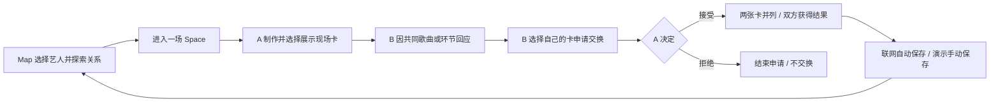

# Music Map × Music Space · 初赛产品方案定稿

版本：1.2 · 2026-09-27，对应应用 MVP 0.2.0。当前实现包括 Map、本地情景演示，以及 Node.js 24 + SQLite 支持的真实独立会话换卡；前端代码在 `web/`，服务在 `server/`。0.2.0 已完成构建和两个独立浏览器会话的核心换卡实操，新视觉继续收尾，尚未部署上线；实际检查证据见[任务记录](../../docs/PROJECT_STATUS.md)。此版取代旧 v0.3 整合方案，历史资料继续留档。

## 1. 一句话定位

**沿音乐认识新的声音，在同一场现场遇见有共同记忆的人。**

Music Map 用艺人和作品之间的关系组织发现；Music Space 面向音乐现场社交，以现场卡作为开口和交换的对象。两者共享艺人、歌曲和活动上下文，组成一款产品。

### Space 的准确含义

一位观众记录了舞台，另一位记录了人海。他们因为同一首歌、返场或合唱时刻看见彼此，回应、申请换卡，经对方同意后交换各自选择的现场卡，把另一种视角带回个人档案。

“先做自己的现场卡”让没有遇到合适对象的人也能获得价值；互动可以由用户跳过。**产品本身仍须展示现场、他人、回应、双方同意与交换结果。** 私人档案负责保存这些结果。

依据：原始[双 App 方案](../../references/original-ideas/Music_Space_vs_Music_Map_双App原型与参赛决策_44页.pdf)第 5、13—15、19 页，以及[《同场》方案](../../references/original-ideas/同场_完整产品设计与团队执行方案_60页.pdf)第 3、10、21—25、54 页。原方案的“先个人价值”描述的是进入顺序，上一轮将其缩成私人唱片馆的做法已撤回。

## 2. 本次整合怎么成立

### 主流程：音乐 → 同场 → 交换 → 继续发现

1. 用户从 Map 选择已收录艺人，沿有具体作品依据的关系探索。
2. 在关联艺人或歌曲处，进入一场明确标识的活动 Space。
3. 选一张现场图、一首歌或现场环节，写一句感受，形成自己的现场卡；本轮联网模式只选用两张预置图片。
4. 看见同场另一位参与者的卡；共同点来自相同歌曲或环节，有文字解释。
5. 选择自己的卡发出交换申请，对方独立接受或拒绝。
6. 接受后并列显示两人的不同视角；联网模式自动保存双方各自的纪念记录，并可下载双联票 PNG，从卡中的音乐回 Map 再探索。本地情景演示仍由当前角色点击保存。

Space 也提供直接入口，现场观众不必先走完 Map。Map 的日常探索历史仍留在“我的记录”，不自动变成到场经历，也不自动拿去社交。

## 3. 初赛的最小范围

初赛只需讲清 **一场活动、两位参与者、每人一张卡、一项共同音乐选择、一次双向交换**。演示实现方式见[交付方案](02-delivery-plan.md)。

| 必须表达或实现 | 定稿要求 |
|---|---|
| Map 探索 | 搜索已有起点、可旋转的关系图、连续切中心、可解释的关系依据 |
| 原有挑战 | 用户自选起终点；只沿合作；无时限、无步数上限；显示实际 X 步 |
| 本场 Space | 一场明确活动、同场内容与歌曲 / 环节共同点；使用示例场次时明显标识 |
| 现场卡 | 一张图、音乐或环节、≤80 字感受、场次、作者；每人在每个房间一张，可预览、展示或撤下 |
| 回应与交换 | 发起、待回应、接受、拒绝、取消；说明具体交换哪两张卡 |
| 结果与记录 | 接受后形成双联现场记忆；联网自动保存双方记录，可返回查看、删除自己的记录、下载票根 PNG |
| Map / Space 衔接 | 场次里的艺人 / 歌曲可回 Map；探索历史和现场经历分开 |
| 在线交互 Demo | 评委能打开并操作核心流程；本地情景演示与真实会话房间明确区分，虚构场次和数据明示 |

MVP 0.2.0 的真实房间采用匿名会话、6 位邀请码、最多 24 人。浏览器保存身份凭据，SQLite 保存成员、卡片、申请快照和个人纪念记录；只提供一场虚构活动。静态单 HTML 保留为本地情景演示的交付方式，不承载共享状态。

暂不排入初赛：手机号注册与账号找回、私聊、好友关系、关注流、票务、实时定位、蓝牙匹配、跨平台歌单同步、海量曲库、模型训练、模型权重下载、多款封套、排行和复杂商业后台。联网模式不上传个人照片。

新版保留风格模式作为示例标签探索，明确区分合作依据与风格标签；当前曲目与关系均为虚构演示数据。接入真实内容时逐条核对依据。路线封套降为可选视觉增强。

## 4. 核心规则

### 4.1 Map 规则沿用

- 用户自行选择起点；未收录只能说明当前范围，不宣称艺人不存在。同名实体用稳定 ID 区分。
- 中心艺人可展开作品，邻居可成为新中心；拖动、打开面板和看作品不增加移动。
- 所有合法邻居都有可访问入口；可以配合图下文字列表，不把必经路径永久藏在背面。
- 合作连接保留作品、版本与双方角色。标签相近不成为合作事实；示例虚构图与真实数据明确区分。
- 挑战只沿本局合作图移动；步数等于当前有效路径的边数，不声称最短。
- 起终点相同不能开局；当前图谱不可达时先提示并保留选择，不将未收录误说成现实无合作。挑战固定本局图谱版本。
- 中途退出保存未完成状态、目标与有效路径，可继续原局；到终点后才标为完成，展示最终有效路线。再次挑战新建一局，不覆盖原漫游。
- “返回上一位”撤销当前路径一段；“回起点”重置路径，挑战中先确认。主动沿边走回旧艺人仍算新移动。
- A→B→C，返回 B 再到 D：当前路径 A→B→D；漫游回顾保留实际分支，不能画成 C→D。
- 主动留下的曲目与浏览、播放分开。回退不删除已留下内容；移除可撤销。继续原记录与新建探索分开。
- 漫游与挑战分开保存；进入挑战后可恢复原漫游，重复保存更新同一条记录。

### 4.2 Space 规则

- 初赛围绕一个活动展开，不从每个艺人节点自动生成社区。活动关联艺人是明确数据关系，不靠临时猜测。
- “我也在”是用户自述；“我也喜欢”表达对音乐的兴趣，不表示到场。照片也不作为到场验证。
- 用户选择展示某张卡，才让它出现在当前房间成员的展示区域；“公开”仅指房内可见。个人所有照片和档案不会自动公开。未展示的自己的卡也可用于定向申请，仅向指定接收者提供该次快照。
- 共同点显示为具体的“同选一首歌 / 同选返场”等理由，不编造契合度分数。
- 交换必须指向两张确定的卡。发送时校验双方卡片版本；确认期间任一卡改变，先提示查看新版，不默默替换对象。申请保存当时的两卡快照，之后编辑不改写这次申请。
- 只有指定接收者能接受或拒绝，只有发送者能取消；不能与自己交换。撤下卡或离开房间会取消相关待回应申请，已接受的快照保留。对方未同意时不显示已完成。
- 接受仅表示本次卡片交换，不自动成为好友、开启私聊或互相披露联系方式。
- 用户可独自做卡并保存，不被迫交换。联网接受操作会一次性保存双方各自的私有纪念记录；删除自己的记录不删除对方的副本。拒绝后可以继续看本场内容，不设计羞辱性反馈。
- 本地情景演示使用同一浏览器的示例角色，交换后手动保存；真实联网使用独立会话，服务端检查成员与操作权限。两种模式的身份和记录互不迁移，不把切换示例角色说成真实双端。
- 退出房间会撤下自己的卡并取消相关待回应申请；已有纪念记录保留，重新凭邀请码加入后可查看。匿名凭据没有账号找回能力，清除浏览器数据后无法恢复原身份；新会话不自动获得旧记录。

## 5. 页面结构

| 页面 | 用户首先看到什么 | 主要动作 |
|---|---|---|
| 探索首页 | 一句定位、起点搜索、实际可用的艺人 | 开始 Map；直接进示例 / 实际 Space |
| Map | 当前艺人、少量清楚的关系、作品依据 | 继续探索、留下音乐、挑战、进入关联 Space |
| 本场 Space | 活动标题、共同歌曲 / 环节、精选现场卡 | 做自己的卡、看另一视角、回应 |
| 制卡 | 预置图与卡面预览；本地演示另可选择本机照片 | 选音乐或环节、写话、决定展示 |
| 交换确认 | 对方卡、自己将交换的卡、申请状态 | 发起 / 接受 / 拒绝 / 取消 |
| 交换结果 | 两人的不同视角并列、具体作者和场次 | 联网已自动保存，可下载票根；本地演示手动保存，从音乐再出发 |
| 我的记录 | 探索记录和现场记忆分别显示 | 打开、继续探索、删除自己的记录 |

## 6. 艺术方向：动态排版主导的当代音乐节视觉

**用户于 2026-09-27 明确：“优秀的视觉包装是我们项目能否成功的根本”。** 本项目把视觉包装作为核心成功标准，为品牌辨识度、构图、摄影、排版和关键动效安排主要设计精力；功能取舍与交付材料围绕这一标准展开。

**主风格已选定：动态排版（Kinetic Typography）。** Op Art（光学艺术）的波纹、重复线条与干涉图形作为辅助；现场摄影与纸张质感作为卡片材料。Map、Space、双联记忆、封面和视频共用这套语言。

| 元素 | 决定 |
|---|---|
| 基础色 | 深墨 `#0C1016`；浅字 `#F2F5F7`；海沫绿 `#70DDCF`；珊瑚色 `#FF7E59`；卡片暖纸白 `#F2EFE7` |
| 排版 | 艺人名、场次名和交换结果承担视觉重点；大标题与精确信息网格形成层次，首先保证中文内容成立 |
| 中文与操作 | 中文保留字形，标题以整行位移、重排或裁切出现表达节奏；正文、关系依据和按钮稳定可读；主要触控区域 44—48px |
| Map | 可读的中心艺人与邻居、明确的关系线和克制纵深；光学图形辅助关系展开，避开名称、依据与操作区 |
| Space | 现场照片占主角，场次、歌曲和短句使用统一排版；纸张质感集中于现场卡和封套 |
| 交换结果 | 两张照片保留各自作者与文字，组成双联票根；双方确认后两组辅助线条短暂交叠，形成共同印记 |
| 动态节奏 | 每屏一个主要动态焦点，优先用于进入、切换与完成；一次关键转场先按 300—500ms 设计，普通阅读时保持安静 |

### 先完成一张标志性画面

先打磨 **“交换成功后的双联记忆”**，让照片、中文标题、共同音乐、两位作者与保存操作形成完整构图。再把其中的字体、颜色、线条和运动规则延伸到 Map、Space 首页与比赛封面。第一轮不再并行扩展多套主风格。

重点打磨三个时刻：**关系展开 → 自己的照片成为现场卡 → 双方确认后两张卡合成同场记忆**。减少动态效果时直接展示结果；只有实际接受后才出现交换完成画面。当前未接音频，光学纹样不称为真实频谱。

### 设计参考与状态

参考 Studio Dumbar 的 [North Sea Jazz](https://studiodumbar.com/work/north-sea-jazz) 的动态排版、COLLINS 的 [San Francisco Symphony](https://wearecollins.com/case-studies/san-francisco-symphony/) 的字体表现力，以及 Pentagram 的 [Resonate](https://www.pentagram.com/work/resonate) 的网格与符号一致性。借鉴方法，项目使用自己的文字、图形与素材。

MVP 0.2.0 的 Map、Space、联网房间与双联结果页已完成统一视觉。已查看桌面主要画面、下载的双联票 PNG，以及修复横向溢出后的390×844手机票根；这不替代实体手机验收。94秒演示视频与独立16:9封面已导出，完成记录见任务记录。v0.3 私人唱片馆概念图继续保留在历史归档，原始双 App 与《同场》资料作现场社交参考。

## 7. AI、数据与音频的边界

比赛允许 AI Coding。当前方案采用 AI 辅助产品梳理、界面制作和开发，提交材料如实说明实际使用；不为参赛额外安排本地模型或在线推理。模板排版、按共同歌曲匹配、基于事实的关系查询可以用普通程序实现。

Hugging Face 调研保留作历史研究，不是当前必须下载的清单。当前 Map 使用明确标识的虚构艺人、曲目和关系，真实合作元数据尚未接入。Space 使用虚构场次、两张 AI 生成现场图和歌曲 / 环节标签；生成记录与开源图标许可见 [THIRD_PARTY_NOTICES](../../THIRD_PARTY_NOTICES.md)。

音频不是官方统一必交项，也不是现场交换成立的前提。若做 Map 试听，播放按钮必须接真实资源；没有资源时清楚说明未接入，或暂不显示播放操作。音频的选择不阻止先完成社交交互 Demo。具体交付与素材范围见[交付方案](02-delivery-plan.md)。

## 8. 比赛价值与停止扩张的标准

产品需要证明两件事：用户为什么愿意沿关系多走一步；为什么另一位同场观众的一张卡值得交换。视觉服务于这两个动作，不能独自证明用户价值。

先让少量目标用户走通演示，观察是否理解共同点、交换对象和双方同意，再问是否愿意保存另一视角。若只夸画面而不理解交换动机，先改场景与卡片内容。试用尚未开展，不填获奖概率、留存率或虚构满意度。

此版冻结 MVP 0.2.0 范围。联网核心路径已有必要实操证据，下一步收尾新视觉，准备定向评审访问、用户试用、视频与封面；新的模型、社区和海量数据构想不进入本轮主线。视频、封面和报名工作稿统一放在[参赛材料](../../docs/competition/README.md)，正式发布与提交状态另记。
