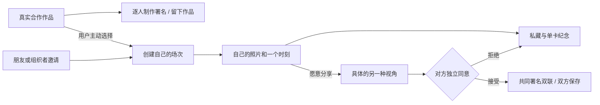

# Music Map × Music Space · 初赛产品方案定稿

版本：2.6 · 2026-09-27，对应应用 MVP 0.15.0。唱片店改为寻声一局（翻唱片找关联、分级提示、揭晓、连线歌单）与完整图鉴；本轮同时把小院改为夜场、补上首屏价值主张，并为双方同意的交换加入全屏仪式页。构建、实际画面和交付状态统一见[任务记录](../../docs/PROJECT_STATUS.md)；0.14 及更早证据保留原范围。

0.15 是视觉整改。用户原话：“优秀的视觉包装是我们项目能否成功的根本”，“这个找关系的玩法应该是探索性的，不是把结果全贴出来给用户了”。「樱下放映」由晴天午后改为傍晚到夜场演出，并冻结为最终美术方向；首页首屏先讲「同一刻，另一面」和交换三步；唱片店不再默认铺开完整网络，也不直接高亮最短链；双联改为全屏夜场仪式页，PNG 改为夜场票根；正文不小于 14px，辅助文字不小于 12px。本轮实际检查见项目状态。

## 1. 一句话定位

**同一刻，另一面。散场以后，用另一位观众的视角，补完整你记住的那一晚；走进唱片店，一张张翻开合作唱片，找出两位歌手之间隔着几首歌。**

Music Map 提供可追溯的真实合作精选、逐人制作署名与独立开放曲库；Music Space 面向同场观众，用自己的一张照片、一个时刻和一句话作为交流对象。比赛主叙事以Space的现场交换为核心，Map提供可选音乐入口。音乐探索和现场记忆各自有直接收益，用户可以单独进入任一入口。Map 的真实艺人不自动挂到虚构活动；创建场次是用户主动填写的独立动作。

### 第一批用户与使用时机

先服务校园演出、小型 Livehouse 或朋友组织的音乐现场，使用时机是散场后、返程前后。由组织者或已有小圈发送同一条邀请，让真实观众、照片与共同场景同时出现。这是当前选定的产品假设，尚无用户试用结论；不把陌生人供给设为启动前提。

### 为什么不直接在群里发照片

群聊和共享相册已经能收集照片。Space 增加的是一次有对象、有回应的共同纪念：**共同瞬间解释为什么相遇，不同视角解释为什么交换，双方确认让双联保留两位作者的意愿。** 已经展示的照片可以被看见或截图，交换不宣称解锁照片或防止复制。如果用户只想收齐照片，共享相册更直接。

研究与取舍依据：[官方复核](../../references/research/2026-09-27/competition-review.md)、[六组产品与两份开源研究](../../references/research/2026-09-27/social-product-review.md)、[音乐发现与开源实现](../../references/research/2026-09-27/music-discovery-review.md)。没有把任一单项机制宣称为首创。

### Space 的准确含义

一位观众记录了舞台，另一位记录了人海。他们因为同一首歌、返场或合唱时刻看见彼此，回应、申请换卡，经对方同意后交换各自选择的现场卡，把另一种视角带回个人档案。

“先做自己的现场卡”让没有遇到合适对象的人也能获得价值；互动可以由用户跳过。**产品本身仍须展示现场、他人、回应、双方同意与交换结果。** 私人档案负责保存这些结果。

依据：原始[双 App 方案](../../references/original-ideas/Music_Space_vs_Music_Map_双App原型与参赛决策_44页.pdf)第 5、13—15、19 页，以及[《同场》方案](../../references/original-ideas/同场_完整产品设计与团队执行方案_60页.pdf)第 3、10、21—25、54 页。原方案的“先个人价值”描述的是进入顺序，上一轮将其缩成私人唱片馆的做法已撤回。

## 2. 本次整合怎么成立

两条路径共用品牌和记录入口，音乐探索不是现场换卡的必经步骤。

- **发现音乐**：进唱片店默认开一局寻声。开局只知道起点和终点，在所在歌手处逐首翻开合作，再沿边前往；找到终点后得到连线歌单，可以把歌留入音乐收藏或带到现场。完整图鉴需另行打开，可在其中选艺人、点关系线看作品与署名；开放曲库单独搜索。共同署名与已核实制作名单分开，未收录不等于现实中不存在。
- **留住现场**：首页记录现场 → 创建场次／凭邀请加入 → 选自己的照片、时刻与视角 → 私藏并可导出单卡 → 邀请朋友、主动展示或向一人申请 → 接收者独立同意 → 双方在个人收藏回看双联。
- **可选衔接**：作品的「带到现场」只把歌名预填进一个新场次，用户可修改；不改现有房间，不推断艺人到场。Space 用户可返回刚才的探索，独立音乐收藏不随路线回退而消失。

## 3. 当前最小范围与主动舍弃

一次核心展示只讲清：**一场用户命名的活动，两位独立参与者，两张自己选择的照片，一个具体时刻，一次双向同意。** Map 提供另一条可独立完成的音乐发现路径。

| 保留或新增 | 用户得到什么 |
| --- | --- |
| 真实合作精选与来源 | 12 位艺人、13 份合作录音、13 条共唱边与 2 个独立回路；看见每个已核实的演唱与制作工种 |
| 寻声与完整图鉴 | 默认从起点逐张翻开合作唱片，直到找到终点；可用分级提示，也可揭晓，抵达后得到连线歌单。完整图鉴由用户主动打开，查看与行走分开 |
| 独立开放曲库 | 从完整 HF 元数据中整理 120 首共同署名作品供搜索，不推断制作工种 |
| 独立音乐收藏 | 真实精选与 HF 歌曲单独存于本机，可从收藏带歌名到新场次 |
| 示例图谱与本地双角色 | 一个人也能完整了解产品，旧记录仍可打开 |
| 自定义场次、邀请码／二维码 | 朋友或小型活动小圈进入同一个具体场景 |
| 一人一张现场卡 | 自己的照片、时刻、舞台／人海／身边／细节视角；感受可留空 |
| 明确的可见范围 | 默认私藏；主动展示到房内，或只向指定接收者发送申请 |
| 透明的选人理由 | 相同环节、共同歌名、不同视角；仅从填写的信息解释，无契合度分数 |
| 双联仪式页与 PNG | 单人也能留下纪念。交换经双方同意后，全屏展示两位作者的双联票根；单卡和双联都可保存为夜场票根 PNG |
| 本人主页与跨场次收藏 | 首屏说明「同一刻，另一面」与交换三步，并展示本人卡；离场后仍可回看自己的卡与双联，示例独立 |
| 记录与版本快照 | 修改当前卡不改写交换快照；本人删除自己的双联不影响对方 |
| 樱下放映 · 夜场 | 同一个三渲二夜场小院贯穿入口、探索、制卡、回看与 PNG，照片和作者保持清楚 |

MVP 使用匿名身份、6位邀请码、最多24人和单实例 SQLite。新房间可填写活动名、日期、地点和共同歌名；后面三项可留空。自填信息与加入房间都不构成到场认证。用户选择的照片存到当前服务的私有数据库，照片不会因上传自动对房内公开；本地情景照片继续只在当前浏览器中保存。

**本轮主动舍弃：** 全城附近的人、开放广场、好友／私聊、票务、手机号账号与找回、自动到场认证、商业全量曲库服务、歌单账号授权、抓取音频、下载模型权重、AI匹配分数、通用活动相册、复杂主办方后台。二维码只编码当前邀请链接，不调用外部二维码服务。

不增加模型推理：官方公开口径允许AI Coding，现有的共同点判断用普通程序即可。AI使用按实际开发与素材制作过程说明，不把规则排序包装为音乐智能。

## 4. 核心规则

### 4.1 Map 规则：寻声与完整图鉴

- 寻声只用当前数据集的共同演唱边，不新增边。默认题组固定，「换一组」按固定顺序轮换，演示可以复现。真实精选依次为费玉清→邓紫棋（默认）、张惠妹→孙燕姿、袁咏琳→萧敬腾、杨瑞代→金莎、蔡卓妍→费玉清；情景示例依次为乔屿→许岸、陆遥→许岸、林间→南枝。出题时再校验一次：两端在本专题内至少隔 2 首。用户也可以在目录里自选起终点。未收录只说明当前范围，不宣称艺人不存在；同名实体用稳定 ID 区分。
- 进入唱片店默认开一局寻声。桌上只正面显示起点、终点和已认识的艺人；其余唱片背面朝上，不显示名字、作品与连接。桌上只画已翻开的合作。布局与完整网络相同，不因选择或翻开而重排。完整网络收在目录的「完整图鉴」里，入口注明会显示全部合作。场景唱片、投影标签、手牌与 WebGL 不可用时的二维图，都使用同一组节点、边、位置和可见性。
- 已认识的艺人包括：起点、终点、走到过的艺人（含退回过的岔路），以及已翻开合作的两端。终点正面朝上并带「终点」签，但它的合作仍封着，不能从终点倒推。点背面唱片不会选中它，只提示「这张还盖着」。读屏只播报一句汇总，说明已认识几张、还有几张盖着。
- 图鉴中任意艺人都可选中查看；寻声中只能选中已认识的艺人，也只看得到其已翻开的合作。只有在所在艺人处翻开某首合作，再沿这条边明确「前往」，才增加一步。翻开、提示、拖动、缩放、看作品和选人都不计步。未翻开的边不能前往，也不能从任意选中对象直接跳到终点。
- 所在艺人的全部合作都列在手牌中。未翻开时只显示歌名，不显示合唱者、版本、署名或外链；翻开后显示合唱者、版本与来源。所有合法邻居都能从手牌翻开并前往，不把必经路径永久藏在背面。翻到终点、翻到来过的艺人时，各有一句提示。手牌全部翻完、唯一邻居是来路且不是终点时，提示这是死胡同，请退一步换条路。
- 泄题约束：寻声进行中，搜索、艺人、连接、作品各面板、二维 DOM、读屏文字、三维封面和投影标签，都只读同一个可见集合。答案在翻开、提示或揭晓之前不出现。逐人署名表会列出担任录音、作词等工种的其他图中艺人，因此局中关闭署名表，抵达或揭晓后在连线歌单中开放；署名按来源原样列出，非演唱署名不表示合唱。
- 图鉴中点关系线，打开相应录音、逐人署名与来源；沿边移动后显示该边的作品或风格依据。合作与风格含义分开，标签相近不写成合作事实。
- 合作连接保留作品、版本与双方角色。标签相近不成为合作事实；示例虚构图与真实数据明确区分。
- 13 份真实合作录音按作品记录各人的演唱、词曲、编曲、制作等已核实分工；来源跟随具体工种。2020《稻香 / Stay With You》联唱作为一份特定现场节目收录，不把原录音室版改写为合唱。未列出不表示未参与，图中的共同演唱边不扩展成制作合作边。
- “开放曲库”是独立的 120 首 HF 元数据搜索入口，不混入寻声或图鉴。`artists` 共同署名不自动推断谁演唱、作词、作曲或制作。
- 「找关联」不直接给出结果。用户可以在图鉴中选中一位艺人，点「和 TA 隔几首？」；也可以在目录自选起终点。两种方式都开始一局寻声，开局前不透露距离。提示分三级，写入本局记录，不计步：
  1. 还隔几首：从所在位置到终点，在本专题收录范围内最少还隔几首，以及面前有几首会更近。此后每次前往盖一个「近 / 远 / 平」章，用文字字形表达，不只靠颜色；退回时不盖章。
  2. 往哪翻：标出所在位置的一首合作，它位于一条最短路线上。只露方向，不露合唱者；同一位置重复点击不重复计次。
  3. 揭晓：也可以随时从目录的「放弃并揭晓」进入。确认后以虚线展示本专题中的一条最短路线，本局记为「已揭晓」，不计为抵达；已翻开的唱片和用户路线都保留。

  “最短”只指当前收录范围，用户路线不声称最短。
- 寻声只沿本局合作图移动；步数等于当前有效路径的边数；到达终点是唯一的完成条件。抵达后整桌翻开，路线依次描成金色，再以「连线歌单」回顾。歌单标题回答开局的问题：「A 与 B，隔着 N 首歌」，N 是本专题最短步数。歌单按顺序列出每首作品的版本、来源与署名入口，并列出有效步数、本专题最短步数、翻开首数、认识人数与提示次数。存在另一条同样短的路线时，放在折叠项里。揭晓时标题为「最少隔着 N 首歌」，并写明用户停在哪一位；用户自己走过的路线保持实线。
- 抵达或揭晓后的局只读：不能再翻开、提示、前往、退回或回起点。仪式可跳过；减少动态时直接显示结果并打开歌单。WebGL 不可用时，播放约 1.8 秒、可跳过的二维仪式。连线歌单的「留下这 N 首」把真实曲目逐首存入独立音乐收藏：已留下的跳过，示例作品只存进本局记录。每首歌都可以单独「带到现场」。注脚写明：路线只来自本专题已核实的共同演唱录音，“最短”仅指本专题收录范围。
- 起终点相同不能开局；当前图谱不可达时先提示并保留选择，不将未收录误说成现实无合作。寻声固定本局图谱版本。
- 中途退出时保存目标、有效路径、已翻开的合作与提示，可以继续原局；迷雾、手牌和提示原样保留。已抵达与已揭晓的局都不能再继续或返回，只能回顾。再开一局会新建记录，不覆盖图鉴或原局。探索记录显示「寻声 · 进行中 / 已抵达 / 已揭晓」，以及翻开首数与提示次数。
- “返回上一位”撤销当前路径一段；“回起点”重置路径，寻声中先确认。主动沿边走回旧艺人，仍算一次新移动。寻声中退回，不收回已翻开的合作与已认识的艺人。
- A→B→C，返回 B 再到 D：当前路径是 A→B→D；回顾保留实际分支，不能画成 C→D。
- 完整图鉴的页头显示「你已亲手翻开 m/13 首合作」。这个数字按本数据集所有寻声局已翻开的合作取并集，只作为进度文字，不改变可见性。
- 真实精选与 HF 曲目主动留下后，进入独立的本机音乐收藏，保留作品来源与数据集；不依赖路线步数或播放。收藏或取消后保留视角、焦点和滚动位置，计数同步更新。取消收藏不删除探索历史，虚构示例不并入真实收藏。
- 「带到现场」只预填新场次的可编辑歌名；日期、地点与场次名称由用户填写，不推断演出关联或音频授权，也不悄悄修改已有房间。
- 完整图鉴（原漫游）与寻声分开保存；进入寻声后可以回到原图鉴路线，重复保存会更新同一条记录。
- 兼容迁移只做一次：旧数据中从未走过、也没有留下作品的默认漫游，换成默认寻声局；已走过的漫游，以及没有迷雾的旧挑战，都原样保留，旧挑战仍显示全网。翻开、提示与揭晓状态随原 Map 本机存储保存，不新增存储键，不改服务端。
- 从 Map 进入 Space 时记住原探索。返回时继续该记录和路径；“从现场艺人新开探索”另建路线，不悄悄覆盖原探索。

### 4.2 Space 规则

- 每个房间围绕一个由创建者命名的活动，不从每个艺人节点自动生成社区。真实Map与场次没有自动关联；旧回声现场保持示例标识。
- “我也在”是用户自述；“我也喜欢”表达对音乐的兴趣，不表示到场。照片也不作为到场验证。
- 用户选择展示某张卡，才让它出现在当前房间成员的展示区域；“公开”仅指房内可见。个人所有照片和档案不会自动公开。未展示的自己的卡也可用于定向申请，仅向指定接收者提供该次快照。
- 共同点显示为具体的“同选一首歌 / 同选返场”等理由，不编造契合度分数。
- 交换必须指向两张确定的卡。发送时校验双方卡片版本；确认期间任一卡改变，先提示查看新版，不默默替换对象。申请保存当时的两卡快照，之后编辑不改写这次申请。
- 只有指定接收者能接受或拒绝，只有发送者能取消；不能与自己交换。撤下卡或离开房间会取消相关待回应申请，已接受的快照保留。对方未同意时不显示已完成。
- 接受仅表示本次卡片交换，不自动成为好友、开启私聊或互相披露联系方式。
- 用户可独自做卡并保存，不被迫交换。联网自己的卡支持单卡PNG；本地自己的卡可单独收藏。本地新交换与联网交换接受后，双方各自自动获得一份纪念记录。删除自己的记录不删除对方副本，拒绝不产生羞辱性反馈。
- 联网制卡分「选照片」「留一句」两步，同一表单保留所有输入；新卡先选照片，旧卡直接进入短句编辑。环节与歌名收在「更多细节」，私藏／展示和保存结果保持可见；切换步骤不保存或公开。同一现场页面内关闭再开编辑器，照片、短句、可见范围和步骤继续保留，修改后提示“草稿未保存”；保存成功或换到另一房间才清理。草稿不写浏览器存储，不承诺刷新或切页后恢复。
- 已接受的交换与已保存的双联，都以全屏夜场仪式页呈现。三个入口共用这一页：真实房间接受后、收藏页翻开、本地示例接受后。当前浏览器第一次看到某个交换时，完整首映：两半照片从两侧合拢，中缝闪光，存根展开，「双方同意」印章落下。再次打开时只做简短回看；减少动态时直接显示终态。只有真实已接受或已保存的交换会进入这一页，申请、拒绝与取消不出现成功画面。主按钮是「保存双联图片」，次按钮是「返回现场」（本地回看为「返回示例现场」）；其余入口为弱链接，删除最弱。“看过”的记录只存在当前浏览器，只决定播放首映还是回看。换浏览器或清除站点数据后，会再首映一次；浏览器存储不可用时直接回看。
- 存根上的共同线索，页面与 PNG 用同一条规则：两张卡都带同一首歌时，显示共同歌名；否则，两卡为同一时刻时显示这个时刻；再否则显示场次。
- PNG 为 1600×1800 的夜场票根。双联保留两位作者、「AI 生成示例照片」标记和「双方已同意共同署名」；本地情景的页脚写明角色、现场与歌曲为虚构。单卡使用「我的现场卡」版式。生成后打开实际成品预览，可再次下载或在手机上长按保存；支持文件分享的浏览器提供「分享图片」，仅由用户主动点击触发。预览与下载不改变房间或交换状态。
- 本地旧版已接受却未保存的交换仍可手动保存，不自动回填历史。当前两张卡版本已有完成交换时，打开已有双联，不重复申请；修改卡片版本后才构成新的交换对象。这条复用规则适用于本地情景演示。
- 普通首页展示当前匿名身份自己的卡，「记录我的现场」或工作桌进入真实制卡，「邀请朋友」有当前房间时直接展示邀请，没有房间时进入昵称、创建场次，再展示邀请码；首页提供邀请码入口，在入场页填写并确认加入。没有本人卡时预置图明确标为示例；「体验示例」才进入本地双角色。没有地址片段时直接打开首页，浏览器返回空地址片段也回首页，不恢复到旧页面。
- 场景只展示自己和当前有权读取的卡片；私藏同伴卡不进入照片墙。联网模型只使用原权限接口已加载的 blob，退出或撤权时清除；视觉切换和拍近照片不等于公开、保存或同意交换。
- 本地情景演示在一个浏览器切换示例角色；真实联网由独立会话操作，服务端检查成员与权限。两种模式的身份和记录互不迁移，不把角色切换说成真实双端。
- 联网空态区分“尚无朋友加入”和“朋友已加入但还没有展示卡”。首次保存后按房间状态提供邀请朋友、看同场卡片或主动展示，并可下载单卡、去个人收藏；保存私卡不自动公开。
- 退出房间会撤下自己的卡并取消相关待回应申请。本人当前卡和已保存双联仍可从跨场次收藏读取；只有本人可删除自己的双联。回到已离开的场次只预填邀请码，由用户主动加入后继续房内操作。匿名凭据没有找回能力，清除浏览器数据后无法恢复原身份；新会话不自动获得旧记录。收藏的“双联”为空且仍在某个现场时，主入口回到该现场换卡；身份失效时提供重新入场入口，并说明新身份不能带回旧记录。

## 5. 页面结构

| 页面 | 用户首先看到什么 | 主要动作 |
|---|---|---|
| Space 首页 | 夜场小院上的首屏：「同一刻，另一面。」、一句承诺与交换三步（回访用户不显示三步）；近期本人卡。尚无卡时示例有标记，并注明照片默认私藏、双方同意才交换 | 记录现场、邀请朋友、输入邀请码、继续场次；单独体验示例 |
| 本地示例 | 简短标题、返回首页、角色切换与两张卡 | 制卡、展示、申请、换角色回应、打开记忆 |
| Map | 樱花纸桌上的寻声局（题签、背面唱片、终点签、手牌）与完整图鉴，唱片位置稳定 | 翻开、前往、分级提示、揭晓、连线歌单；图鉴中选人、点线看作品与来源、和 TA 隔几首；缩放拖动，收藏作品或带歌名建场 |
| 联网房间 | 场次票签、自己的照片托盘、可展开同场目录与待回应申请 | 留照片、邀请朋友、换卡；“本场”菜单收起换房与离开 |
| 制卡 | 工作纸上选照片、留一句；更多细节折叠，保存栏说明可见范围 | 两步间保留输入，选视角、写话、决定展示；本地示例保留原编辑器 |
| 交换确认 | 对方卡、自己将交换的卡、申请状态 | 发起 / 接受 / 拒绝 / 取消 |
| 交换结果 | 全屏夜场仪式页：两人的不同视角并列，作者、场次、共同线索存根与「双方同意」印章 | 新交换已自动保存；首次看到时首映，之后回看；保存双联图片、返回现场，支持时主动分享；其余入口为弱链接，删除最弱 |
| 我的收藏 | 店内纪念册，默认我的现场；分类为轻量下划线标签，筛选为胶囊，包含音乐、路线和示例 | 翻开双联进入仪式页回看、下载、继续场次或主动重入、删除本人双联、管理音乐、继续探索 |

顶部保留品牌，一套空间导航通向小院、唱片店、照片墙和收藏。夜空上的品牌与导航使用奶油色字和深色玻璃。唱片、票签、托盘、纪念册与对话内页共用暖纸、细墨线、纸角和短索引，纸件带夜间灯光阴影。照片、唱片和下一步动作占据主画面，说明放在相关操作处：保留私藏／展示、交换对象、双方同意、来源与 AI 图片标记。正文不小于 14px，辅助文字不小于 12px。长表单可以正常滚动，不为凑满一屏裁掉内容。

## 6. 艺术方向：樱下放映 · 夜场

**用户于 2026-09-27 明确：“优秀的视觉包装是我们项目能否成功的根本”。** 各版本的演进：0.11 确定只留樱下放映，0.12 统一小院物件语言，0.13 在同一樱花纸桌上呈现完整网状关系，0.14 按纸件占位安排镜头并收起次要内容。0.15 把小院从晴天午后改为傍晚到夜场演出，并将「樱下放映 · 夜场」冻结为最终美术方向，后续只做打磨，不再换方向。运行界面与 PNG 使用 `sakura`；声浪现场、独立刊物及主题切换保留为历史。艺术规范见 [VISUAL_THEMES.md](../../docs/VISUAL_THEMES.md)。

| 元素 | 决定 |
| --- | --- |
| 色彩与材质 | 夜空靛紫（theme-color `#23214a`）、地平线暖辉、串灯琥珀、暖纸、樱粉与鼠尾草绿。夜空上用奶油色字和深色玻璃导航，纸件带夜间灯光阴影，焦点环为琥珀色。WebGL 不可用时回到浅纸深字 |
| 场景 | 一个夜场小院：月光是唯一投影光，另有店内暖光、两组串灯、舞台 par 灯与光束、亮窗远屋和自发光的夜樱。唱片店、照片墙、工作桌和店内收藏相互连通，按纸件与弹窗的实际占位为主体取景 |
| 排版 | 首屏大字「同一刻，另一面。」、一句承诺与交换三步；其余为紧凑中文标题、短标签和作者署名。正文不小于 14px，辅助文字不小于 12px；照片与下一步动作占主画面 |
| 操作层 | 场次票签、封套内页、工作纸和纪念册共用纸角、墨线与索引；说明只放在用户需要决定的位置 |
| Map | 唱片默认背面朝上，摆在常驻场景的纸桌上，探索机位由桌灯照亮。翻开时封套翻正、墨线生长；抵达时整桌翻开、路线逐段描金，揭晓用虚线。连线歌单与双联票根共用纸张与票条语言。主控件不超过 3 个，其余收进目录；翻面与仪式可跳过，减少动态时直接显示结果。完整图鉴保留全部关系网 |
| Space | 场景照片、票签和照片托盘承载现场，工作纸承载制卡，纪念册承载收藏；示例、作者、可见范围与待回应明确 |
| 交换结果 | 全屏夜场仪式页：两半照片从两侧合拢，中缝闪光，存根展开，「双方同意」印章落下；回看时简短。页面与夜场票根 PNG 共用虚线中缝、存根和印章 |
| 动效 | GSAP / Flip 管卡片和弹窗，镜头和抬卡可被下一次选择打断。首次挂载时有不超过 1.4 秒的开场亮灯；灯的数量在运行期固定，只补间强度。寻声翻面、描金与双联首映都可跳过；减少动态时直接显示结果 |
| 滚动 | 页面使用自动隐藏的细浮动条；窄纸面弹窗保留原生滚动，短屏制卡与创建表单可滚动到末尾动作 |

构图变化度 / 动态强度 / 视觉密度采用 `(7,4,3)`，范围为 1–10，表示设计取舍，不作为质量或性能评分。内容丰富度来自真实照片、朋友的不同视角、场次和收藏成品，避免增添说明模块来填满空间。

### 同一空间里的功能

`#sakura-world` 保留一个常驻 Three.js 场景，跨路由切换机位：`home` 小院全景、`explore` 唱片关系桌、`live` 照片墙、`editor` 工作桌、`records` 店内收藏、`photo` 选中照片。手机使用独立镜头。寻声中，背面唱片不可选中；已认识的唱片与投影标签只选中对象，翻开和前往都用手牌中的明确动作。图鉴中，连接线打开录音依据。照片和工作桌打开对应操作；首页不显示照片投影标签。HTML 承载输入、署名、确认与错误反馈，镜头不改变业务状态。场景排布只服务构图，不表示地理位置、音乐相似度或算法评分。

页面与单卡、双联 PNG 使用同一艺术方向。照片、作者和已接受的交换快照不会因视觉整理而改写；场景只展示已有权限的内容。关键时刻有三个：寻声抵达时整桌翻开，自己的照片成为现场卡，双方接受后的双联首映。未接受时不出现成功画面。当前没有音频，光学纹样不称为真实频谱。

### 设计参考与证据

早期音乐节设计参考 Studio Dumbar 的 [North Sea Jazz](https://studiodumbar.com/work/north-sea-jazz)、COLLINS 的 [San Francisco Symphony](https://wearecollins.com/case-studies/san-francisco-symphony/) 与 Pentagram 的 [Resonate](https://www.pentagram.com/work/resonate)，继续作为历史品牌研究保留。樱下放映实际复用 Sakura Crossing 的 MIT `toon.js`、`post.js`、`palette.js`；小院几何、程序纹理与构图由本项目编写。夜场的天空、灯光与调色值写在本项目的 `sakura-scene.js` / `sakura-world.js` 中，上游 vendor 文件未改。固定提交和改动见[源码清单](../../web/js/vendor/sakura/SOURCE.json)，许可见[第三方声明](../../THIRD_PARTY_NOTICES.md)。

0.14 及更早的构建、场景和数据检查保留原范围，不自动成为 0.15 的结果。本轮构建、画面和交付按[项目状态](../../docs/PROJECT_STATUS.md)登记。以下几项均未验证：实体手机、真机双指、读屏软件，以及正常硬件下的仪式与开场亮灯时长。现有 106 秒视频与 16:9 封面仍对应 **0.4.0**，需按 0.15 重制，见[交付清单](../../delivery/README.md)。

## 7. AI、数据与音频的边界

比赛允许 AI Coding。当前方案采用 AI 辅助产品梳理、界面制作和开发，提交材料如实说明实际使用；不为参赛额外安排本地模型或在线推理。模板排版、按共同歌曲匹配、基于事实的关系查询可以用普通程序实现。

已下载 Hugging Face `maharshipandya/spotify-tracks-dataset` 固定 revision `635b034f69257814eff850a5c2b3346fe458134f` 的完整 CSV：114,000 行、20,118,244 B，保存在 `data/external/spotify-tracks-dataset/dataset.csv`。前端只内置 120 首整理后的共同署名作品，不替代人工核实的 13 份合作录音；没有下载音频、艺人图片或模型权重。HF 名字可能同名，共同署名也可能含制作人员，不能自动铺成合唱图。原 10 首见[合作署名记录](../../references/research/2026-09-27/collaboration-roles.md)，新增 3 份录音、回路与 HF 分布见[关系网扩展记录](../../references/research/2026-09-27/vocal-network-expansion.md)，下载范围见[数据记录](../../references/research/2026-09-27/huggingface-download.md)。Space 新房间继续使用用户填写的场次和主动选择的照片，旧情景保留 AI 预置图。来源与许可见 [THIRD_PARTY_NOTICES](../../THIRD_PARTY_NOTICES.md)。

Map 已撤下试听链接；QQ 音乐同版本直达尚未核实，作品来源链接只用于查看署名证据。本应用没有内置音频播放器。Space 的共同歌名是参与者提供的音乐线索，不是识曲或曲库匹配结果。具体交付范围见[交付方案](02-delivery-plan.md)。

## 8. 比赛价值与停止扩张的标准

从用户路径审阅看，自己的照片能成为可带走的纪念物，双方同意后又能保留朋友的另一种视角，已有明确收获。0.11 整理邀请、草稿和回访，0.12 统一空间物件，0.13 补齐稳定全网并分开查看与行走，0.14 处理纸件遮挡主体、常驻内容过多与短屏弹窗拥挤。本轮把视觉改为夜场，首屏先讲清交换价值，并把找关系改为由用户自己翻开的寻声一局。音乐探索没有内置音频，提供的是作品发现、关系依据与收藏。寻声是否比完整网状图更能让观众记住具体合作，需要实际试用后判断。

先让少量目标用户走通演示，观察是否理解共同点、交换对象和双方同意，再问是否愿意保存另一视角。若只夸画面而不理解交换动机，先改场景与卡片内容。试用尚未开展，不填获奖概率、留存率或虚构满意度。

0.4.0 补足真实内容与可操作收益，0.5–0.8 调整视觉、阅读负担与空间，0.9 连接本人主页与收藏，0.10 精简制卡并呈现导出成品，0.11–0.12 统一樱花艺术与页面物件，0.13 形成稳定的完整关系网与真实回路，0.14 让镜头与纸件共同构图，0.15 改为夜场并冻结美术方向，补上首屏主张、寻声一局与双联仪式页。后续是否扩大陌生人社交，取决于少量真实观众能否说出具体交换理由、是否在意双人署名、是否愿意自主回应。建议以6对观众与共享相册／群聊简化基线做一次小样本比较，具体否决条件见竞品研究第9节；这些是团队决策门槛，不是已取得的数据。

真实观众是否愿意交换、是否比群相册多一份纪念价值，以及实体手机和跨设备使用是否顺畅，仍需真实试用。评审部署、目标用户试用、连续操作录像和正式提交分别记实。获奖需要评委判断，当前不填获奖概率或虚构满意度。材料的实际版本见[交付清单](../../delivery/README.md)。
