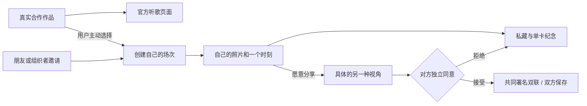

# Music Map × Music Space · 初赛产品方案定稿

版本：1.6 · 2026-09-27，对应应用 MVP 0.5.1。本轮将首页与本地示例分开，精简图谱、房间、记录和外观选择的说明，保留三套艺术方向及既有业务。前端在 `web/`，服务在 `server/`；收尾与实际检查见[任务记录](../../docs/PROJECT_STATUS.md)。旧 v0.3 概念方案不是当前界面目标。

## 1. 一句话定位

**顺着音乐发现新的声音；散场以后，用另一位观众的视角，补完整你记住的那一刻。**

Music Map 提供可追溯的真实合作精选与官方听歌外链；Music Space 面向同场观众，用自己的一张照片、一个时刻和一句话作为交流对象。比赛主叙事以Space的现场交换为核心，Map提供可选音乐入口。音乐探索和现场记忆各自有直接收益，用户可以单独进入任一入口。Map 的真实艺人不自动挂到虚构活动；创建场次是用户主动填写的独立动作。

### 第一批用户与使用时机

先服务校园演出、小型 Livehouse 或朋友组织的音乐现场，使用时机是散场后、返程前后。由组织者或已有小圈发送同一条邀请，让真实观众、照片与共同场景同时出现。这是当前选定的产品假设，尚无用户试用结论；不把陌生人供给设为启动前提。

### 为什么不直接在群里发照片

群聊和共享相册已经能收集照片。Space 增加的是一次有对象、有回应的共同纪念：**共同瞬间解释为什么相遇，不同视角解释为什么交换，双方确认让双联保留两位作者的意愿。** 已经展示的照片可以被看见或截图，交换不宣称解锁照片或防止复制。如果用户只想收齐照片，共享相册更直接。

研究与取舍依据：[官方复核](../../references/research/2026-09-27/competition-review.md)、[六组产品与两份开源研究](../../references/research/2026-09-27/social-product-review.md)、[音乐发现与开源实现](../../references/research/2026-09-27/music-discovery-review.md)。没有把任一单项机制宣称为首创。

### Space 的准确含义

一位观众记录了舞台，另一位记录了人海。他们因为同一首歌、返场或合唱时刻看见彼此，回应、申请换卡，经对方同意后交换各自选择的现场卡，把另一种视角带回个人档案。

“先做自己的现场卡”让没有遇到合适对象的人也能获得价值；互动可以由用户跳过。**产品本身仍须展示现场、他人、回应、双方同意与交换结果。** 私人档案负责保存这些结果。

依据：原始[双 App 方案](../../references/original-ideas/Music_Space_vs_Music_Map_双App原型与参赛决策_44页.pdf)第 5、13—15、19 页，以及[《同场》方案](../../references/original-ideas/同场_完整产品设计与团队执行方案_60页.pdf)第 3、10、21—25、54 页。原方案的“先个人价值”描述的是进入顺序，上一轮将其缩成私人唱片馆的做法已撤回。

## 2. 本次整合怎么成立

两条路径共用品牌和记录入口，音乐探索不是现场换卡的必经步骤。

- **发现音乐**：选择真实艺人 → 沿一首有来源的合作作品探索 → 留下作品 → 到官方页面听歌。音乐数据是小型精选，未收录不等于现实不存在。
- **留住现场**：创建有名字的场次／凭邀请加入 → 选自己的照片、时刻与视角 → 私藏并可导出单卡 → 主动展示或向一人申请 → 接收者独立同意 → 双方自动保存共同署名的双联。
- **可选衔接**：Map 用户可主动创建自己的同场；Space 用户可返回刚才的探索。真实艺人、用户自填场次与虚构演示活动分别建模，不伪造演出关联或到场经历。

## 3. 当前最小范围与主动舍弃

一次核心展示只讲清：**一场用户命名的活动，两位独立参与者，两张自己选择的照片，一个具体时刻，一次双向同意。** Map 提供另一条可独立完成的音乐发现路径。

| 保留或新增 | 用户得到什么 |
| --- | --- |
| 真实合作精选与来源 | 可以理解、核对并在官方外链聆听的音乐发现 |
| 示例图谱与本地双角色 | 一个人也能完整了解产品，旧记录仍可打开 |
| 自定义场次、邀请码／二维码 | 朋友或小型活动小圈进入同一个具体场景 |
| 一人一张现场卡 | 自己的照片、时刻、舞台／人海／身边／细节视角；感受可留空 |
| 明确的可见范围 | 默认私藏；主动展示到房内，或只向指定接收者发送申请 |
| 透明的选人理由 | 相同环节、共同歌名、不同视角；仅从填写的信息解释，无契合度分数 |
| 单卡与双联 PNG | 单人有纪念收益；同意交换后有两位作者的共同产物 |
| 记录与版本快照 | 修改当前卡不改写已发出或已接受的两卡快照 |
| 三套完整外观 | 按喜好选择页面和票根的艺术方向，保留同一份音乐与现场内容 |

MVP 使用匿名身份、6位邀请码、最多24人和单实例 SQLite。新房间可填写活动名、日期、地点和共同歌名；后面三项可留空。自填信息与加入房间都不构成到场认证。用户选择的照片存到当前服务的私有数据库，照片不会因上传自动对房内公开；本地情景照片继续只在当前浏览器中保存。

**本轮主动舍弃：** 全城附近的人、开放广场、好友／私聊、票务、手机号账号与找回、自动到场认证、海量曲库、歌单账号授权、抓取音频、下载模型权重、AI匹配分数、通用活动相册、复杂主办方后台。二维码只编码当前邀请链接，不调用外部二维码服务。

不增加模型推理：官方公开口径允许AI Coding，现有的共同点判断用普通程序即可。AI使用按实际开发与素材制作过程说明，不把规则排序包装为音乐智能。

## 4. 核心规则

### 4.1 Map 规则沿用

- 用户自行选择起点；未收录只能说明当前范围，不宣称艺人不存在。同名实体用稳定 ID 区分。
- 中心艺人可展开作品，邻居可成为新中心；拖动、打开面板和看作品不增加移动。
- 起点与邻居直接可选，不用常驻教程挡住图谱；移动后展示这条边对应的合作曲或共同风格标签。合作与风格含义分开，标签相近不写成合作事实。
- 所有合法邻居都有可访问入口；可以配合图下文字列表，不把必经路径永久藏在背面。
- 合作连接保留作品、版本与双方角色。标签相近不成为合作事实；示例虚构图与真实数据明确区分。
- 挑战只沿本局合作图移动；步数等于当前有效路径的边数，不声称最短。
- 起终点相同不能开局；当前图谱不可达时先提示并保留选择，不将未收录误说成现实无合作。挑战固定本局图谱版本。
- 中途退出保存未完成状态、目标与有效路径，可继续原局；到终点后才标为完成，展示最终有效路线。再次挑战新建一局，不覆盖原漫游。
- “返回上一位”撤销当前路径一段；“回起点”重置路径，挑战中先确认。主动沿边走回旧艺人仍算新移动。
- A→B→C，返回 B 再到 D：当前路径 A→B→D；漫游回顾保留实际分支，不能画成 C→D。
- 主动留下的曲目与浏览、播放分开。回退不删除已留下内容；移除可撤销。继续原记录与新建探索分开。
- 漫游与挑战分开保存；进入挑战后可恢复原漫游，重复保存更新同一条记录。
- 从 Map 进入 Space 时记住原探索。返回继续该记录和路径；“从现场艺人新开探索”另建路线，不悄悄覆盖原探索。

### 4.2 Space 规则

- 每个房间围绕一个由创建者命名的活动，不从每个艺人节点自动生成社区。真实Map与场次没有自动关联；旧回声现场保持示例标识。
- “我也在”是用户自述；“我也喜欢”表达对音乐的兴趣，不表示到场。照片也不作为到场验证。
- 用户选择展示某张卡，才让它出现在当前房间成员的展示区域；“公开”仅指房内可见。个人所有照片和档案不会自动公开。未展示的自己的卡也可用于定向申请，仅向指定接收者提供该次快照。
- 共同点显示为具体的“同选一首歌 / 同选返场”等理由，不编造契合度分数。
- 交换必须指向两张确定的卡。发送时校验双方卡片版本；确认期间任一卡改变，先提示查看新版，不默默替换对象。申请保存当时的两卡快照，之后编辑不改写这次申请。
- 只有指定接收者能接受或拒绝，只有发送者能取消；不能与自己交换。撤下卡或离开房间会取消相关待回应申请，已接受的快照保留。对方未同意时不显示已完成。
- 接受仅表示本次卡片交换，不自动成为好友、开启私聊或互相披露联系方式。
- 用户可独自做卡并保存，不被迫交换。联网自己的卡支持单卡PNG；本地自己的卡可单独收藏。本地新交换与联网交换接受后，双方各自自动获得一份纪念记录。删除自己的记录不删除对方副本，拒绝不产生羞辱性反馈。
- 本地旧版已接受却未保存的交换仍可手动保存，不自动回填历史。当前两张卡版本已有完成交换时，打开已有双联，不重复申请；修改卡片版本后才构成新的交换对象。这条复用规则适用于本地情景演示。
- 首页仅保留主视觉与两个入口；点「体验换卡」后进入本地示例，顶部可返回首页。制卡、申请、换角色和重绘保留当前示例流程，业务入口直接打开对应状态。
- 本地情景演示在一个浏览器切换示例角色；真实联网由独立会话操作，服务端检查成员与权限。两种模式的身份和记录互不迁移，不把角色切换说成真实双端。
- 联网空态区分“尚无朋友加入”和“朋友已加入但还没有展示卡”；保存私卡后明确提供展示或继续私藏的选择，默认仍私藏。
- 退出房间会撤下自己的卡并取消相关待回应申请；已有纪念记录保留。离开前可复制邀请码，离开后在入场栏保留，用户主动再次加入后查看旧记录。匿名凭据没有找回能力，清除浏览器数据后无法恢复原身份；新会话不自动获得旧记录。

## 5. 页面结构

| 页面 | 用户首先看到什么 | 主要动作 |
|---|---|---|
| Space 首页 | 主视觉、一句产品描述、两个入口 | 创建／加入同场；体验换卡 |
| 本地示例 | 简短标题、返回首页、角色切换与两张卡 | 制卡、展示、申请、换角色回应、打开记忆 |
| Map | 紧凑图谱、当前艺人和可选邻居 | 探索、留下音乐、挑战；按需打开作品／来源，主动创建自己的同场 |
| 联网房间 | 入场操作或本房成员、卡片与当前申请 | 留自己的照片、邀请朋友、选择另一视角 |
| 制卡 | 手机本地制卡先输入，预览可折叠；联网保留清楚的保存栏 | 选图、音乐或环节、写话、决定展示 |
| 交换确认 | 对方卡、自己将交换的卡、申请状态 | 发起 / 接受 / 拒绝 / 取消 |
| 交换结果 | 两人的不同视角并列、作者、场次与完成时间 | 新交换已自动保存，下载票根；返回原探索或另开路线 |
| 我的记录 | 按类型区分探索和现场记忆，提供筛选及实际计数 | 打开、继续探索、删除自己的记录 |

首页不再在主视觉下堆放示例说明、音乐条、角色、卡片和收尾段。解释放在发生操作的位置：保留私藏／展示、交换对象、双方同意、来源与 AI 图片标记；删除重复教程、英文副标和状态说明。外观选择直接呈现三种选项。

## 6. 艺术方向：三套可切换的完整视觉

**用户于 2026-09-27 明确：“优秀的视觉包装是我们项目能否成功的根本”。** 本项目把视觉包装作为核心成功标准，为品牌辨识度、构图、摄影、排版和关键动效安排主要设计精力；功能取舍与交付材料围绕这一标准展开。

**默认使用 `festival`「声浪现场」，同时提供 `sakura`「樱下放映」与 `zine`「独立刊物」。** 用户从右上角主题按钮选择，按钮显示当前主题名；每套主题都贯穿主要页面、卡片与 PNG。艺术规范集中在 [VISUAL_THEMES.md](../../docs/VISUAL_THEMES.md)。

| 主题 | 艺术表达 | 构图变化度 / 动态强度 / 视觉密度 |
| --- | --- | --- |
| 声浪现场 `festival` · 默认 | 动态中文排版、深墨与珊瑚色、Op Art 波纹 / 干涉图形、摄影与纸质联票 | 8 / 6 / 4 |
| 樱下放映 `sakura` | 暖白与樱粉、紫灰阴影、平涂轮廓和较多留白；Space 首屏为原创 Three 小音乐街角 | 7 / 4 / 3 |
| 独立刊物 `zine` | 纸张与油墨、章节编号、编辑网格、不对称构图与票刊式导出 | 9 / 4 / 4 |

参数范围为 1–10，表示设计取舍，不作为质量或性能评分。声浪现场沿用以下已建立的视觉基础；另外两套主题按各自规范组织构图、字体层次与材质。

| 元素 | 决定 |
|---|---|
| 基础色 | 深墨 `#0C1016`；浅字 `#F2F5F7`；海沫绿 `#70DDCF`；珊瑚色 `#FF7E59`；卡片暖纸白 `#F2EFE7` |
| 排版 | 艺人名、场次名和交换结果承担视觉重点；大标题与精确信息网格形成层次，首先保证中文内容成立 |
| 中文与操作 | 中文保留字形，标题以整行位移、重排或裁切出现表达节奏；正文、关系依据和按钮稳定可读；主要触控区域 44—48px |
| Map | 可读的中心艺人与邻居、明确的关系线和克制纵深；光学图形辅助关系展开，避开名称、依据与操作区 |
| Space | 现场照片占主角，场次、歌曲和短句使用统一排版；纸张质感集中于现场卡和封套 |
| 交换结果 | 两张照片保留各自作者与文字，组成双联票根；双方确认后两组辅助线条短暂交叠，形成共同印记 |
| 动态节奏 | 每屏一个主要动态焦点，优先用于进入、切换与完成；一次关键转场先按 300—500ms 设计，普通阅读时保持安静 |
| 滚动体验 | 页面使用自动隐藏的 6px 浮动滚动条，弹窗保留原生细条；保持浏览器滚动与键盘导航 |

### 让每套主题形成完整表达

以 **“交换成功后的双联记忆”** 为视觉核心，让照片、中文标题、共同音乐、两位作者与保存操作形成完整构图。每套主题内部保持 Map、Space、记录和导出票根的连贯表达，允许三套方向使用不同构图与材质。

外观偏好独立存入 `music-map-visual-theme:v1`，切换不刷新页面或重置探索路线、房间身份、制卡草稿、申请和记录。照片内容、作者与已同意的两卡快照不因主题而改写；导出使用选定的主题排版。樱下放映的场景只在对应主题的 Space hero 创建，离开时释放资源，减少动态效果时保持内容可见。

重点打磨三个时刻：**关系展开 → 自己的照片成为现场卡 → 双方确认后两张卡合成同场记忆**。减少动态效果时直接展示结果；只有实际接受后才出现交换完成画面。当前未接音频，光学纹样不称为真实频谱。

### 设计参考与状态

声浪现场参考 Studio Dumbar 的 [North Sea Jazz](https://studiodumbar.com/work/north-sea-jazz) 的动态排版、COLLINS 的 [San Francisco Symphony](https://wearecollins.com/case-studies/san-francisco-symphony/) 的字体表现力，以及 Pentagram 的 [Resonate](https://www.pentagram.com/work/resonate) 的网格与符号一致性。樱下放映借鉴 Sakura Crossing 的平涂、轮廓与环境氛围，采用本项目独立编写的小音乐街角，不复制原作代码、原图、音频或场景。[固定来源与采用决定](../../references/research/2026-09-27/sakura-visual-reference.md)记录具体范围；Three 实际运行时许可另见第三方声明。

0.5.0 的三主题页面、切换与 PNG 检查保留为历史证据，0.5.1 正在收尾，实际结果统一见[项目状态](../../docs/PROJECT_STATUS.md)。现有 106 秒实际操作视频与 16:9 封面仍对应 **0.4.0**，不包含三主题或本轮精简界面，见[交付清单](../../delivery/README.md)。0.2 / 0.3 检查与旧私人唱片馆概念继续留在历史归档；原始双 App 与《同场》资料作现场社交参考。

## 7. AI、数据与音频的边界

比赛允许 AI Coding。当前方案采用 AI 辅助产品梳理、界面制作和开发，提交材料如实说明实际使用；不为参赛额外安排本地模型或在线推理。模板排版、按共同歌曲匹配、基于事实的关系查询可以用普通程序实现。

Hugging Face 调研保留作历史研究。Map 使用有官方来源的真实合作精选，并保留独立的虚构示例图谱；不下载音频或艺人图片。Space 新房间使用用户填写的场次与主动选择的照片；旧房和本地情景保留虚构场次与AI生成预置图。来源与依赖许可见 [THIRD_PARTY_NOTICES](../../THIRD_PARTY_NOTICES.md)。

Map 的听歌动作为打开真实作品的官方外部页面，可能受平台登录或地区限制；本应用没有内置音频播放器。Space 的共同歌名是参与者提供的音乐线索，不是识曲或曲库匹配结果。具体交付范围见[交付方案](02-delivery-plan.md)。

## 8. 比赛价值与停止扩张的标准

产品需要证明两件事：用户为什么愿意沿关系多走一步；为什么另一位同场观众的一张卡值得交换。视觉服务于这两个动作，不能独自证明用户价值。

先让少量目标用户走通演示，观察是否理解共同点、交换对象和双方同意，再问是否愿意保存另一视角。若只夸画面而不理解交换动机，先改场景与卡片内容。试用尚未开展，不填获奖概率、留存率或虚构满意度。

0.4.0 补足真实内容与可操作收益，0.5.0 深化三套视觉，0.5.1 减少进入流程前的阅读负担。后续是否扩大陌生人社交，取决于少量真实观众能否说出具体交换理由、是否在意双人署名、是否愿意自主回应。建议以6对观众与共享相册／群聊简化基线做一次小样本比较，具体否决条件见竞品研究第9节；这些是团队决策门槛，不是已取得的数据。

评审部署、目标用户试用、连续操作录像和正式提交分别记实。获奖需要评委判断，当前不填获奖概率或虚构满意度。材料的实际版本见[交付清单](../../delivery/README.md)。
