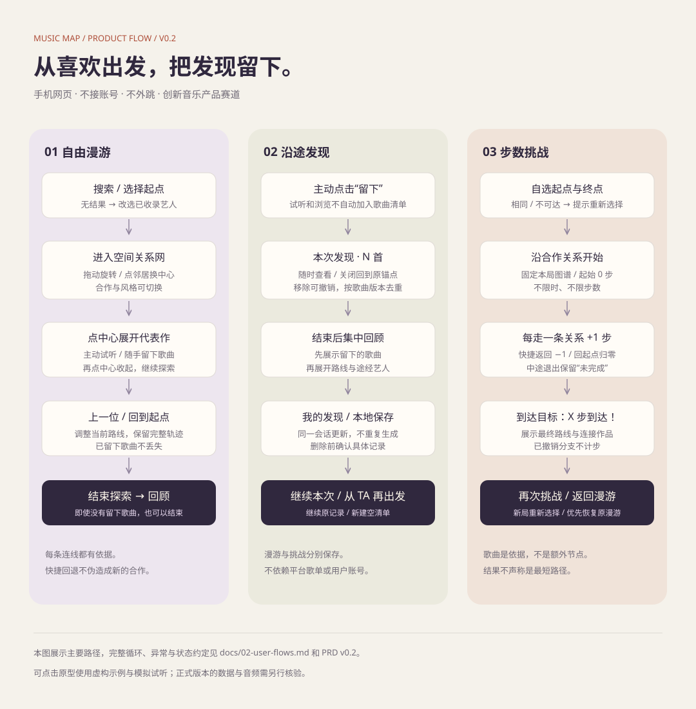
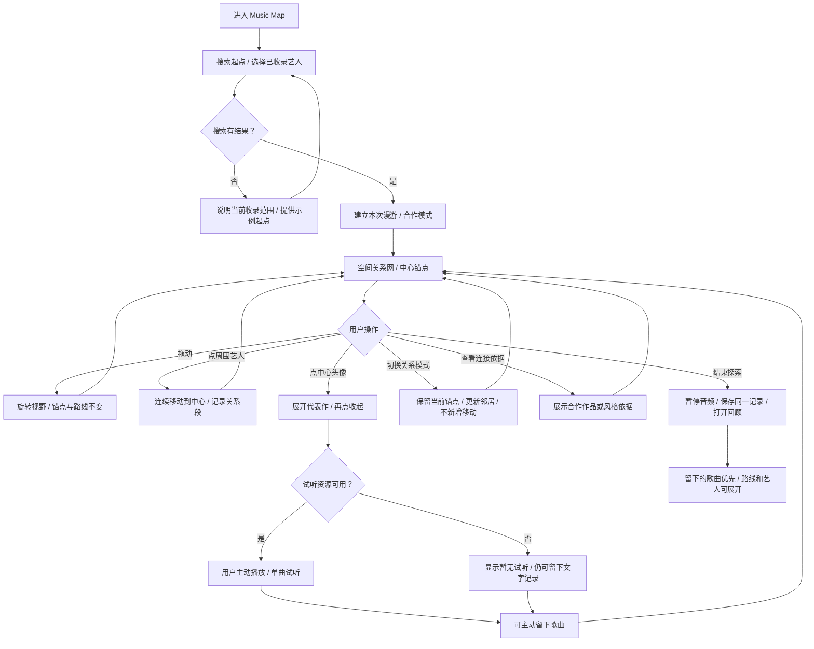
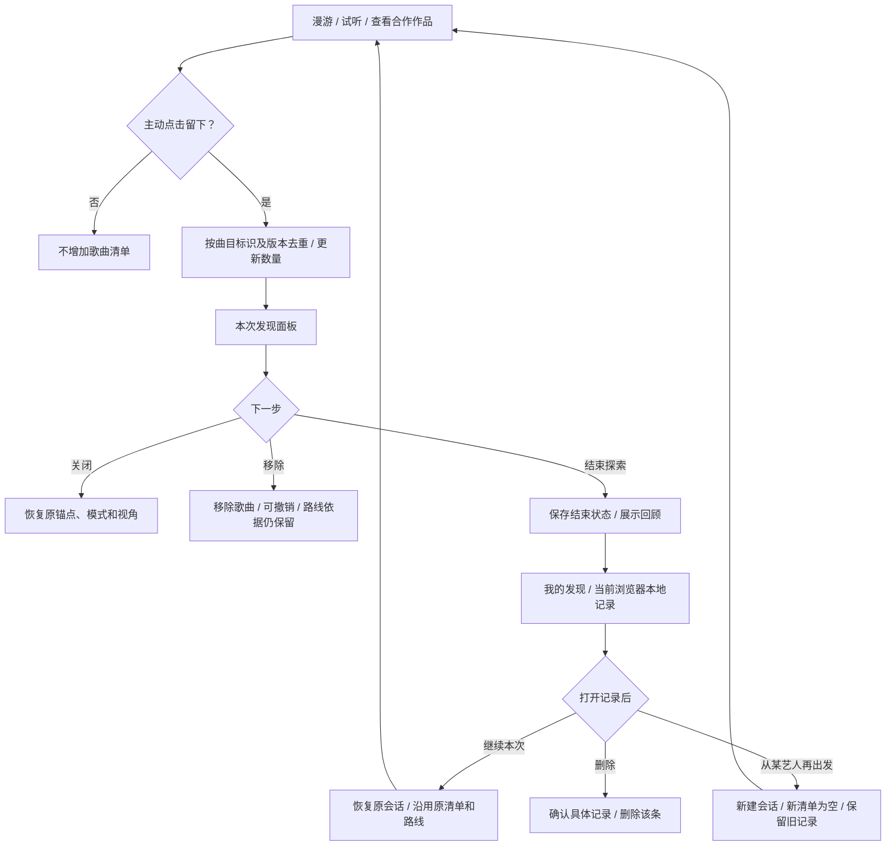
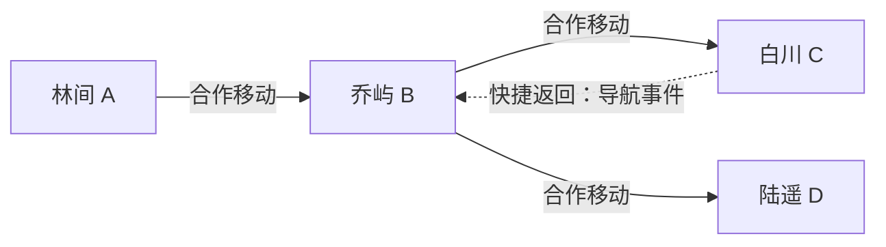
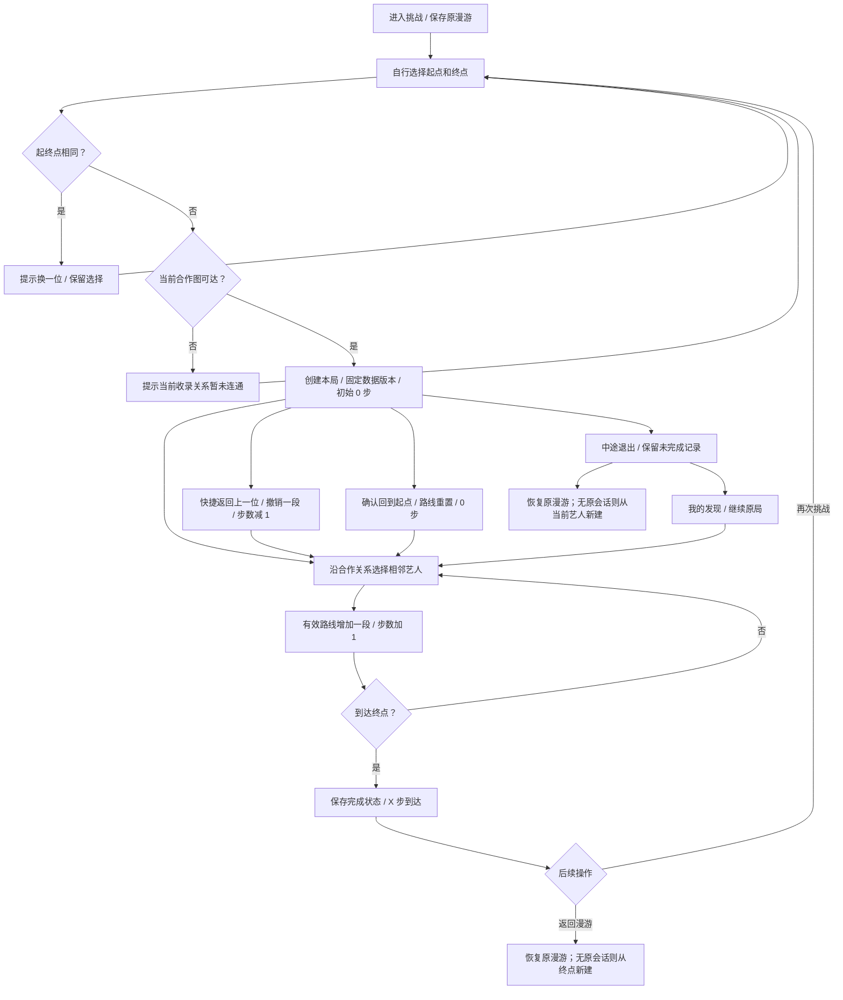

# 用户流程图

版本：2026-09-26。依据：[PRD v0.2](01-PRD.md)。图内都是产品行为约定；原型的虚构数据不影响流程理解。

## 1. 自由漫游：从进入到结束

拖动手势优先于点击；移动超过阈值不触发头像。地图中所有合法邻居都必须有可访问入口，不能只展示视觉上好排布的一部分。

## 2. 本次发现、历史和再次出发

“结束”是同一记录的状态变化，反复结束不重复创建历史。没有留下歌曲也能结束。浏览过的艺人不等同于“用户从未听过的艺人”。

## 3. 回退如何影响路线

| 记录 | 此例最终内容 |
|---|---|
| 当前导航路线 | A → B → D |
| 漫游完整回顾 | A → B → C；文字提示“返回 B，换个方向”；B → D |
| 若发生在挑战中 | 最终有效路线 A → B → D，共 2 步 |
| 主动留下的歌曲 | 回退不移除，仍属于该会话 |

虚线只表示导航，不是新的合作边。不能生成 C → D 的关系；若用户点相邻艺人实际沿关系返回旧节点，则属于一次新移动，应记录并计步。

## 4. 步数挑战

挑战中不能切换为风格关系。看作品、模拟或真实试听、留下歌曲、拖动均不计步。歌曲不是额外计步节点，不声称最短路线。

## 5. 异常处理

| 情况 | 用户看见什么 | 可继续做什么 |
|---|---|---|
| 未收录搜索词 | 当前范围无结果 | 修改关键词或选择已有艺人 |
| 当前模式没有邻居 | 暂无收录关系 | 返回；漫游可切换模式 |
| 缺头像 | 姓名首字占位 | 照常探索 |
| 缺音频 | 暂无试听 | 仍可留下文字资料 |
| 本地保存失败 | 明确保存未成功 | 重试，当前页面保留内容 |
| 旧图谱版本无法恢复 | 原记录仍可回顾；说明无法继续原局 | 重新选择当前有效起终点，不改写旧路线 |
| 误移除歌曲 | 已移除 / 撤销 | 恢复原位置 |

最后一项图谱更新处理属于正式实现要求。原型固定一份图谱，不模拟服务器数据版本迁移，详见原型说明。
