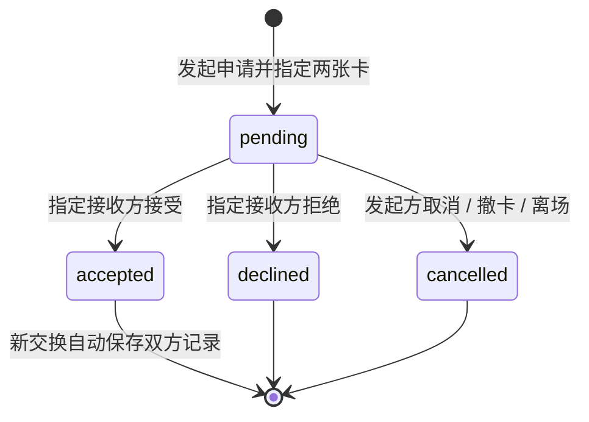

# 实施与演示规格

版本：2.3 · 2026-09-27，对应应用 MVP 0.12.0。产品范围见[产品方案](01-product-plan.md)，比赛交付见[交付方案](02-delivery-plan.md)。本轮把音乐关系接入常驻 Three 场景，统一现场票签、照片托盘、纪念册与内页，沿用后端接口、照片权限与数据库结构。本轮构建和浏览器结果见[项目状态](../../docs/PROJECT_STATUS.md)记录；第 8 节旧证据保留原版本。

## 1. 技术决定

| 部分 | 当前实现 | 边界 |
|---|---|---|
| 页面 | HTML / CSS / JavaScript ES 模块；Vite 8.3.1 + vite-plugin-singlefile 2.3.3 | 复用当前原生 JavaScript，不迁移框架 |
| 视觉 | Three 0.186.1 常驻小院与唱片关系桌 + Sakura Crossing cel / 深度描线 / 调色 / FXAA；DOM 纸件与投影标签，GSAP 3.15.0 / Flip 管镜头、抬卡和弹窗 | 仅保留 sakura，手机独立机位；WebGL 不可用时保留普通 DOM / SVG 图与页面操作 |
| 场景外壳 | `web/js/themes.js` 固定管理樱花场景 | 不读写或监听旧外观键；旧键即便存在也无效果，不改业务存储 |
| 滚动 | OverlayScrollbars 2.16.0 增强 body，自动隐藏的 6px 浮动条；弹窗使用原生细条 | 保留浏览器滚动与键盘导航；仅前端依赖 |
| 内容 | 11 位艺人、10 首作品、10 条共同演唱关系与逐人制作署名；独立 HF 开放曲库 120 首；保留虚构示例及两张 AI 生成图 | 共同署名不推断制作工种；试听链接撤下，QQ 同版本直达待核；不内置音频 |
| 本地情景状态 | localStorage `music-map-space:v1`，两个示例角色 | 仅当前浏览器；可选本机照片，不上传服务 |
| 音乐收藏 | localStorage `music-map-saved-music:v1`，真实精选与 HF 作品 | 独立于探索路线，仅当前浏览器；保留来源和数据集 |
| 联网身份 | 匿名 bearer 凭据，浏览器保存于 `music-map-live:v1` | 不是手机号账号，无找回与跨设备身份迁移 |
| 个人现场收藏 | 受身份保护的 `/api/live/library`，本人跨场次当前卡与已保存双联 | 离场后仍可读；删除接口仅删本人双联，不公开他人私卡 |
| 共享服务 | Node.js 24+，内置 HTTP 与 `node:sqlite` 的 DatabaseSync；无运行时 npm 依赖 | 同源 `/api/live`，服务端校验成员和操作权限 |
| 二维码 | 浏览器打包 `qrcode-generator` 2.0.4，现场生成邀请链接二维码 | 不调用外部二维码服务；前端依赖与无 npm 依赖的后端分别说明 |
| 数据库 | SQLite，默认 `data/music-map.sqlite`，事务与 WAL；用户照片存独立表的 BLOB | 单实例 + 持久磁盘；图片不写入公开目录，`data/` 和数据库 sidecars 不提交 |
| 输出 | 单个 `dist/index.html`；联网服务同时提供它和 API；浏览器绘制主题单卡 / 双联 PNG | 具体构建与导出检查见项目状态；只托管 HTML 可跑 Map 和本地演示，不能运行后端 |

源码分工：外壳 `web/js/app.js`、本人主页 `home.js`、Map `map.js` / `map-data.js` / `map-catalogue.js`、开放曲库 `open-catalogue.js`、音乐收藏 `music-library.js`、本地示例 `space.js`、联网房间 `live.js`、现场收藏 `live-library.js`、照片 `live-photo.js`、票根 `ticket-export.js`、界面动画 `motion.js`；服务入口 `server/index.js`，数据库 `server/db.js`。使用 hash 路由，依赖由锁文件固定。Three 场景随功能切换镜头，HTML 层负责输入与业务操作；OverlayScrollbars 调整滚动条呈现。没有引入 React、测试框架或推理模型。

### 0.12 页面与操作

- 顶部品牌与一套空间导航连接小院、唱片店、照片墙和收藏。封套内页、场次票签、工作纸和纪念册共用暖纸、细墨线、纸角与索引；说明仅出现在相关决定处。
- `home.js` 读取本人收藏，保留近期私人卡入口；无卡时预置内容注明示例。记录入口进入真实制卡，邀请入口有房间直接展示邀请码，无房间走昵称→创建→邀请。首页提供邀请码入口；邀请码在入场页填写，加入由用户确认。
- 没有 hash 的访问直接进入首页，不被上次页面覆盖；返回空 hash 同样回首页。邀请链接仍进入对应入场流程。点本人卡进收藏，点示例进明确的本地情景。
- `space.js` 保留本地双角色和旧 payload；普通首页与示例不混用身份、计数或记录。`#sakura-world` 全屏小院承担主画面。
- Map 以唱片关系桌承载当前艺人与合法邻居，实体细线表达数据中的连接，HTML 艺人标签随物件投影。封套索引和路线纸条调用原探索逻辑，作品内页保留逐人署名及具体工种来源，开放曲库独立搜索；WebGL 不可用时保留普通关系图。没有试听链接或站内播放器。
- 收藏、取消和撤销恢复 Map 焦点、折叠状态与滚动；订阅同步按钮和计数。移除真实曲目收藏不删除探索历史。
- 我的收藏以纪念册与索引呈现，默认本人现场，另有音乐、路线和示例。双联为空且仍在场时回到已有房间换卡；身份失效给重新入场入口，401 说明新身份无法带回旧记录。私人收藏不批量发布到照片墙。
- 房间以场次票签和照片托盘为主体，同场卡片、共同记忆与动态使用可展开目录；轮询重绘保留目录展开状态。收到的待回应申请保持显式入口，其他房间与离开留在 `details.live-room-menu`；异常连接、私藏与同意状态保留。
- 同一 live 页面内关闭再开编辑器，保留照片、短句、可见范围及步骤，修改后显示“草稿未保存”。保存成功或切换房间清理；草稿不落盘，刷新或切页不承诺恢复。照片处理的 `photoSelection` 和 `currentDraft` 边界继续防止旧异步结果写回新草稿。
- body 使用 OverlayScrollbars 2.16.0 的自动隐藏细浮动条，弹窗保持原生滚动；许可见[第三方说明](../../THIRD_PARTY_NOTICES.md)。

### 樱花模块与生命周期

| 文件 | 职责 |
| --- | --- |
| `web/index.html` | 固定首屏 `data-theme="sakura"`，不读取历史主题偏好 |
| `web/js/themes.js` | 名称沿用，固定管理常驻樱花场景；无主题按钮、选择弹窗或偏好同步 |
| `web/css/themes.css` / `theme-sakura.css` | 纸面 token、浅色业务页面、樱花卡片与表单；`theme-zine.css` 删除 |
| `web/css/app-studio.css` / `space-studio.css` / `map-studio.css` | 既有外壳、照片工作台和图谱的基础构图 |
| `web/js/sakura-world.js` | 原创小院、店铺雨篷、印刷唱片、樱树、照片墙、工作桌与收藏道具 |
| `web/js/sakura-music.js` | 原创唱片关系桌、实体连接、艺人投影标签与物件动作，复用同一场景和 cel 材质 |
| `web/js/sakura-scene.js` | Three 场景、透视机位、授权卡片贴图、拾取、镜头控制与销毁 |
| `web/css/map-spatial.css` | 场景探索的封套索引、路线纸条、投影标签与普通图降级 |
| `web/css/spatial-world.css` | 全屏场景、HTML 操作层与手机构图 |
| `web/js/motion.js` | GSAP / Flip 驱动卡片和弹窗，支持减少动态 |
| `web/js/open-catalogue.js` / `music-library.js` | HF 搜索与独立本机音乐收藏，保留来源和数据集 |
| `web/js/home.js` / `live-library.js` | 本人主页、跨场次收藏、授权照片及回访入口 |
| `web/css/map-credits.css` | 按人合并工种与逐工种来源 |
| `web/js/vendor/sakura/` | MIT cel、彩色阴影、深度描线、调色与 FXAA；`SOURCE.json` 固定上游提交 |
| `web/js/ticket-export.js` / `web/css/memory-export.css` | 仅绘制樱花单卡和双联，原生 dialog 展示 PNG 成品，提供下载和可用的文件分享 |

历史键 `music-map-visual-theme:v1` 不再读写或监听，即便存在也不影响界面；不主动迁移或清除它。匿名身份、探索、收藏和示例存储键保持不变。规范见 [VISUAL_THEMES.md](../../docs/VISUAL_THEMES.md)。

`#sakura-world` 的同一 scene / renderer 跨 hash 路由保留。基础机位为 `home`、`explore`、`live`、`records`；`editor` 走近工作桌，`photo` 靠近选中照片。手机独立取景；新选择可打断旧转场，减少动态直接显示目标。场景销毁时释放后处理目标、材质、几何、纹理、renderer 和监听。

业务接口沿用 `api.spatial.publish({mode,cards,onPhoto,onEdit})`、`focus(kind,id?)`、`restore()`。本人主页发布 `home`，示例发布 `exchange`，Live 发布 `live`；卡片含 `id/src/title/subtitle/alt/isDemo`，最多 6 张。首页可展示本人私卡，同伴只发布当前展示卡；缺自卡的 seed 明示示例。联网 `src` 只来自已授权读取的 blob，不把照片 ID 改为公共网址。清缓存、退出或撤权前先撤下场景贴图，再释放 blob。

Map 使用同一 `publish` 入口发布 `mode:'explore'`、`music` 与 `onMusic`。`music` 从当前 session 提取中心艺人、邻居、关系说明与视角；场景的 `setMusic` 更新唱片与细线。唱片拾取及投影标签回调复用原 `runAction`，不新建图谱状态、不绕过挑战完成条件；离开探索清除当前音乐展示。DOM / SVG 图仍作为 WebGL 不可用时的操作入口。场景销毁释放关系桌自己的纹理、材质、几何和监听。

场景拾取复用已有预览、编辑、申请和双联操作，关闭弹窗恢复基础机位，替换弹窗时延后恢复。小院几何、程序纹理与构图由本项目编写；渲染方法复用 Sakura Crossing MIT 源码，未复制其完整街区、人物、纹理原图或音频。Three 0.180.0 的上游 shader 补丁已按项目 0.186.1 适配；独立材质池、透视深度描线与 FXAA 保持。空闲 30fps / 转场 60fps 是调度目标，不是设备实测保证。

PNG 只保留樱花绘制。双联取已接受快照，单卡取本人的当前卡；照片、文字、作者与交换数据不被视觉整理改写。预置图保留 AI 标记，上传图通过原授权 blob 读取。

`downloadCard` / `downloadTicket` 接口不变：同一 canvas 生成 PNG，保留下载并展示实际 blob 图片，可再次下载或长按保存。仅在 `navigator.canShare({files})` 支持时显示分享，用户点击才调用 `navigator.share`；取消不报错。预览避开全局 GSAP 位移动画，关闭、下次导出、返回或离页释放对象 URL，不增加照片权限。

Three 与 Sakura Crossing 模块保留 MIT 许可，GSAP 使用 Standard No Charge 许可。固定提交和改动见[源码清单](../../web/js/vendor/sakura/SOURCE.json)与[第三方说明](../../THIRD_PARTY_NOTICES.md)。0.5 的[研究记录](../../references/research/2026-09-27/sakura-visual-reference.md)保留原历史范围。

### 0.7 数据来源与复现

`map-catalogue.js` 的 10 首精选使用 `real-vocal-2026-09-v2`，稳定 ID 与共同演唱边保持。`credits[]` 每项包含 `name`、`role`、`sourceId` 和可选 `artistId`；幕后人员可以没有图节点。`creditSources[]` 提供来源 URL、标题和核对日期。`creditsScope: 'selected-verified'` 表示只列已核实分工，不承诺完整名单。详情按人合并工种，来源仍精确到工种；见[署名取证记录](../../references/research/2026-09-27/collaboration-roles.md)。

Hugging Face 数据：`maharshipandya/spotify-tracks-dataset`，固定 revision `635b034f69257814eff850a5c2b3346fe458134f`。完整 `dataset.csv` 位于 `data/external/spotify-tracks-dataset/`，共 **114,000 行、20,118,244 B**；同目录有清单、文件树和数据卡副本。复现：

```sh
python scripts/datasets/download_hf_catalogue.py
```

前端载入 `web/assets/data/hf-collaborations.json` 的 **120 首**整理结果，由 `open-catalogue.js` 提供独立搜索。HF 中的共同 artist 署名不推断主唱、词曲或制作，不合并到原共唱挑战图中。完整 CSV 不进入 HTML 或运行包，启动不依赖在线 HF 请求；没有下载音频、封面或模型权重。下载范围和来源见[下载记录](../../references/research/2026-09-27/huggingface-download.md)。

### 沿用的 0.4.0 能力

0.4 在动态排版主导的音乐节视觉下加入以下能力；当前版本保留其业务含义。0.4 实际操作范围见第 8 节与项目状态：

1. 0.4 的 Map 加入 11 位艺人的真实合作专题，10 首作品附署名、版本、日期，当时带官方 MV 外链；0.7 保留数据身份并扩充逐人制作署名，撤下试听链接。虚构示例保持独立，旧探索与记录仍能识别其示例身份；不把真实艺人挂到虚构场次。
2. 用户用活动名、日期、城市和共同歌曲建立自己的私有房间；共同歌曲是用户填写的信息，不代表取得音频或证明艺人到场。
3. 真实房间支持用户自己的压缩 JPEG 和舞台 / 人海 / 同伴 / 细节视角，默认私藏，可主动展示或定向发起交换。服务端保存照片与快照引用；前端负责压图、携带身份读取 blob URL 和单卡 PNG。
4. 保留可直接操作的邻居、即时探索收获、`mapReturnId` 返回原探索、手机输入优先与折叠预览、本地接受后自动保存、记录筛选和重入邀请码。0.5.1 删除的是常驻教程，不改变探索或交换状态。

0.2.0 / 0.3.0 的历史检查见项目状态。0.4.0 已交付 106 秒实际操作中文字幕视频和 16:9 封面；全片解码通过，关键帧已目视。它们不包含 0.5 三主题，文件、规格与检查范围见[交付清单](../../delivery/README.md)。旧截图编排仍是历史展示，不作为照片上传流程的操作证据。

## 2. 两种实现状态写清楚

### A. 保留的静态交付：本地情景演示

首页点「体验示例」进入本地工作区，再制卡或点照片预览与交换。流程使用一场预置活动与两个明确标识的示例角色 A / B；没有自卡时的 seed 仅作示例，用户保存后才进入该角色的卡片状态。评委可以制卡、切换角色、发起申请、接受或拒绝、查看结果。两个角色仍在同一浏览器中模拟；示例区不常驻首页下方。

- 视图标明“本地示例”，提供角色切换、重置与返回首页。
- 角色 A 不能在 A 的操作区替 B 接受；切到 B 视角后才能执行 B 的操作，以讲清产品规则。
- 新交换接受后自动为两个示例角色各保存一份；自己的卡也可单独收藏。旧版已接受但未保存的交换保留手动保存入口，不批量回填旧记录。
- 当前两张卡的 ID / 所有者 / 版本已有 accepted 交换时，打开已有双联，不重复创建申请；不同卡版本可发起新交换。刷新保留同一浏览器进度，不假称跨设备同步。
- 这是完整的交互演示，能表达社交机制；不能宣传已经有真人用户或真实跨设备交换。

### B. 沿用 0.4.0：自己的活动与真实独立会话

参与者各持独立匿名会话，通过 6 位邀请码或携带房间码的链接进入同一房间，最多 24 人。新房间的活动由创建者填写：标题必填 ≤60 字，日期为有效 `YYYY-MM-DD` 或空，城市 ≤40 字、共同歌曲 ≤80 字，后二者可空。服务生成 `eventId = 'room:' + roomId`，不提供公开房间目录，也没有活动真实性或到场认证。

创建场次默认只展示名称；日期、地点与歌名收在「补充场次信息」，从音乐入口带歌名时默认展开。底部创建按钮固定，展开选填项后仍可直接提交。

各用户每房一张持久化卡片：短句 ≤80 字，环节为 `encore` / `chorus` / `lights`，视角 `perspective` 为 `stage` / `crowd` / `friends` / `detail`。`photoId` 指向本人在本房上传的照片，或为 `null`；`photoKey` 仍为 `stage` / `crowd`，作为预置图片回退。`trackId` 为 `co-0` 或空，在自定义房间仅表示是否带上本房共同歌名，不扩展成真实曲库 ID 或试听能力。

编辑器使用同一个 form，在「选照片」「留一句」两个 fieldset 间切换可见性，保留输入与草稿。新卡从选图开始，已有卡直接编辑短句，可返回换图；压图完成前不能继续。环节与歌名放在「更多细节」，私藏／展示和保存结果在第二步及底部显示。步骤切换不上传、保存或公开，最终提交沿用原卡片接口。关闭再开在当前页面继续草稿，成功保存或换房清理；不写 localStorage，不承诺跨页面恢复。

前端调用同源 `/api/live` 并短轮询。浏览器持有随机 bearer 凭据，数据库只存其哈希；刷新可返回已加入房间。清除浏览器数据后无法找回原身份。服务不可用时显示实际错误并保留制卡输入，不伪造申请或交换成功。

前端将用户选择的照片重绘、压缩为 JPEG 后上传，服务端接收的二进制不超过 300 KiB；图片保存在 SQLite `photos.data` BLOB 中，不生成公共图片网址。房间轮询只返回 `photoId` 等元数据，不携带 base64。前端使用 bearer 身份获取照片并转为本会话使用的 blob URL；导出前也需完成授权读取。本地演示照片不会自动迁入房间。

服务在接受操作的事务中为双方各自生成私有纪念记录，用户无需再点击保存。双联 PNG 从接受时的快照绘制；单卡 PNG 使用自己的当前卡，两者都在浏览器生成，不另建云文件存储或新的记录种类。卡片持久化、纪念记录生成、PNG 下载是不同动作。

房内操作要求调用者为成员，只有指定接收者可接受 / 拒绝，只有发送者可取消。私人自卡可用于定向申请；其他成员不能因此读取它。切换到房间入口不会自动退会；显式退出会隐藏自卡、取消相关 pending 并删除成员关系。本人卡片与双联保留，可直接从个人收藏读取；回到房内操作仍须主动加入。

**照片读取权限：** 照片主人可读；同房成员可读当前正在展示的卡所引用的照片；pending / accepted 交换的双方或拥有引用该照片的个人记录者可读。拒绝 / 取消后，仅依赖该 pending 的共享权限失效。accepted 交换持续保留读取依据：删除自己的 record 不会删除对方记录，也不会撤销 accepted 交换的照片权限。已分享或下载的副本不能通过删除本人记录收回；当前没有清除全部历史照片的接口。退出后房间 API 仍需重新入会，已接受交换对照片的读取依据继续保留。

**旧库兼容：** 启动时通过增列迁移补充房间的日期 / 城市 / 歌曲和卡片的照片 / 视角字段，不重建数据表或改写旧交换快照。旧房间仍是 `echo-live-2026` 的虚构“回声现场”，返回 `isDemo:true`；旧卡 `photoId` 为 `null`，视角沿用 `photoKey`，旧记录缺少新字段时使用示例兼容显示。新房返回 `isDemo:false`，仅表示用户自建，不表示活动已核验。

0.4 整合时已重启服务执行增列迁移，并读回旧森森 / 小舟匿名身份及原房间列表；这项历史结果说明当次保留的旧数据可读，不扩展成任意历史数据库迁移验证。

前端空墙按成员数和自卡状态显示下一步。首次保存或保存私卡后，可邀请朋友、看同场卡片、主动展示、下载单卡或去收藏；不自动公开。为定向交换补卡时继续进入两卡确认。离开确认可复制邀请码，成功后用原有会话存储的 `rejoinCode` 预填入场栏；只有用户主动加入才恢复成员关系。联网票根各入口与 PNG 统一取 `decidedAt`，记录对象使用其完成时的 `createdAt`。

### C. 0.9：个人收藏与入口衔接

`GET /library` 在 bearer 身份下返回 `{me,rooms,cards,records}`。`rooms` 只含当前已加入房间；`cards` 只含本人的跨场次当前卡；`records` 只含本人已保存的交换双联。两类内容附 `roomId / roomCode / roomTitle / joined`，即使离场也可读。当前卡会随本人编辑更新，双联保留接受时快照；不返回他人未交换私卡，不改变照片读取权限。

`DELETE /library/records/:id` 仅按记录 ID 与本人 `owner_id` 删除，离场后也可用；不删除对方副本、交换或照片。收藏页读取不自动恢复成员关系，回场只预填邀请码，等待用户点击加入。

Live 的入口 payload：`roomId` 选择本人已加入场次；`intent:'make-card'` 在当前场次开编辑器，没有场次则创建后开编辑器；`intent:'invite'` 有当前场次则开邀请，没有场次则留昵称、创建后开邀请；`joinCode` 加 `intent:'join-room'` 仅预填加入码。携带 `songDraft:{id,title,artists,source,dataset}` 时始终走新建场次，只将 `title` 写入可编辑的歌名草稿，不改旧房间。

音乐收藏独立保存为 `{version:1,tracks:[],imports:[]}`；条目含 `id / title / artists / source / dataset / savedAt`。真实精选与 HF 可留下，虚构作品仍属于示例。旧真实 Map 收藏仅导入一次，移除后不再次补回；删歌不删路线。它仅在本机，不写入 SQLite 或声明跨设备同步。

## 3. 最少数据对象

| 对象 | 最少字段 / 用途 |
|---|---|
| Artist / Track | 稳定 ID、`dataset`、名称、显式 `songIds`；真实精选含录音版本、`credits` / `creditSources`、日期与空的 `listenLinks`；`audioAvailable:false` |
| OpenCatalogue | 独立 HF 精选 JSON；共同署名和数据来源，不写入原挑战图或人工核实制作工种 |
| SavedMusic | 本机独立收藏的 `id / title / artists / source / dataset / savedAt`，不属于房间歌曲、交换快照或路线步数 |
| Relation | 两端艺人、`dataset`、合作作品、版本、演唱角色和来源；真实共同演唱或明确示例 |
| Event | 房间响应与新卡快照中的 `{id,title,date,city,song,isDemo}`；Map 真实合作专题与虚构示例另行标识 |
| Moment | 场次内的歌曲或环节，如返场、全场合唱 |
| User / Room / Member | 用户 ID 与 token 哈希、房间 ID / 邀请码 / 活动、成员关系；加入时检查 24 人容量 |
| Photo | ID、room_id、owner_id、mime、data BLOB、created_at；当前只接收 JPEG |
| Card | ID、房间、作者、eventId / event、momentId、trackId、photoKey / photoId、perspective、短句、展示状态、revision、时间 |
| Exchange | 房间、双方用户和卡 ID、发出时两张卡的快照、状态、取消原因、时间 |
| Record | 记录所有者、房间、已接受交换 ID、两卡快照；每位用户每次交换一条 |
| LocalMemory | 本地单卡收藏、新接受后自动保存的双联，以及兼容手存的旧接受记录；与联网 Record、Map 记录分开 |
| MapSession | `dataset`、图谱版本、类型、完成状态、起点 / 当前艺人、挑战目标、模式 / 视角、当前路径、完整事件、主动留下曲目、原漫游引用 |
| Sakura presentation | 固定樱花艺术方向；无新业务对象或数据库表，不写入 Card、Exchange 或 Record 快照 |

SQLite 包含用户、房间、成员、照片、卡片、交换和记录表。新交换序列化完整卡片对象，因而同时冻结照片 ID、活动、环节、视角和短句；后续换图、改卡、撤卡不改写已有快照。Map 的合作依据、Space 的共同兴趣和用户自述到场保持不同含义。

Map 的真实数据使用 `real-*` ID，原 `a…i` / `co-*` / `style-*` 保留为 `fictional`。旧会话缺 `dataset` 时按原艺人 ID 补识别，不将旧路线替换成真实艺人；切换图谱恢复该数据集已有会话。进入 Space 前保存 `space.mapReturnId`，真实专题传 `{from:'real-map',intent:'create-room',resumeSessionId}` 引导用户自建活动，返回按 `{resumeSessionId}` 恢复原局。

## 4. 交换状态



联网发起请求必传 `fromRevision` 和 `toRevision`；任一与当前卡不符返回 `409 CARD_CHANGED`，先看新版再确认。pending 保存不可变的两卡快照，后续编辑不替换申请内容；撤下或离场会取消相关 pending。相同两人同房间最多一条 pending，不能自换。只有 accepted 展示完成动效并自动保存两份私有记录；拒绝和取消不生成记录。删除自己的记录不影响对方，也不撤销 accepted 交换的照片读取依据，终态重复响应不重复保存。本地同版本已完成交换的复用规则见第 2 节，不混写为服务端新增约束。

### API 入口

除健康检查和创建会话外，其余请求携带 `Authorization: Bearer <token>`；JSON 错误格式为 `{error:{code,message}}`。普通 JSON 请求限制 8 KiB；照片上传 JSON 限制 420 KiB，其中 JPEG 二进制最多 300 KiB。服务检查 JPEG data URL、base64 和首尾签名，不引入图像处理库；浏览器负责重绘压缩。图片上传每人最多 12 次 / 分钟、60 次 / 小时，仍受整体请求频率限制。不开放跨域 CORS。

| 接口（均以 `/api/live` 开头） | 用途 |
|---|---|
| `GET /health` | 公开返回 `{ok:true,storage:'sqlite'}`，不泄露房间或用户 |
| `POST /session`、`GET /session` | 创建匿名凭据；恢复用户和自己已加入房间列表 |
| `GET /library` | `{me,rooms,cards,records}`；本人跨场次当前卡与已保存双联，附房间信息及 `joined`；离场后仍可读取 |
| `DELETE /library/records/:id` | 仅删除本人双联，离场后也可用；返回 `{ok:true}`，不删除对方记录、交换或照片 |
| `POST /rooms` | `{title,eventDate,city,song}` 建立自定义活动房间，返回 room state；`room.event` 含 `date`（请求字段为 `eventDate`） |
| `POST /rooms/join` | `{code}` 按 6 位码加入，不提供公共房间检索 |
| `GET /rooms/:id` | 获取房间、自卡、可见卡、自己参与的交换、自己的纪念记录 |
| `POST /rooms/:id/photos` | `{dataUrl:'data:image/jpeg;base64,...'}`；检查本房成员身份，成功返回 `201 {photoId}` |
| `GET /photos/:id` | 携带 bearer 且满足照片读取权限时返回 `image/jpeg`，`Cache-Control:no-store`；无身份为 401，不可查看或不存在统一 404。不能以裸 URL 直接读取 |
| `PUT /rooms/:id/card` | `{photoKey,photoId,perspective,caption,momentId,trackId,isPublic}` 创建 / 修改自卡，递增版本；photoId 仅允许本人本房照片 |
| `PATCH /rooms/:id/card/visibility` | 展示或撤下自卡 |
| `POST /rooms/:id/exchanges` | 指定 `toCardId`、`fromRevision`、`toRevision` 发出申请 |
| `POST /rooms/:id/exchanges/:exchangeId/decision` | `accepted` / `declined` / `cancelled`，服务检查操作方 |
| `DELETE /rooms/:id/records/:recordId` | 只删除当前用户自己的记录 |
| `DELETE /rooms/:id/membership` | 显式退出，隐藏自卡、取消待回应，保留已接受记录 |

## 5. 音频如果加入

当前没有播放器、音频下载或实时音频分析；试听链接已撤下。以后优先采用经核实的 QQ 音乐同作品、同版本直达，未核实时继续不显示入口。当前来源链接只用于署名取证。以下仅是未来确实接入试听时的规格。

使用单一原生音频元素，只有用户明确点击才播放。浏览其他艺人、开关面板或进入 Space 不主动打断；播放器显示实际音源，避免把 A 的歌归到当前查看的 B。刷新不自动播放，后台表现以实际浏览器为准。

缺资源、加载失败和播放被拒绝都要反馈；不以计时器伪装真实声音，也不把另一首歌挂到目标作品名下。只有确实接入音频分析时才显示真实频谱，普通装饰不标作实时音频。

本条是“实现试听时”的规格。已下载的 HF 文件只有元数据，不提供试听音频；没有试听仍可完整展示现场卡和交换。

## 6. 本地运行与部署

环境：Node.js **24 或更高**。首次安装与构建：

```powershell
npm ci
npm run build
```

开发时开两个终端，分别运行 `npm run server` 与 `npm run dev`。前端 Vite 把 `/api/live` 代理到 `http://127.0.0.1:8787`；使用 Vite 打印的页面地址。`npm run preview` 仅用于查看静态构建，不是生产 API 服务。

生产产物本地运行：构建后执行 `npm start`，再打开 `http://127.0.0.1:8787`。Node 同时提供网页、API 和 SPA fallback。默认仅本机访问；需要指定绑定地址、端口或数据目录时，在启动前设置环境变量：

```powershell
$env:HOST = '127.0.0.1'
$env:PORT = '8787'
$env:DATA_DIR = 'D:\music-map-data'
npm start
```

以上数据目录仅为示例，应使用实际有写权限且持续保留的路径；未设置时为仓库根 `data/`。数据库与 `-wal` / `-shm` 文件、用户照片、`.env`、`node_modules/`、`dist/` 均不提交。

### 可选 Docker 交付

仓库有多阶段 Dockerfile：构建前端，运行时保留 Node 24、服务和 `dist/`，以非 root 用户运行。

```powershell
docker build -t music-map-space:0.12.0 .
docker volume create music-map-data
docker run -d --name music-map-space --restart unless-stopped -p 127.0.0.1:8787:8787 -v music-map-data:/app/data music-map-space:0.12.0
```

这些是部署说明，不代表已经执行。Docker 内服务监听 `0.0.0.0`，上述端口映射仍只开放到宿主机环回地址。生产由反向代理将同一 HTTPS 域名的页面和 `/api/live` 全部转发到这个 Node 实例；需要定向访问时也在入口限制站点访问。保留 `music-map-data` volume，不把数据库放进镜像或无持久磁盘的平台。采用单实例，不启用多个独立 SQLite 副本的自动横向扩容。实际托管、TLS、访问控制与备份安排尚未执行。

## 7. 当前交付与后续

| 项目 | 当前安排 | 记录位置 |
|---|---|---|
| 0.12 场景与界面融合 | 场景内的唱片关系桌、封套索引、场次票签、照片托盘、纪念册与统一内页；本轮构建和实际画面按任务记录登记 | [项目状态](../../docs/PROJECT_STATUS.md) |
| 0.10 制卡与成品预览历史证据 | 首次樱花、同表单两步制卡、真实 PNG 预览、收藏保位与首页返回；保留当时的构建和实操范围 | [项目状态](../../docs/PROJECT_STATUS.md) |
| 0.9 本人主页与收藏历史证据 | 当时的构建及主页恢复、跨场次回访、HF 带歌建场、私藏保存与邀请实操保留 | [项目状态](../../docs/PROJECT_STATUS.md) |
| 0.8 全屏小院历史证据 | 六类机位、独立手机取景、授权照片贴图、工作桌与店内收藏；保留当次构建、画面和运行包记录 | [项目状态](../../docs/PROJECT_STATUS.md) |
| 0.7 空间与数据历史证据 | 常驻透视小院、GSAP / Flip、逐人制作署名、完整 HF CSV 与 120 首开放曲库；保留当次记录 | [项目状态](../../docs/PROJECT_STATUS.md) |
| 0.6 独立 App 历史证据 | 悬浮导航、照片卡工作台、唱片图谱与 MIT 三渲二管线，保留当次构建和画面范围 | [项目状态](../../docs/PROJECT_STATUS.md) |
| 0.5.1 界面精简历史证据 | 首页与示例分开、紧凑图谱、按需说明与浮动滚动条，保留原版本检查 | [项目状态](../../docs/PROJECT_STATUS.md) |
| 0.5.0 三主题历史证据 | 默认声浪现场、樱下放映与独立刊物；当时的构建、切换、页面与 PNG 检查保留原版本 | [项目状态](../../docs/PROJECT_STATUS.md) |
| 0.4.0 历史构建与关键操作 | 构建通过；旧身份 / 房间读回，自定义活动、文件上传、独立同意、双方记录和单卡 / 双联下载已操作；范围见第 8 节 | [项目状态](../../docs/PROJECT_STATUS.md) |
| 现有实际操作视频与封面 | 0.4 的 106 秒中文字幕成片、16:9 封面完成，全片解码及关键帧目视通过；不包含新主题 | [交付清单](../../delivery/README.md) |
| 运行包 | 按本轮构建更新，具体打包产物与大小单独登记，不由应用构建自动推定 | [交付清单](../../delivery/README.md) |
| 定向评审访问、目标用户试用、正式提交 | 分别取得实际访问、观察和提交记录 | 项目状态与参赛材料 |

10 月 7–8 日冻结提交材料、10 月 9 日实际提交是团队安排，不写成已发生事实。

本轮不新增推理模型或内置音频。若联网部署受阻，可如实交付静态情景演示并保留联网代码；录像和介绍须同步删去未经展示的联网完成声明，不能用本地角色切换充数。

## 8. 证据与待检查边界

### 0.12 当前整合

当前规格将音乐关系接入小院的唱片桌，现场、制卡、收藏与详情统一为小院里的纸件。本轮构建、实际浏览器画面、运行包、PR 与合并结果只以[项目状态](../../docs/PROJECT_STATUS.md)为准；0.11 及更早证据保留原范围，实体手机和外部用户试用仍未完成。

### 0.10 历史结果

首次默认樱花、两步制卡、真实 PNG 预览与音乐收藏保位的当次构建和浏览器结果见[项目状态](../../docs/PROJECT_STATUS.md)。文件分享按钮存在不代表已在实体手机发送。

### 0.9 历史结果

本机构建已完成。已操作本人主页恢复现有场次编辑器（未保存改动）、跨场次查看双联与离场自卡，以及 HF 搜索 Sam Smith → 收藏 Unholy → 带歌创建内部示例场次 → 明确选择 AI 示例图 → 私藏保存 → 收藏回看 → 返回房间邀请。离场后刷新仍可查看本人卡，重入只预填邀请码、没有自动加入。新增本人收藏读删接口沿用数据库结构及照片授权。

390px 双联页已目视未见横向溢出。0.9 的 PNG 得到生成成功提示；下载事件工具不支持，未检查实际文件，不记为已下载或已目视 PNG。该版本画面、打包、CI 与同步范围见[项目状态](../../docs/PROJECT_STATUS.md)，不代替 0.10 成品预览、实体手机、外部用户试用或评审部署。

### 0.8 历史结果

全屏小院、六类视角、独立手机镜头、授权照片与现有编辑 / 交换入口已接通。生产构建和本地运行包已更新，桌面与 390×844 模拟手机的关键画面已查看；具体范围、资源处理与 GitHub / CI 见[项目状态](../../docs/PROJECT_STATUS.md)。静态模型按相同几何、材质、阴影和动作分组实例化；这不代表实体手机性能已达标。没有新增测试套件、后端协议或数据库迁移。

### 0.7 历史结果

常驻透视场景、四路由镜头、GSAP 界面动画、逐人署名和开放曲库的当次构建、桌面 / 模拟手机画面及同步结果保留在[项目状态](../../docs/PROJECT_STATUS.md)，不代替 0.8 全屏构图与实物操作的检查。

### 0.6 历史结果

照片卡工作台、唱片 Map、悬浮导航和 MIT 三渲二管线的当次检查保留在[项目状态](../../docs/PROJECT_STATUS.md)，不代替 0.7 空间镜头、动画或新数据的检查。

### 0.5.1 历史结果

当时的首页／示例分离、紧凑 Map、说明精简和滚动条检查保留在[项目状态](../../docs/PROJECT_STATUS.md)，不代替 0.6 新构图或新渲染的检查。

### 0.5.0 历史结果

当时已查看三套 Space 首屏、主题选择器、浅色 Map／记录／编辑与双联弹窗，以及 390px 关键画面；切换保留邀请码输入与已有房间记忆，刷新保留外观。两套新主题双联已实际导出并目视；樱花场景实际显示，切走后 canvas 移除。具体范围见项目状态，不代替 0.6 检查。

### 0.4.0 历史实际结果

以下来自 2026-09-27 整合者的实际构建与页面操作记录，本次文档同步没有额外执行构建或检查。

| 范围 | 已取得结果 | 仍有的边界 |
| --- | --- | --- |
| 生产构建 | `npm run build` 通过，`dist/index.html` 为 **588,715 B** | 本机构建成功不等于 CI 或线上部署完成 |
| 旧库迁移 | 重启服务执行 SQLite 增列迁移，旧森森 / 小舟身份和原房间列表仍读回 | 不扩大为所有迁移、恢复或备份场景验证 |
| 自定义场次与照片 | `127.0.0.1` 的森森与 `localhost` 的小舟持不同来源身份，进入新房“校园声场演示”；各用真实文件选择器上传项目 AI 图，压缩至 960px | 验证上传流程；图片是 AI 演示素材，不是实拍现场或外部用户提供 |
| 独立同意与同步 | A 私卡、B 展示卡；界面解释共同返场及舞台 / 人海视角，A 确认两卡申请、B 独立接受、A 自动同步，双方各有 record | 这是本机独立会话，不是两台实体手机或公网环境 |
| 实际导出 | 下载 **1600×1800** 单卡 **1,041,477 B**、双联 **1,097,920 B** PNG；桌面二维码、新双联与单卡已目视 | 结果对应本次卡片内容，不是固定产物体积 |
| 窄屏 | 390px 模拟视口下编辑与票根容器可见宽 / 滚动宽均为 320px，未见横向溢出 | 仅模拟视口，不声称实体手机或全页面验收 |
| Map | 已操作真实周杰伦 → 张惠妹与来源面板，旧 fictional 路线保持 | 没有内置音频或官方 MV 实际播放保证 |
| 视频素材 | 0.4.0 已完成 **106 秒、1080p、30fps** 的实际操作中文字幕成片与 16:9 封面；全片解码与关键帧目视已完成 | 不包含 0.5 三主题；详细规格与剪辑来源见交付清单，不扩大为全部新主题录制 |

以上为 0.4 的历史结果；当时尚未下载 HF 曲库。当前完整 CSV 已下载，仍无模型权重、内置音频或实时 AI 推理。线上受保护评审链接、外部目标用户试用、实体手机与正式提交尚待完成，原始操作与本轮状态见[项目状态](../../docs/PROJECT_STATUS.md)。

### 历史版本记录

2026-09-26 的应用 0.1.0 已构建，并在生产预览操作本地制卡 → 待回应 → 接收方接受 → 手动保存 → 刷新重开，以及 Map 挑战前进与返回。查看过桌面和 390px 宽关键画面。手动保存是该历史版本行为，不是当前新交换规则。

**下表仅为 0.2.0 的历史检查与边界。** 后续版本不沿用这张表宣布新增能力已通过；0.3.0 结果另见[项目状态](../../docs/PROJECT_STATUS.md)。

| 检查 | 判断标准 | 0.2.0 当时状态 |
|---|---|---|
| 服务语法 | 两份后端 JS 可被 Node 解析 | `node --check server/index.js` 与 `node --check server/db.js` 已通过；不等于运行验证 |
| 生产构建 | Vite 产物可生成 | 0.2.0 生产构建已通过 |
| 独立身份与同意 | 独立会话，发送者不能代接受；版本变化拒绝发送 | 小满 / 阿遥两份独立浏览器存储会话完成入场、A 私卡 / B 展示卡、指定两卡申请、B 接受、A 同步；API 实操未入房 C 读取为 403、A 接受为 403、B 接受为 200；版本变化分支未专项实测 |
| 联网记录 | 自动生成双方记录，快照不变，删除互不影响 | 两方 record 快照一致；刷新同房记录仍在；A 编辑短句不改旧记录，A 删除不影响 B。服务进程重启后，原身份同房卡片与记录仍可读回 |
| 票根 PNG | 从已接受快照导出，文件可打开、中文与图像完整 | 已实际下载约 1.62 MB 并目视查看 |
| 新视觉与手机 | 中文层级清楚，关键状态和窄屏布局可用 | 390×844 票根横向溢出修复后已查看；不扩大为实体手机或全页面验收 |
| 线上部署 | 评审实际可访问，API 同源，磁盘持续保留 | 尚未部署；Dockerfile 存在不等于容器已运行 |
| 音频与真实元数据 | 来源及实际能力准确 | 尚未接入 |

以上 0.2.0 运行证据由整合者及接口检查协作者提供，当时没有新增或运行测试框架 / 套件。本次文档同步没有新增检查；0.4.0 至 0.11 按历史范围保留，0.12 由任务记录记实，不将局部检查扩展成未执行的环境或路径。
