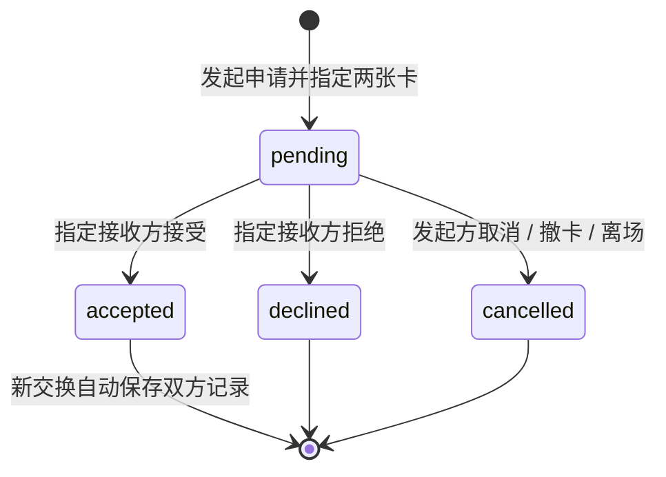

# 实施与演示规格

版本：1.5 · 2026-09-27，对应应用 MVP 0.5.0。产品范围见[产品方案](01-product-plan.md)，比赛交付见[交付方案](02-delivery-plan.md)。本轮在既有真实合作、个人活动与照片交换之上增加三主题、原创街角和主题 PNG，沿用 Node + SQLite。0.5 的构建与实际画面检查进度统一见[项目状态](../../docs/PROJECT_STATUS.md)；第 8 节保留 0.4 及更早版本的证据，不充作本轮主题验收。

## 1. 技术决定

| 部分 | 当前实现 | 边界 |
|---|---|---|
| 页面 | HTML / CSS / JavaScript ES 模块；Vite 8.3.1 + vite-plugin-singlefile 2.3.3 | 复用当前原生 JavaScript，不迁移框架 |
| 视觉 | DOM / SVG、主题 CSS、有限动画；Three 0.186.1 绘制樱下放映的原创 Space 街角 | festival 默认，sakura / zine 可选；正文、按钮可读，装饰不称为真实频谱 |
| 外观偏好 | `web/js/themes.js`；localStorage `music-map-visual-theme:v1` | 仅保存主题 ID，与身份、路线、草稿和记录分开；切换不重载页面 |
| 内容 | 11 位艺人、10 首作品、10 条共同演唱关系及官方外链；保留独立的虚构示例及两张 AI 生成图 | 专题不是完整曲库；不内置音频，真实艺人不绑定虚构活动 |
| 本地情景状态 | localStorage `music-map-space:v1`，两个示例角色 | 仅当前浏览器；可选本机照片，不上传服务 |
| 联网身份 | 匿名 bearer 凭据，浏览器保存于 `music-map-live:v1` | 不是手机号账号，无找回与跨设备身份迁移 |
| 共享服务 | Node.js 24+，内置 HTTP 与 `node:sqlite` 的 DatabaseSync；无运行时 npm 依赖 | 同源 `/api/live`，服务端校验成员和操作权限 |
| 二维码 | 浏览器打包 `qrcode-generator` 2.0.4，现场生成邀请链接二维码 | 不调用外部二维码服务；前端依赖与无 npm 依赖的后端分别说明 |
| 数据库 | SQLite，默认 `data/music-map.sqlite`，事务与 WAL；用户照片存独立表的 BLOB | 单实例 + 持久磁盘；图片不写入公开目录，`data/` 和数据库 sidecars 不提交 |
| 输出 | 单个 `dist/index.html`；联网服务同时提供它和 API；浏览器绘制主题单卡 / 双联 PNG | 具体构建与导出检查见项目状态；只托管 HTML 可跑 Map 和本地演示，不能运行后端 |

源码分工：外壳 `web/js/app.js`、Map `map.js` / `map-data.js` / `map-catalogue.js`、本地 Space `space.js`、联网房间 `live.js`、照片 `live-photo.js`、票根 `ticket-export.js`；服务入口 `server/index.js`，数据库 `server/db.js`。使用 hash 路由，依赖由锁文件固定。新增的 Three 仅用于浏览器装饰场景；没有引入 React、Motion、测试框架或推理模型。

### 0.5.0 外观模块与生命周期

| 文件 | 职责 |
| --- | --- |
| `web/index.html` | 首屏读取独立偏好键，仅接受 `festival` / `sakura` / `zine`，默认 festival |
| `web/js/themes.js` | 顶部「外观」对话框、偏好保存、根节点 `data-theme`、主题色和色彩模式；与业务状态独立 |
| `web/css/themes.css` | 主题选择入口、共享样式和外观切换基础 |
| `web/css/theme-sakura.css` / `theme-zine.css` | 樱下放映 / 独立刊物的页面、卡片、表单和结果视觉；festival 沿用基础样式 |
| `web/js/sakura-scene.js` | 原创 Three 0.186.1 小音乐街角的创建、渲染、可见性和销毁 |
| `web/js/ticket-export.js` | 按主题绘制单卡 / 双联 PNG，保留快照、照片和来源说明 |

外观通过顶部按钮即时选择，存储键为 **`music-map-visual-theme:v1`**。模块只更新呈现与偏好，不调用业务保存、换角色、退出房间、申请或接受操作，不重载页面。首屏与跨标签偏好同步使用同一主题白名单；业务 localStorage 和匿名凭据保持各自原有键。主题规范与设计参数见 [VISUAL_THEMES.md](../../docs/VISUAL_THEMES.md)。

`themes.js` 观察当前页面的 Space hero，仅在 `sakura` 主题且 hero 存在时挂载街角；离开或切换主题时调用销毁函数并移除容器。场景使用固定镜头与程序绘制物体，不复制参考项目的街区、模型、音频或 shader patch。实现限制设备像素比至 1.5，按容器调整画面，在隐藏页面、场景不可见或减少动态效果时停止不必要的动画；销毁时取消帧回调、断开观察器、移除监听并释放几何体、材质、纹理与 renderer。上述是实现描述，设备性能与画面结果仍按实际检查记录。

PNG 在开始异步加载照片和字体前确定本次导出主题；用户稍后切换页面外观，不改变已开始导出的画风。双联继续使用已接受的两卡快照，单卡使用自己的当前卡；主题不写回照片、文案、作者或交换数据。三套绘制共用照片披露逻辑，预置示例保留 AI 标识；上传照片通过既有授权 blob URL 读取，不因外观转换而改放公共目录。

Three 为实际 MIT 运行时依赖，许可保留与固定来源见 [THIRD_PARTY_NOTICES](../../THIRD_PARTY_NOTICES.md)。Sakura Crossing 仅作视觉参考，采用范围见[研究记录](../../references/research/2026-09-27/sakura-visual-reference.md)。

### 沿用的 0.4.0 能力

0.4 在动态排版主导的音乐节视觉下加入以下能力；0.5 保持其业务含义，扩展外观表达。0.4 实际操作范围见第 8 节与项目状态：

1. Map 加入 11 位艺人的真实合作小专题，10 首合作作品逐项附署名、版本、来源日期和官方 MV 外链。虚构示例保持独立，旧探索与记录仍能识别其示例身份；不把真实艺人挂到虚构场次。
2. 用户用活动名、日期、城市和共同歌曲建立自己的私有房间；共同歌曲是用户填写的信息，不代表取得音频或证明艺人到场。
3. 真实房间支持用户自己的压缩 JPEG 和舞台 / 人海 / 同伴 / 细节视角，默认私藏，可主动展示或定向发起交换。服务端保存照片与快照引用；前端负责压图、携带身份读取 blob URL 和单卡 PNG。
4. 保留 0.3.0 的第一跳引导、即时探索收获、`mapReturnId` 返回原探索、手机输入优先与折叠预览、本地接受后自动保存、记录筛选和重入邀请码。新增内容不把本地示例角色改写为真人用户。

0.2.0 / 0.3.0 的历史检查见项目状态。0.4.0 已交付 106 秒实际操作中文字幕视频和 16:9 封面；全片解码通过，关键帧已目视。它们不包含 0.5 三主题，文件、规格与检查范围见[交付清单](../../delivery/README.md)。旧截图编排仍是历史展示，不作为照片上传流程的操作证据。

## 2. 两种实现状态写清楚

### A. 保留的静态交付：本地情景演示

一场预置活动、两个明确标识的示例角色 A / B。评委可以制作卡、切换角色、发起申请、接受或拒绝、查看结果。状态变化由实际程序执行，不是把几张截图当成功反馈；但两个角色仍在同一浏览器中模拟。

- 页面展示“情景演示”，另有简洁的 A / B 角色切换和重置入口。
- 角色 A 不能在 A 的操作区替 B 接受；切到 B 视角后才能执行 B 的操作，以讲清产品规则。
- 新交换接受后自动为两个示例角色各保存一份；自己的卡也可单独收藏。旧版已接受但未保存的交换保留手动保存入口，不批量回填旧记录。
- 当前两张卡的 ID / 所有者 / 版本已有 accepted 交换时，打开已有双联，不重复创建申请；不同卡版本可发起新交换。刷新保留同一浏览器进度，不假称跨设备同步。
- 这是完整的交互演示，能表达社交机制；不能宣传已经有真人用户或真实跨设备交换。

### B. 沿用 0.4.0：自己的活动与真实独立会话

参与者各持独立匿名会话，通过 6 位邀请码或携带房间码的链接进入同一房间，最多 24 人。新房间的活动由创建者填写：标题必填 ≤60 字，日期为有效 `YYYY-MM-DD` 或空，城市 ≤40 字、共同歌曲 ≤80 字，后二者可空。服务生成 `eventId = 'room:' + roomId`，不提供公开房间目录，也没有活动真实性或到场认证。

各用户每房一张持久化卡片：短句 ≤80 字，环节为 `encore` / `chorus` / `lights`，视角 `perspective` 为 `stage` / `crowd` / `friends` / `detail`。`photoId` 指向本人在本房上传的照片，或为 `null`；`photoKey` 仍为 `stage` / `crowd`，作为预置图片回退。`trackId` 为 `co-0` 或空，在自定义房间仅表示是否带上本房共同歌名，不扩展成真实曲库 ID 或试听能力。

前端调用同源 `/api/live` 并短轮询。浏览器持有随机 bearer 凭据，数据库只存其哈希；刷新可返回已加入房间。清除浏览器数据后无法找回原身份。服务不可用时显示实际错误并保留制卡输入，不伪造申请或交换成功。

前端将用户选择的照片重绘、压缩为 JPEG 后上传，服务端接收的二进制不超过 300 KiB；图片保存在 SQLite `photos.data` BLOB 中，不生成公共图片网址。房间轮询只返回 `photoId` 等元数据，不携带 base64。前端使用 bearer 身份获取照片并转为本会话使用的 blob URL；导出前也需完成授权读取。本地演示照片不会自动迁入房间。

服务在接受操作的事务中为双方各自生成私有纪念记录，用户无需再点击保存。双联 PNG 从接受时的快照绘制；单卡 PNG 使用自己的当前卡，两者都在浏览器生成，不另建云文件存储或新的记录种类。卡片持久化、纪念记录生成、PNG 下载是不同动作。

服务检查：调用者须为房内成员，只有指定接收者可接受 / 拒绝，只有发送者可取消。私人自卡可用于定向申请；其他成员不能因此读取它。切换到房间入口不会自动退会；显式退出会隐藏自卡、取消相关 pending 并删除成员关系。旧纪念记录保留，再凭邀请码加入后可读取自己的记录。

**照片读取权限：** 照片主人可读；同房成员可读当前正在展示的卡所引用的照片；pending / accepted 交换的双方或拥有引用该照片的个人记录者可读。拒绝 / 取消后，仅依赖该 pending 的共享权限失效。accepted 交换持续保留读取依据：删除自己的 record 不会删除对方记录，也不会撤销 accepted 交换的照片权限。已分享或下载的副本不能通过删除本人记录收回；当前没有清除全部历史照片的接口。退出后房间 API 仍需重新入会，已接受交换对照片的读取依据继续保留。

**旧库兼容：** 启动时通过增列迁移补充房间的日期 / 城市 / 歌曲和卡片的照片 / 视角字段，不重建数据表或改写旧交换快照。旧房间仍是 `echo-live-2026` 的虚构“回声现场”，返回 `isDemo:true`；旧卡 `photoId` 为 `null`，视角沿用 `photoKey`，旧记录缺少新字段时使用示例兼容显示。新房返回 `isDemo:false`，仅表示用户自建，不表示活动已核验。

0.4 整合时已重启服务执行增列迁移，并读回旧森森 / 小舟匿名身份及原房间列表；这项历史结果说明当次保留的旧数据可读，不扩展成任意历史数据库迁移验证。

前端空墙按成员数和自卡状态显示下一步。私卡保存后可以选择展示或保持私藏，不自动公开；为定向交换补卡时继续进入两卡确认。离开确认可复制邀请码，成功后用原有会话存储的 `rejoinCode` 预填入场栏，刷新仍保留；只有用户主动加入才恢复成员关系，成功进入房间后清除此待用码。联网票根各入口与 PNG 统一取 `decidedAt`，记录对象使用其完成时的 `createdAt`。

## 3. 最少数据对象

| 对象 | 最少字段 / 用途 |
|---|---|
| Artist / Track | 稳定 ID、`dataset`、名称、显式 `songIds`；真实作品含版本、`credits`、来源、日期与 `listenLinks`，无内置音频 |
| Relation | 两端艺人、`dataset`、合作作品、版本、演唱角色和来源；真实共同演唱或明确示例 |
| Event | 房间响应与新卡快照中的 `{id,title,date,city,song,isDemo}`；Map 真实合作专题与虚构示例另行标识 |
| Moment | 场次内的歌曲或环节，如返场、全场合唱 |
| User / Room / Member | 用户 ID 与 token 哈希、房间 ID / 邀请码 / 活动、成员关系；加入时检查 24 人容量 |
| Photo | ID、room_id、owner_id、mime、data BLOB、created_at；当前只接收 JPEG |
| Card | ID、房间、作者、eventId / event、momentId、trackId、photoKey / photoId、perspective、短句、展示状态、revision、时间 |
| Exchange | 房间、双方用户和卡 ID、发出时两张卡的快照、状态、取消原因、时间 |
| Record | 记录所有者、房间、已接受交换 ID、两卡快照；每位用户每次交换一条 |
| LocalMemory | 本地单卡收藏、新接受后自动保存的双联，以及兼容手存的旧接受记录；与联网 Record、Map 记录分开 |
| MapSession | `dataset`、图谱版本、类型、完成状态、起点 / 当前艺人、挑战目标、模式 / 视角、当前路径、完整事件、主动留下曲目、原漫游引用 |
| VisualTheme | 独立 localStorage 偏好，值为 `festival` / `sakura` / `zine`；不是数据库表，不属于 Card、Exchange 或 Record 快照 |

SQLite 包含用户、房间、成员、照片、卡片、交换和记录表。新交换序列化完整卡片对象，因而同时冻结照片 ID、活动、环节、视角和短句；后续换图、改卡、撤卡不改写已有快照。Map 的合作依据、Space 的共同兴趣和用户自述到场保持不同含义。

Map 的真实数据使用 `real-*` ID，原 `a…i` / `co-*` / `style-*` 保留为 `fictional`。旧会话缺 `dataset` 时按原艺人 ID 补识别，不将旧路线替换成真实艺人；切换图谱恢复该数据集已有会话。进入 Space 前保存 `space.mapReturnId`，真实专题传 `{from:'real-map',intent:'create-room',resumeSessionId}` 引导用户自建活动，返回按 `{resumeSessionId}` 恢复原局。

## 4. 交换状态



联网发起请求必传 `fromRevision` 和 `toRevision`；任一与当前卡不符返回 `409 CARD_CHANGED`，先看新版再确认。pending 保存不可变的两卡快照，后续编辑不替换申请内容；撤下或离场会取消相关 pending。相同两人同房间最多一条 pending，不能自换。只有 accepted 展示完成动效并自动保存两份私有记录；拒绝和取消不生成记录。删除自己的记录不影响对方，也不撤销 accepted 交换的照片读取依据，终态重复响应不重复保存。本地同版本已完成交换的复用规则见第 2 节，不混写为服务端新增约束。

### API 入口

除健康检查和创建会话外，其余请求携带 `Authorization: Bearer <token>`；JSON 错误格式为 `{error:{code,message}}`。普通 JSON 请求限制 8 KiB；照片上传 JSON 限制 420 KiB，其中 JPEG 二进制最多 300 KiB。服务检查 JPEG data URL、base64 和首尾签名，不引入图像处理库；浏览器负责重绘压缩。图片上传每人最多 12 次 / 分钟、60 次 / 小时，仍受整体请求频率限制。不开放跨域 CORS。

| 接口（均以 `/api/live` 开头） | 用途 |
|---|---|
| `GET /health` | 公开返回 `{ok:true,storage:'sqlite'}`，不泄露房间或用户 |
| `POST /session`、`GET /session` | 创建匿名凭据；恢复用户和自己已加入房间列表 |
| `POST /rooms` | `{title,eventDate,city,song}` 建立自定义活动房间，返回 room state；`room.event` 含 `date`（请求字段为 `eventDate`） |
| `POST /rooms/join` | `{code}` 按 6 位码加入，不提供公共房间检索 |
| `GET /rooms/:id` | 获取房间、自卡、可见卡、自己参与的交换、自己的纪念记录 |
| `POST /rooms/:id/photos` | `{dataUrl:'data:image/jpeg;base64,...'}`；检查本房成员身份，成功返回 `201 {photoId}` |
| `GET /photos/:id` | 携带 bearer 且满足照片读取权限时返回 `image/jpeg`，`Cache-Control:no-store`；无身份为 401，不可查看或不存在统一 404。不能以裸 URL 直接读取 |
| `PUT /rooms/:id/card` | `{photoKey,photoId,perspective,caption,momentId,trackId,isPublic}` 创建 / 修改自卡，递增版本；photoId 仅允许本人本房照片 |
| `PATCH /rooms/:id/card/visibility` | 展示或撤下自卡 |
| `POST /rooms/:id/exchanges` | 指定 `toCardId`、`fromRevision`、`toRevision` 发出申请 |
| `POST /rooms/:id/exchanges/:exchangeId/decision` | `accepted` / `declined` / `cancelled`，服务检查操作方 |
| `DELETE /rooms/:id/records/:recordId` | 只删除当前用户自己的记录 |
| `DELETE /rooms/:id/membership` | 显式退出，隐藏自卡、取消待回应，保留已接受记录 |

## 5. 音频如果加入

当前实现只有官方 MV 外链，跳转 YouTube，可能受地区与账号条件影响；没有播放器、音频下载或实时音频分析。外链元数据核对不等于实际播放验证。以下仅是未来确实接入试听时的规格。

使用单一原生音频元素，只有用户明确点击才播放。浏览其他艺人、开关面板或进入 Space 不主动打断；播放器显示实际音源，避免把 A 的歌归到当前查看的 B。刷新不自动播放，后台表现以实际浏览器为准。

缺资源、加载失败和播放被拒绝都要反馈；不以计时器伪装真实声音，也不把另一首歌挂到目标作品名下。只有确实接入音频分析时才显示真实频谱，普通装饰不标作实时音频。

本条是“实现试听时”的规格。没有试听版本仍可完整展示现场卡和交换，不因此要求下载整库。

## 6. 本地运行与部署

环境：Node.js **24 或更高**。首次安装与构建：

```powershell
npm ci
npm run build
```

开发时开两个终端，分别运行 `npm run server` 与 `npm run dev`。前端 Vite 把 `/api/live` 代理到 `http://127.0.0.1:8787`；使用 Vite 打印的页面地址。`npm run preview` 仅用于查看静态构建，不是生产 API 服务。

生产产物本地运行：构建后执行 `npm start`，再打开 `http://127.0.0.1:8787`。Node 同时提供网页、API 和 SPA fallback。默认仅本机访问；需要指定绑定地址、端口或数据目录时，在启动前设置环境变量：

```powershell
$env:HOST = '127.0.0.1'
$env:PORT = '8787'
$env:DATA_DIR = 'D:\music-map-data'
npm start
```

以上数据目录仅为示例，应使用实际有写权限且持续保留的路径；未设置时为仓库根 `data/`。数据库与 `-wal` / `-shm` 文件、用户照片、`.env`、`node_modules/`、`dist/` 均不提交。

### 可选 Docker 交付

仓库有多阶段 Dockerfile：构建前端，运行时保留 Node 24、服务和 `dist/`，以非 root 用户运行。

```powershell
docker build -t music-map-space:0.5.0 .
docker volume create music-map-data
docker run -d --name music-map-space --restart unless-stopped -p 127.0.0.1:8787:8787 -v music-map-data:/app/data music-map-space:0.5.0
```

这些是部署说明，不代表已经执行。Docker 内服务监听 `0.0.0.0`，上述端口映射仍只开放到宿主机环回地址。生产由反向代理将同一 HTTPS 域名的页面和 `/api/live` 全部转发到这个 Node 实例；需要定向访问时也在入口限制站点访问。保留 `music-map-data` volume，不把数据库放进镜像或无持久磁盘的平台。采用单实例，不启用多个独立 SQLite 副本的自动横向扩容。实际托管、TLS、访问控制与备份安排尚未执行。

## 7. 当前交付与后续

| 项目 | 当前安排 | 记录位置 |
|---|---|---|
| 0.5.0 三主题 | 默认声浪现场、樱下放映与独立刊物；构建、切换、页面和 PNG 的当前检查进度统一登记 | [项目状态](../../docs/PROJECT_STATUS.md) |
| 0.4.0 历史构建与关键操作 | 构建通过；旧身份 / 房间读回，自定义活动、文件上传、独立同意、双方记录和单卡 / 双联下载已操作；范围见第 8 节 | [项目状态](../../docs/PROJECT_STATUS.md) |
| 现有实际操作视频与封面 | 0.4 的 106 秒中文字幕成片、16:9 封面完成，全片解码及关键帧目视通过；不包含新主题 | [交付清单](../../delivery/README.md) |
| 运行包 | 按本轮构建更新，具体打包产物与大小单独登记，不由应用构建自动推定 | [交付清单](../../delivery/README.md) |
| 定向评审访问、目标用户试用、正式提交 | 分别取得实际访问、观察和提交记录 | 项目状态与参赛材料 |

10 月 7–8 日冻结提交材料、10 月 9 日实际提交是团队安排，不写成已发生事实。

本轮不新增推理模型或内置音频。若联网部署受阻，可如实交付静态情景演示并保留联网代码；录像和介绍须同步删去未经展示的联网完成声明，不能用本地角色切换充数。

## 8. 证据与待检查边界

### 0.5.0 当前检查

本轮三主题、场景生命周期、状态保持及导出结果的构建和浏览器检查，由整合者统一记录在[项目状态](../../docs/PROJECT_STATUS.md)。本次文档同步不重复构建，不提前填入未完成的画面验收；下方旧版本结果保留原版本。

### 0.4.0 历史实际结果

以下来自 2026-09-27 整合者的实际构建与页面操作记录，本次文档同步没有额外执行构建或检查。

| 范围 | 已取得结果 | 仍有的边界 |
| --- | --- | --- |
| 生产构建 | `npm run build` 通过，`dist/index.html` 为 **588,715 B** | 本机构建成功不等于 CI 或线上部署完成 |
| 旧库迁移 | 重启服务执行 SQLite 增列迁移，旧森森 / 小舟身份和原房间列表仍读回 | 不扩大为所有迁移、恢复或备份场景验证 |
| 自定义场次与照片 | `127.0.0.1` 的森森与 `localhost` 的小舟持不同来源身份，进入新房“校园声场演示”；各用真实文件选择器上传项目 AI 图，压缩至 960px | 验证上传流程；图片是 AI 演示素材，不是实拍现场或外部用户提供 |
| 独立同意与同步 | A 私卡、B 展示卡；界面解释共同返场及舞台 / 人海视角，A 确认两卡申请、B 独立接受、A 自动同步，双方各有 record | 这是本机独立会话，不是两台实体手机或公网环境 |
| 实际导出 | 下载 **1600×1800** 单卡 **1,041,477 B**、双联 **1,097,920 B** PNG；桌面二维码、新双联与单卡已目视 | 结果对应本次卡片内容，不是固定产物体积 |
| 窄屏 | 390px 模拟视口下编辑与票根容器可见宽 / 滚动宽均为 320px，未见横向溢出 | 仅模拟视口，不声称实体手机或全页面验收 |
| Map | 已操作真实周杰伦 → 张惠妹与来源面板，旧 fictional 路线保持 | 没有内置音频或官方 MV 实际播放保证 |
| 视频素材 | 0.4.0 已完成 **106 秒、1080p、30fps** 的实际操作中文字幕成片与 16:9 封面；全片解码与关键帧目视已完成 | 不包含 0.5 三主题；详细规格与剪辑来源见交付清单，不扩大为全部新主题录制 |

线上受保护评审链接、外部目标用户试用、实体手机与正式提交仍未完成。没有下载大数据或模型权重，没有内置音频或实时 AI 推理。具体原始操作证据见[项目状态](../../docs/PROJECT_STATUS.md)。

### 历史版本记录

2026-09-26 的应用 0.1.0 已构建，并在生产预览操作本地制卡 → 待回应 → 接收方接受 → 手动保存 → 刷新重开，以及 Map 挑战前进与返回。查看过桌面和 390px 宽关键画面。手动保存是该历史版本行为，不是当前新交换规则。

**下表仅为 0.2.0 的历史检查与边界。** 后续版本不沿用这张表宣布新增能力已通过；0.3.0 结果另见[项目状态](../../docs/PROJECT_STATUS.md)。

| 检查 | 判断标准 | 0.2.0 当时状态 |
|---|---|---|
| 服务语法 | 两份后端 JS 可被 Node 解析 | `node --check server/index.js` 与 `node --check server/db.js` 已通过；不等于运行验证 |
| 生产构建 | Vite 产物可生成 | 0.2.0 生产构建已通过 |
| 独立身份与同意 | 独立会话，发送者不能代接受；版本变化拒绝发送 | 小满 / 阿遥两份独立浏览器存储会话完成入场、A 私卡 / B 展示卡、指定两卡申请、B 接受、A 同步；API 实操未入房 C 读取为 403、A 接受为 403、B 接受为 200；版本变化分支未专项实测 |
| 联网记录 | 自动生成双方记录，快照不变，删除互不影响 | 两方 record 快照一致；刷新同房记录仍在；A 编辑短句不改旧记录，A 删除不影响 B。服务进程重启后，原身份同房卡片与记录仍可读回 |
| 票根 PNG | 从已接受快照导出，文件可打开、中文与图像完整 | 已实际下载约 1.62 MB 并目视查看 |
| 新视觉与手机 | 中文层级清楚，关键状态和窄屏布局可用 | 390×844 票根横向溢出修复后已查看；不扩大为实体手机或全页面验收 |
| 线上部署 | 评审实际可访问，API 同源，磁盘持续保留 | 尚未部署；Dockerfile 存在不等于容器已运行 |
| 音频与真实元数据 | 来源及实际能力准确 | 尚未接入 |

以上 0.2.0 运行证据由整合者及接口检查协作者提供，当时没有新增或运行测试框架 / 套件。本次文档同步没有新增检查；0.4.0 按本节历史范围保留，0.5.0 按根 README / 任务记录记实，不将局部检查扩展成未执行的环境或路径。
