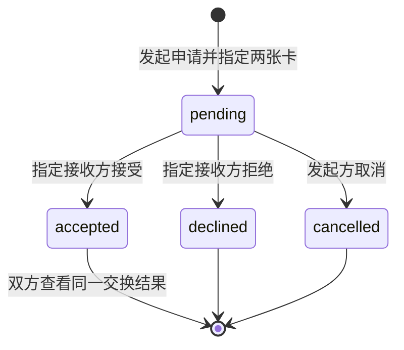

# 实施与演示规格

版本：1.0 · 2026-09-26。执行范围以[产品方案](01-product-plan.md)为准，发布方式见[交付方案](02-delivery-plan.md)。新版应用 0.1.0 已落地，实际完成证据见[项目状态](../../docs/PROJECT_STATUS.md)。

## 1. 技术决定

| 部分 | 初赛决定 | 升级触发条件 |
|---|---|---|
| 页面 | HTML / CSS / JavaScript ES 模块；复用旧版 Map 规则与数据。Vite 8.3.1 + vite-plugin-singlefile 2.3.3 构建 | 页面规模确实影响协作时再评估框架 |
| 空间感 | DOM / SVG、CSS 变换和有限动画 | 不把 Three.js / WebGL 列为依赖 |
| 现场卡 | 图片预览 + 固定版式 + 普通交互状态 | 不需要本地模型、生成式图像服务或 AI 匹配分数 |
| 内容 | 精选 JSON：艺人、作品、合作边、活动、示例卡 | 先解决演示内容，不接全量曲库和活动数据库 |
| 本地状态 | localStorage 保存会话、交换及记录；预置图按素材 ID 引用。可选照片缩至最长边 1000px 后本地保存，存储失败明确提示 | 多图或长期相册再考虑 IndexedDB；当前每角色一张卡 |
| 托管 | 优先考察 WorkBuddy 轻量发布是否支持最终产物；超出能力再用 CloudBase 静态托管 | 以外部浏览器能完整访问为准 |
| 真实双端交换 | 需要时增加托管数据库与少量云函数，临时匿名会话 | 两台设备确实互相影响时启用；不用购买和运维 CVM |

当前源码按外壳、Map、Space 分工，使用 hash 路由和独立存储键 `music-map-space:v1`。构建结果为单一 `dist/index.html`；开发依赖有锁文件，GitHub Actions 只构建并保存产物。没有引入 React、Motion、Three.js、测试框架或推理模型。

## 2. 两种实现状态写清楚

### A. 默认初赛基线：在线前端情景演示

一场预置活动、两个明确标识的示例角色 A / B。评委可以制作卡、切换角色、发起申请、接受或拒绝、查看结果。状态变化由实际程序执行，不是把几张截图当成功反馈；但两个角色仍在同一浏览器中模拟。

- 页面展示“情景演示”，另有简洁的 A / B 角色切换和重置入口。
- 角色 A 不能在 A 的操作区替 B 接受；切到 B 视角后才能执行 B 的操作，以讲清产品规则。
- 成功画面基于实际演示状态。刷新保存同一浏览器中的进度，不假称跨设备同步。
- 这是完整的交互演示，能表达社交机制；不能宣传已经有真人用户或真实跨设备交换。

### B. 加分增强：两台设备真实交换

在 A 的流程基础上，把房间、卡片和交换请求放到共享服务。两部手机各持独立会话，通过邀请链接或房间码进入同一活动，由接收者本人接受，结果同步到双方。

只增加必要能力：临时会话身份、查询房间与卡片、发起申请、接受 / 拒绝 / 取消、读取结果。演示阶段短轮询即可，不必引入实时聊天或复杂长连接。CloudBase 这类托管服务提供数据库和云函数，不要求团队运维服务器。

双方先用预置且允许使用的照片，可省去图片上传。允许上传真实照片时，再增加对象存储、大小限制与读写权限。无需先开发个人主页、找回密码、好友列表、聊天或管理控制台。

接受请求的权限由共享服务检查：只有指定接收方会话能接受，发送方不能直接写成双方已同意。本地角色切换版的限制只能解释流程，不能替代真实服务的身份与权限。

## 3. 最少数据对象

| 对象 | 最少字段 / 用途 |
|---|---|
| Artist / Track | 稳定 ID、名称、曲目与艺人对应、来源；可选音频地址 |
| Relation | 两端艺人、合作作品及版本、角色、来源；真实或明确示例 |
| Event | ID、活动标题、时间显示、关联艺人 / 曲目、是否示例 |
| Moment | 场次内的歌曲或环节，如返场、全场合唱 |
| Card | ID、作者会话、活动、Moment、照片引用、短句、是否选择展示 |
| Exchange | ID、发起方 / 接收方、双方指定卡 ID、状态、时间 |
| Memory | 自己的卡或已完成的双联记录、来源交换 ID；与 Map 探索记录分开 |
| MapSession | 类型、完成状态、起点 / 当前艺人、挑战目标、模式 / 视角、当前路径、完整事件、主动留下曲目、图谱版本、原漫游引用 |

初赛不预先建立复杂统一 Schema 或服务架构。选择实际实现档位后，在代码里保持这些 ID 关系清楚即可。Map 的合作事实、Space 的共同兴趣和用户自述到场是不同含义。

## 4. 交换状态

重复点击不能生成多次交换。只有 accepted 展示完成动效；pending 显示待回应，拒绝和取消不生成双联记忆。共享版失败时显示实际状态并允许重新获取，不能只在发起方本地显示成功。

## 5. 音频如果加入

使用单一原生音频元素，只有用户明确点击才播放。浏览其他艺人、开关面板或进入 Space 不主动打断；播放器显示实际音源，避免把 A 的歌归到当前查看的 B。刷新不自动播放，后台表现以实际浏览器为准。

缺资源、加载失败和播放被拒绝都要反馈；不以计时器伪装真实声音，也不把另一首歌挂到目标作品名下。只有确实接入音频分析时才显示真实频谱，普通装饰不标作实时音频。

本条是“实现试听时”的规格。没有试听版本仍可完整展示现场卡和交换，不因此要求下载整库。

## 6. 准备顺序

| 顺序 | 产物 | 完成条件 |
|---|---|---|
| 1 | 一场活动、两张照片、共同歌曲 / 环节、短句 | 能讲清为什么两个人愿意交换；示例身份清楚 |
| 2 | 做卡 → 申请 → 接受 / 拒绝 → 结果 | 单机角色演示完整，状态真实工作 |
| 3 | 与 Map 互相进入，统一视觉 | 现场活动和艺人对应，返回不会丢失当前记录 |
| 4 | 在线发布前端 | 外部手机能打开全部功能，图片与脚本可加载 |
| 5 | 有余量才接真实双端共享 | 两台设备各自操作，接收方接受后双方结果一致 |
| 6 | 录屏、封面、介绍 | 内容与实际版本一致，链接在评审期间可用 |

日期目标：9 月 26–27 日冻结场景与素材；9 月 28–30 日完成单机主流程；10 月 1–3 日统一视觉、衔接 Map 并发布；10 月 4–6 日处理试用问题，有余量再补双端或音频；10 月 7–8 日冻结并录制；10 月 9 日正式提交。实际工作量以成员可投入时间为准。

若进度不足，先延后真实双端、音频增强和额外视觉样式；保住可访问链接、清楚的现场社交闭环、双方同意规则和完整提交材料。

## 7. 必要检查与当前结果

2026-09-26 已构建新版，并在生产预览完成一条核心流程；详细事实见[项目状态](../../docs/PROJECT_STATUS.md)。不扩大成全量测试。

| 检查 | 判断标准 | 当前状态 |
|---|---|---|
| 发布链接 | 用外部浏览器打开，不依赖开发电脑；核心资源加载完成 | 未发布新版 |
| 现场卡 | 照片、歌曲 / 环节、作者与场次对应，能清楚看见自己的选择 | 制卡、文字编辑、主动展示已操作；上传未专项检查 |
| 交换同意 | 接受、拒绝、取消各自正确；未同意无成功结果 | 已实现三种决定；实际走过待回应→接收方接受→双联保存，未穷举拒绝/取消 |
| 演示标识 | 本地 A / B 场景不被误认作真人实时活动 | 页面角色条、场次和说明明确标识 |
| Map 回退 | 分支和步数沿用产品方案，不产生虚构连接 | 新版挑战前进与返回，步数 0→1→0；恢复原漫游 |
| 音频（若接入） | 实际有声、音源正确、失败不假称播放 | 未接入 |
| 双端（若接入） | 接收方独立接受，两端读到同一结果，发送方不能越权 | 未接入 |
| 手机与长内容 | 常见手机宽度可用，按钮不被遮挡，减少动态效果仍可操作 | 查看桌面与 390px 手机版关键画面；未做全机型和长内容穷举 |

构建得到单 HTML，核心交换记录刷新后仍可打开。后续检查只针对实际新增或受影响能力，不反复回归整个项目。
