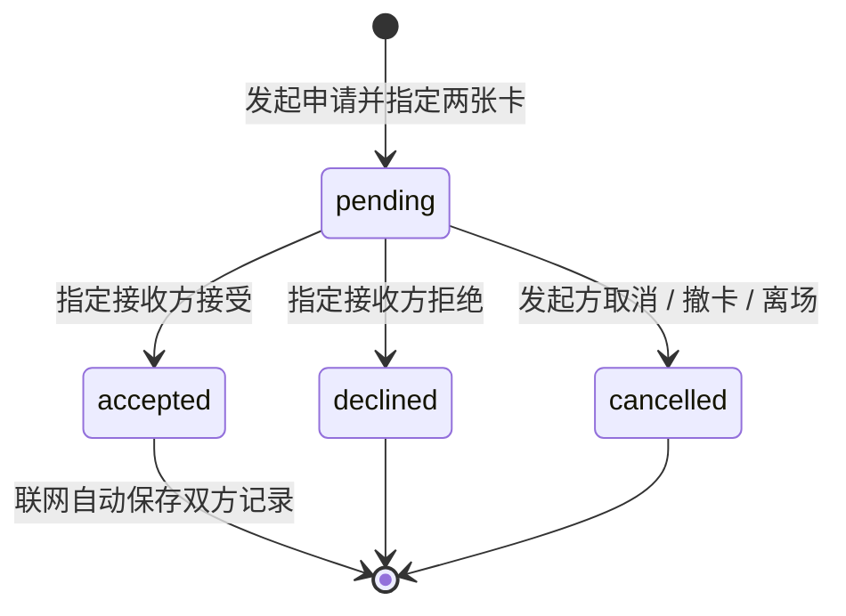

# 实施与演示规格

版本：1.2 · 2026-09-27，对应应用 MVP 0.2.0。产品范围见[产品方案](01-product-plan.md)，比赛交付见[交付方案](02-delivery-plan.md)。Node 服务与联网前端已实现，并完成两个独立浏览器会话的核心换卡实操；音乐节视觉已落地。以下区分实现规格、运行方法与已经取得的证据，检查记录见[项目状态](../../docs/PROJECT_STATUS.md)。

## 1. 技术决定

| 部分 | 当前实现 | 边界 |
|---|---|---|
| 页面 | HTML / CSS / JavaScript ES 模块；Vite 8.3.1 + vite-plugin-singlefile 2.3.3 | 复用当前原生 JavaScript，不迁移框架 |
| 视觉 | DOM / SVG、CSS 变换与有限动画，动态排版主导 | 正文、按钮可读；装饰线条不称为真实频谱 |
| 内容 | 本地 JSON：虚构艺人、作品、关系、活动；两张 AI 生成图 | 真实音乐元数据、音频尚未接入 |
| 本地情景状态 | localStorage `music-map-space:v1`，两个示例角色 | 仅当前浏览器；可选本机照片，不上传服务 |
| 联网身份 | 匿名 bearer 凭据，浏览器保存于 `music-map-live:v1` | 不是手机号账号，无找回与跨设备身份迁移 |
| 共享服务 | Node.js 24+，内置 HTTP 与 `node:sqlite` 的 DatabaseSync；无运行时 npm 依赖 | 同源 `/api/live`，服务端校验成员和操作权限 |
| 数据库 | SQLite，默认 `data/music-map.sqlite`，事务与 WAL | 单实例 + 持久磁盘，`data/` 和数据库 sidecars 不提交 |
| 输出 | 单个 `dist/index.html`；联网服务同时提供它和 API；双联票由浏览器导出 PNG | 只托管 HTML 可跑本地演示，不能运行后端 |

源码分工：外壳 `web/js/app.js`、Map `map.js`、本地 Space `space.js`、联网房间 `live.js`、票根 `ticket-export.js`；服务入口 `server/index.js`，数据库 `server/db.js`。使用 hash 路由，开发依赖由锁文件固定。没有引入 React、Motion、Three.js、测试框架或推理模型。

### 当前优先实施：视觉表达

用户将优秀视觉包装列为核心成功标准。已选 **动态排版主导的当代音乐节视觉**，具体规范集中在产品方案第 6 节。

1. 先完成交换成功页的视觉样稿：同一组照片、歌曲、作者与短句，确定双联构图、字体层级和共同印记。
2. 把已确定的颜色、字体、间距与线条规则提取到公共样式，再延伸到 Map 和 Space。
3. 用进入、关系切换和接受交换三个真实状态驱动有限动效；中文正文与按钮保持稳定，减少动态效果时直接显示结果。
4. 用最终页面制作封面和录屏。仅做受影响画面与操作的必要检查，不另加测试框架或为风格选择重写技术栈。

页面已完成本轮音乐节视觉改造。已查看桌面 Map、Space、真实交换面板与本地双联，以及 390×844 Map 和联网票根。手机邀请栏改为两行网格后，布局读取为宽350px、标题297px、页面无横向溢出。封面与94秒1080p视频已导出；具体产物见[交付清单](../../delivery/README.md)。

## 2. 两种实现状态写清楚

### A. 保留的静态交付：本地情景演示

一场预置活动、两个明确标识的示例角色 A / B。评委可以制作卡、切换角色、发起申请、接受或拒绝、查看结果。状态变化由实际程序执行，不是把几张截图当成功反馈；但两个角色仍在同一浏览器中模拟。

- 页面展示“情景演示”，另有简洁的 A / B 角色切换和重置入口。
- 角色 A 不能在 A 的操作区替 B 接受；切到 B 视角后才能执行 B 的操作，以讲清产品规则。
- 成功画面基于实际演示状态。接受后仍需当前角色手动点击“保存这场记忆”；刷新保留同一浏览器中的进度，不假称跨设备同步。
- 这是完整的交互演示，能表达社交机制；不能宣传已经有真人用户或真实跨设备交换。

### B. MVP 0.2.0：真实独立会话房间

两位参与者各持独立匿名会话，通过 6 位邀请码或携带房间码的链接进入同一房间，最多 24 人。活动固定为虚构的“回声现场”，房内成员可看到主动展示的卡片。各用户每房一张卡，`photoKey` 仅 `stage` / `crowd`、短句 ≤80 字，`trackId` 为 `co-0`（《把晚风借给你》）或空，环节为 `encore` / `chorus` / `lights`。

前端调用同源 `/api/live` 并短轮询。浏览器持有随机 bearer 凭据，数据库只存其哈希；刷新可返回已加入房间。清除浏览器数据后无法找回原身份。服务不可用时显示实际错误并保留制卡输入，不伪造申请或交换成功。

联网只传预置照片键，不接收个人照片或图片文件；本地演示中的照片不迁入房间。服务在接受操作的事务中为双方各自生成私有纪念记录，用户无需再点击保存。PNG 票根由浏览器从接受的快照绘制、下载，与数据库记录保存是两个动作。

服务检查：调用者须为房内成员，只有指定接收者可接受 / 拒绝，只有发送者可取消。私人自卡可用于定向申请；其他成员不能因此读取它。切换到房间入口不会自动退会；显式退出会隐藏自卡、取消相关 pending 并删除成员关系。旧纪念记录保留，再凭邀请码加入后可读取自己的记录。

## 3. 最少数据对象

| 对象 | 最少字段 / 用途 |
|---|---|
| Artist / Track | 稳定 ID、名称、曲目与艺人对应、来源；可选音频地址 |
| Relation | 两端艺人、合作作品及版本、角色、来源；真实或明确示例 |
| Event | ID、活动标题、时间显示、关联艺人 / 曲目、是否示例 |
| Moment | 场次内的歌曲或环节，如返场、全场合唱 |
| User / Room / Member | 用户 ID 与 token 哈希、房间 ID / 邀请码 / 活动、成员关系；加入时检查 24 人容量 |
| Card | ID、房间、作者、活动、Moment、照片键、短句、展示状态、revision、时间 |
| Exchange | 房间、双方用户和卡 ID、发出时两张卡的快照、状态、取消原因、时间 |
| Record | 记录所有者、房间、已接受交换 ID、两卡快照；每位用户每次交换一条 |
| LocalMemory | 本地自己的卡或手动保存的双联记录；与联网 Record、Map 记录分开 |
| MapSession | 类型、完成状态、起点 / 当前艺人、挑战目标、模式 / 视角、当前路径、完整事件、主动留下曲目、图谱版本、原漫游引用 |

SQLite 已实现用户、房间、成员、卡片、交换和记录表。Map 的合作依据、Space 的共同兴趣和用户自述到场保持不同含义；没有到场认证功能。

## 4. 交换状态



发起请求必传 `fromRevision` 和 `toRevision`；任一与当前卡不符返回 `409 CARD_CHANGED`，先看新版再确认。pending 保存不可变的两卡快照，后续编辑不替换申请内容；撤下或离场会取消相关 pending。相同两人同房间最多一条 pending，不能自换。只有 accepted 展示完成动效并自动保存两份私有记录；拒绝和取消不生成记录。删除自己的记录不影响对方，终态重复响应不重复保存。

### API 入口

除健康检查和创建会话外，其余请求携带 `Authorization: Bearer <token>`；JSON 错误格式为 `{error:{code,message}}`。请求有字段长度、体积与频率限制，不开放跨域 CORS。

| 接口（均以 `/api/live` 开头） | 用途 |
|---|---|
| `GET /health` | 公开返回 `{ok:true,storage:'sqlite'}`，不泄露房间或用户 |
| `POST /session`、`GET /session` | 创建匿名凭据；恢复用户和自己已加入房间列表 |
| `POST /rooms`、`POST /rooms/join` | 建房；按 6 位码加入，不提供公共房间检索 |
| `GET /rooms/:id` | 获取房间、自卡、可见卡、自己参与的交换、自己的纪念记录 |
| `PUT /rooms/:id/card` | 创建 / 修改自卡；递增版本 |
| `PATCH /rooms/:id/card/visibility` | 展示或撤下自卡 |
| `POST /rooms/:id/exchanges` | 指定 `toCardId`、`fromRevision`、`toRevision` 发出申请 |
| `POST /rooms/:id/exchanges/:exchangeId/decision` | `accepted` / `declined` / `cancelled`，服务检查操作方 |
| `DELETE /rooms/:id/records/:recordId` | 只删除当前用户自己的记录 |
| `DELETE /rooms/:id/membership` | 显式退出，隐藏自卡、取消待回应，保留已接受记录 |

## 5. 音频如果加入

使用单一原生音频元素，只有用户明确点击才播放。浏览其他艺人、开关面板或进入 Space 不主动打断；播放器显示实际音源，避免把 A 的歌归到当前查看的 B。刷新不自动播放，后台表现以实际浏览器为准。

缺资源、加载失败和播放被拒绝都要反馈；不以计时器伪装真实声音，也不把另一首歌挂到目标作品名下。只有确实接入音频分析时才显示真实频谱，普通装饰不标作实时音频。

本条是“实现试听时”的规格。没有试听版本仍可完整展示现场卡和交换，不因此要求下载整库。

## 6. 本地运行与部署

环境：Node.js **24 或更高**。首次安装与构建：

```powershell
npm ci
npm run build
```

开发时开两个终端，分别运行 `npm run server` 与 `npm run dev`。前端 Vite 把 `/api/live` 代理到 `http://127.0.0.1:8787`；使用 Vite 打印的页面地址。`npm run preview` 仅用于查看静态构建，不是生产 API 服务。

生产产物本地运行：构建后执行 `npm start`，再打开 `http://127.0.0.1:8787`。Node 同时提供网页、API 和 SPA fallback。默认仅本机访问；需要指定绑定地址、端口或数据目录时，在启动前设置环境变量：

```powershell
$env:HOST = '127.0.0.1'
$env:PORT = '8787'
$env:DATA_DIR = 'D:\music-map-data'
npm start
```

以上数据目录仅为示例，应使用实际有写权限且持续保留的路径；未设置时为仓库根 `data/`。数据库与 `-wal` / `-shm` 文件、用户照片、`.env`、`node_modules/`、`dist/` 均不提交。

### 可选 Docker 交付

仓库有多阶段 Dockerfile：构建前端，运行时保留 Node 24、服务和 `dist/`，以非 root 用户运行。

```powershell
docker build -t music-map-space:0.2.0 .
docker volume create music-map-data
docker run -d --name music-map-space --restart unless-stopped -p 127.0.0.1:8787:8787 -v music-map-data:/app/data music-map-space:0.2.0
```

这些是部署说明，不代表已经执行。Docker 内服务监听 `0.0.0.0`，上述端口映射仍只开放到宿主机环回地址。生产由反向代理将同一 HTTPS 域名的页面和 `/api/live` 全部转发到这个 Node 实例；需要定向访问时也在入口限制站点访问。保留 `music-map-data` volume，不把数据库放进镜像或无持久磁盘的平台。采用单实例，不启用多个独立 SQLite 副本的自动横向扩容。实际托管、TLS、访问控制与备份安排尚未执行。

## 7. 收尾顺序

| 顺序 | 产物 | 完成条件 |
|---|---|---|
| 1 | 完成艺术改造与前后端整合 | 换卡结果、Map、Space 共用视觉；已有流程可操作 |
| 2 | 独立会话必要实操 | 两端制卡、申请、接收者决定、双方记录一致，身份不能越权 |
| 3 | 持久化与导出必要检查 | 保留磁盘重启后能读取记录；票根 PNG 可打开 |
| 4 | 少量目标用户试用 | 能理解共同点、两张卡与同意机制，记录真实反馈 |
| 5 | 定向评审访问 | HTTPS、同源 API、持久卷和实际评审访问方式可用 |
| 6 | 2 分钟视频、16:9 封面、介绍 | 来自最终运行版本；材料与真实能力一致 |

截至 9 月 27 日，0.2.0 构建及联网核心路径已有操作证据，音乐节视觉已落地。10 月 7–8 日冻结材料、10 月 9 日实际提交是团队安排，不写成已发生事实。

本轮不再扩充模型、音频或额外主题。若联网部署受阻，可如实交付静态情景演示并保留联网代码；录像和介绍须同步删去未经展示的联网完成声明，不能用本地角色切换充数。

## 8. 证据与待检查边界

2026-09-26 的应用 0.1.0 已构建，并在生产预览操作本地制卡 → 待回应 → 接收方接受 → 手动保存 → 刷新重开，以及 Map 挑战前进与返回。查看过桌面和 390px 宽关键画面。这些证据只覆盖当时版本，不自动转为 0.2.0 联网或新视觉验收。

| 检查 | 判断标准 | 当前状态 |
|---|---|---|
| 服务语法 | 两份后端 JS 可被 Node 解析 | `node --check server/index.js` 与 `node --check server/db.js` 已通过；不等于运行验证 |
| 生产构建 | Vite 产物可生成 | 0.2.0 生产构建已通过 |
| 独立身份与同意 | 独立会话，发送者不能代接受；版本变化拒绝发送 | 小满 / 阿遥两份独立浏览器存储会话完成入场、A 私卡 / B 展示卡、指定两卡申请、B 接受、A 同步；API 实操未入房 C 读取为 403、A 接受为 403、B 接受为 200；版本变化分支未专项实测 |
| 联网记录 | 自动生成双方记录，快照不变，删除互不影响 | 两方 record 快照一致；刷新同房记录仍在；A 编辑短句不改旧记录，A 删除不影响 B。服务进程重启后，原身份同房卡片与记录仍可读回 |
| 票根 PNG | 从已接受快照导出，文件可打开、中文与图像完整 | 已实际下载约 1.62 MB 并目视查看 |
| 新视觉与手机 | 中文层级清楚，关键状态和窄屏布局可用 | 390×844 票根横向溢出修复后已查看；不扩大为实体手机或全页面验收 |
| 线上部署 | 评审实际可访问，API 同源，磁盘持续保留 | 尚未部署；Dockerfile 存在不等于容器已运行 |
| 音频与真实元数据 | 来源及实际能力准确 | 尚未接入 |

以上 0.2.0 运行证据由整合者及接口检查协作者提供；没有新增或运行测试框架 / 套件，本次文档编辑也未重复执行构建或测试。后续只对新增或受影响能力做必要检查，并把结果写入根 README 和任务记录。
